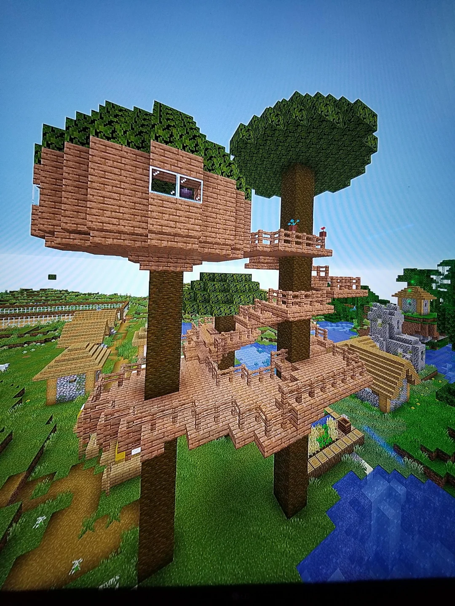
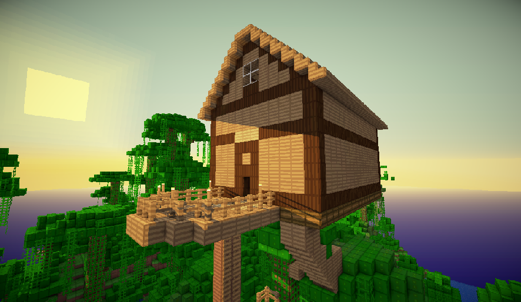
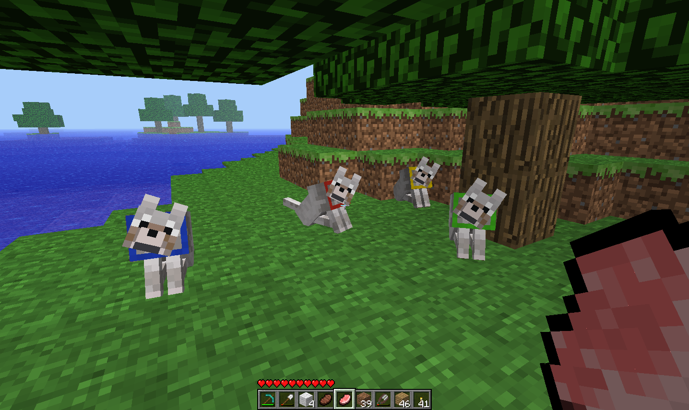
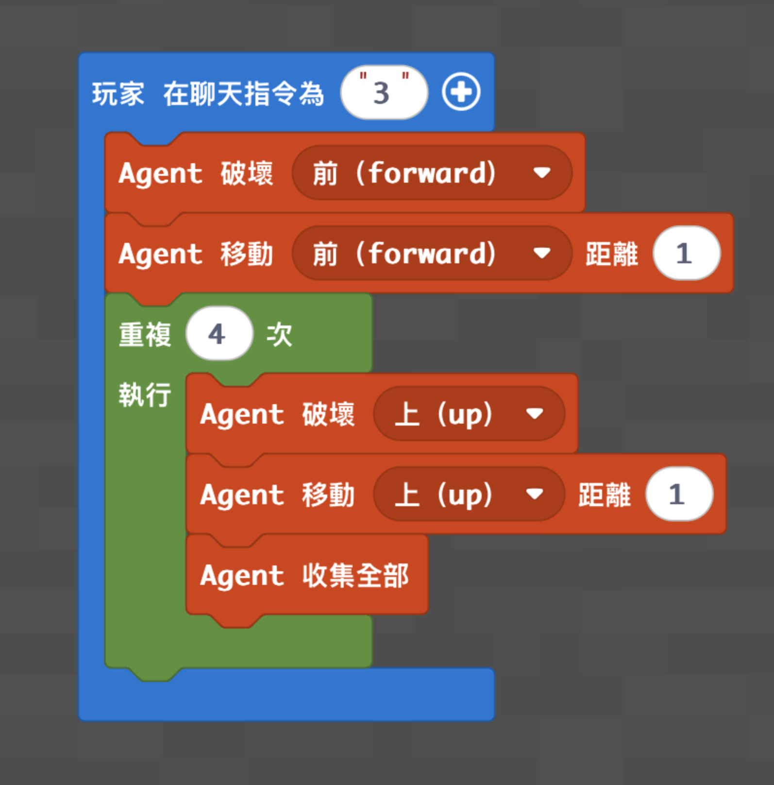
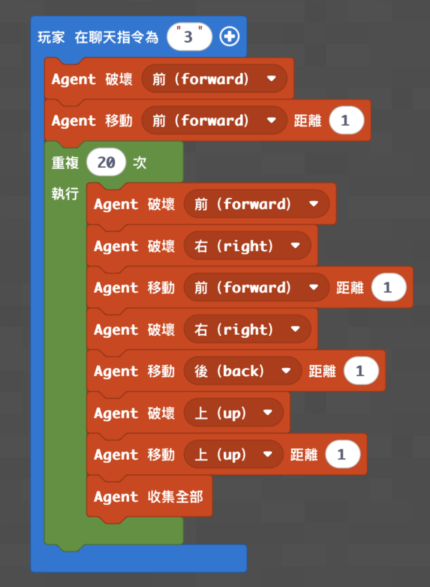

# 梯次A：麥塊程式求生大冒險

- 課程時間：09:00－12:00
- 遊戲版本：Minecraft Education
- 程式平台：Microsoft MakeCode Python
- 核心概念：Agent 控制、方向、迴圈、自動砍伐、資源收集
- 程式狀態：已從原教案保留兩份文字程式碼；高階程式目前缺少；現有程式尚未在 Minecraft Education 實機驗證

## 課前準備

- 使用地圖：[下載神木村8人版.mcworld](maps/神木村8人版.mcworld)
- 由老師開啟神木村世界，讓全班加入同一個世界。
- 學生執行程式時，將學生權限設置為操作者（皇冠）。
- 課前確認每台電腦能開啟 Minecraft Education、進入 MakeCode，並能貼上或建立程式。
- 準備一般單格樹幹，供第一次寫程式的學生測試砍樹機器人。
- 準備以 2×2 樹苗種出的巨型杉木、叢林木或深色橡木，供學生測試砍超大樹機器人。
- 可使用骨粉讓樹苗快速生長；深色橡木必須使用 2×2 四棵樹苗。
- 確認樹木上方沒有建築物；中階程式會讓 Agent 向上重複移動最多 20 次。
- 準備樹屋建造區。原教案沒有指定樹屋尺寸、材料數量或完成標準，老師課前只能先保留建造空間。
- 若要保留其他遊戲素材，準備鞘翅、煙火、夜魅薄膜、馬／豬生成蛋、鞍、狼生成蛋、骨頭、命名牌、鐵砧與染料。
- 兩支程式使用相同聊天指令 `3`，必須分開使用；切換版本前先停止舊程式並清除 MakeCode 編輯器原有內容。

## 教師備課快速總覽

| 教學階段 | 老師帶學生完成的程式 | 程式完成標準 | 完成後的遊戲或活動 |
|---|---|---|---|
| **程式一：砍樹機器人** | 讓 Agent 進入單格樹幹，使用迴圈向上破壞並收集木頭 | 輸入 `3` 後，Agent 能破壞前方樹幹、向上移動四次並收集木頭 | 使用收集到的木頭開始樹屋建造；建造規則目前缺少 |
| **程式二：砍超大樹機器人** | 讓 Agent 清理 2×2 大型樹木，每一層破壞四格木頭並向上移動 | 輸入 `3` 後，Agent 能沿大型樹向上，清理每層四格樹幹並收集木頭 | 使用大量木材延伸樹屋；建造與競賽規則目前缺少 |
| **程式三：機器人走地毯** | **目前缺少程式頁、截圖與程式碼，待討論** | **目前缺少** | **目前缺少** |

## 遊戲內容

### 一、Minecraft 操作暖身

第一次玩的學生先練習：

- 移動、跳躍及轉動視角。
- 開啟物品欄並切換物品。
- 召喚 Agent，確認 Agent 面向及前、後、左、右、上、下方向。
- 找到一般樹木、2×2 大型樹木及老師指定的樹屋建造區。

熟練的學生可以先觀察不同樹種與樹幹大小，程式教學開始前回到集合地點。

### 二、程式一完成後：單格樹木採集與樹屋起步

1. 把 Agent 放在單格樹幹前方，確認 Agent 面對樹幹。
2. 在聊天欄輸入 `3`，觀察 Agent 是否破壞前方樹幹並進入樹木位置。
3. 確認 Agent 向上破壞與移動四次，並把掉落物收集起來。
4. 學生取回木材，在老師指定的位置開始建造樹屋。

原教案只有「樹屋」活動名稱與樹苗資料，沒有記錄樹屋尺寸、材料數量、時間、分組、評分或勝負條件；建造規則**目前缺少**。

### 三、程式二完成後：2×2 大型樹採集與樹屋延伸

1. 使用 2×2 四棵樹苗種出巨型杉木、叢林木或深色橡木；需要時使用骨粉加速生長。
2. 將 Agent 放在大型樹左下方的起始位置，確認前方與右方都是樹幹。
3. 在聊天欄輸入 `3`，觀察 Agent 是否每一層破壞四格樹幹並向上移動。
4. 檢查木頭是否完整收集，再使用取得的材料延伸樹屋。

原教案沒有記錄大型樹高度限制、樹屋完成條件或競賽規則；成果挑戰**目前缺少**。

### 四、其他原有遊戲素材

以下內容存在於原教案，但沒有與砍樹程式建立直接關係，也沒有完整遊戲規則，因此保留為素材，不列為程式完成後的正式競賽。

#### 鞘翅與煙火

- 原資料提供鞘翅與煙火使用影片。
- 鞘翅可使用夜魅薄膜修復，夜魅薄膜由夜魅取得。
- 學生任務、場地、時間、計分與勝負條件**目前缺少**。

#### 騎馬與騎豬

- 原資料備註準備生成蛋與鞍，馴服後即可騎乘。
- 騎乘路線、回合時間、比賽方式與勝負條件**目前缺少**。

#### 養狗與染色項圈

- 使用狼生成蛋與骨頭馴服狼。
- 使用命名牌與鐵砧替狗命名。
- 使用染料改變項圈顏色。
- 飼養或展示活動的完成條件與競賽規則**目前缺少**。

## 樹苗與樹屋參考

原樹屋頁保存了不同樹苗的生長條件與木材用途。授課老師可依地圖現場樹種選擇測試材料。

| 樹種 | 2×2 種植 | 原資料記錄的特色或用途 |
|---|---|---|
| 橡木 | 否 | 常見，樹葉可能掉落蘋果，適合基礎建築 |
| 杉木 | 可以 | 2×2 可長成巨型杉木，適合大量伐木與中世紀建築 |
| 白樺木 | 否 | 高度較一致，適合現代裝潢與地板 |
| 叢林木 | 可以 | 2×2 可長成巨型叢林樹，適合樹屋 |
| 相思木 | 否 | 樹幹可能傾斜或分叉，木材為橘色 |
| 深色橡木 | **必須 2×2** | 深色木材；單棵樹苗不會生長 |
| 紅樹林 | 否 | 可種在水下或陸地，具有複雜根部 |
| 櫻花木 | 否 | 粉紅色樹冠與木材，適合景觀建造 |

## 程式內容

### 程式示範影片

- 中階：[14 砍超大樹](https://youtu.be/Eev5VJZwym0?list=PL3600H0DVFhSzXec8B_GPnGsuRxV6wqmv)

低階「砍樹機器人」原程式頁沒有 YouTube 示範影片。

### 其他參考資料

- [鞘翅 10 件事](https://youtu.be/kZWjddQp-3g)
- [鞘翅與煙火使用方法](https://youtu.be/ZloUqJPBcRs)
- [豬 10 件事](https://youtu.be/JLcHK490kDs)
- [如何騎豬](https://youtu.be/Ee530ipEWG8)
- [如何馴服並騎馬](https://youtu.be/JWy2t-CQows)
- [狼 10 件事](https://youtu.be/p9NplgkiC3g)

### 程式一：砍樹機器人

老師帶學生完成：

- 使用聊天指令 `3` 啟動程式。
- 先破壞 Agent 前方方塊並向前移動一格。
- 使用迴圈重複四次破壞上方、向上移動及收集物品。

**教學重點：** 認識 Agent 方向、指令執行順序，以及迴圈如何取代重複的向上砍伐動作。

**完成標準：** Agent 能進入單格樹幹位置，向上砍伐四格並收集木頭。

**功能測試：** 把 Agent 放在一般樹幹前輸入 `3`，確認前方與上方破壞、移動及收集都有執行。

**完成後活動：** 使用木頭開始樹屋建造；完整規則目前缺少。

- [開啟低階完整程式碼](code/low.py)

### 程式二：砍超大樹機器人

老師帶學生完成：

- 使用聊天指令 `3` 啟動程式。
- 每一層破壞前方與右方的四格樹幹。
- 使用向前、向後移動在同一層處理 2×2 樹幹。
- 完成一層後破壞上方並向上移動。
- 使用迴圈最多重複 20 次並收集木頭。

**教學重點：** 將 2×2 樹幹拆成每一層四格的固定路徑，再使用迴圈讓 Agent 持續向上執行。

**完成標準：** Agent 能沿 2×2 大型樹向上，清理每一層四格木頭並收集材料。

**功能測試：** 把 Agent 放在大型樹正確起點後輸入 `3`，確認每一層四格樹幹都有清除；若 Agent 離開樹幹，先檢查起點與面向。

**完成後活動：** 使用大量木材延伸樹屋；完整規則目前缺少。

- [開啟中階完整程式碼](code/medium.py)

### 程式三：機器人走地毯

原半日營頁只記錄「機器人走地毯」名稱，沒有可追查的程式頁、截圖、影片或程式碼。

**目前缺少，待後續討論。**

- [查看缺少項目註記](code/high.py)

## 半日營標準流程

| 時間 | 流程大綱 |
|---|---|
| **09:00－09:10** | 開場、自我介紹與破冰 |
| **09:10－09:35** | 遊戲操作與自由探索 |
| **09:35－10:15** | 基礎程式教學 |
| **10:15－10:35** | 基礎功能測試與遊戲活動 |
| **10:35－10:45** | 休息時間 |
| **10:45－11:25** | 進階程式教學 |
| **11:25－11:50** | 進階功能測試與成果挑戰 |
| **11:50－12:00** | 課程複習與收尾 |

## 分級教學設計

本梯次使用不同程式作為程度安排，不把低、中、高功能疊在同一個 MakeCode 專案。全班預設目標是完成中階；第一次玩或第一次寫程式的學生完成低階後，也能使用收集到的木頭參加樹屋建造。

| 層級 | 適合學生 | 對應程式 | 完成後活動 |
|---|---|---|---|
| **低** | 年紀較小、第一次玩 Minecraft、第一次寫程式 | 砍樹機器人 | 使用木頭開始建造樹屋 |
| **中（全班預設）** | 大部分學生 | 砍超大樹機器人 | 使用大量木材延伸樹屋 |
| **高** | 進度快、年紀較大、操作熟練或參加過多次 | 機器人走地毯：**目前缺少** | **目前缺少** |

## 實際程式碼

低階與中階程式是兩個獨立版本。貼上前先刪除 MakeCode Python 編輯器原有內容，不要將兩份程式疊在同一個專案。兩份程式均來自原教案，**尚未在 Minecraft Education 實機驗證**。

### 低階程式

- 程式名稱：砍樹機器人
- 聊天指令：`3`
- [開啟完整程式碼](code/low.py)

### 中階程式（全班預設）

- 程式名稱：砍超大樹機器人
- 聊天指令：`3`
- [開啟完整程式碼](code/medium.py)

### 高階程式

**目前缺少，待後續討論。**

- [查看缺少項目註記](code/high.py)

## 家長回饋

查看原回饋

親愛的家長您好：

今天的主題是「麥塊程式求生大冒險」。我們學習如何透過程式控制機器人（Agent）自動化採集生存資源，挑戰編寫自動砍伐 2×2 大型樹木的程式，讓機器人能自動攀升並清理整棵神木。

學習重點：

1. 掌握 2×2 大型樹木的砍伐邏輯，透過精確的位移與方向控制，確保機器人能完整清理每一格木頭。
2. 運用迴圈結構簡化繁瑣的採集過程，讓機器人能自動重複執行破壞、移動與爬升的動作，並將資源收回背包。

今天每位孩子表現得非常棒，都有順利完成程式建構任務！

## 教師課後確認

- [ ] 全班完成低階或中階版本。
- [ ] 學生能說出 Agent 的方向及程式起點要求。
- [ ] 學生能說明迴圈如何重複砍伐與向上移動。
- [ ] 學生實際使用自己寫的程式收集木頭。
- [ ] 學生使用收集到的木頭參加樹屋建造。
- [ ] 老師記錄樹屋規則、其他遊戲與高階程式仍待補充。
- [ ] 下課前完成今日程式概念複習。
