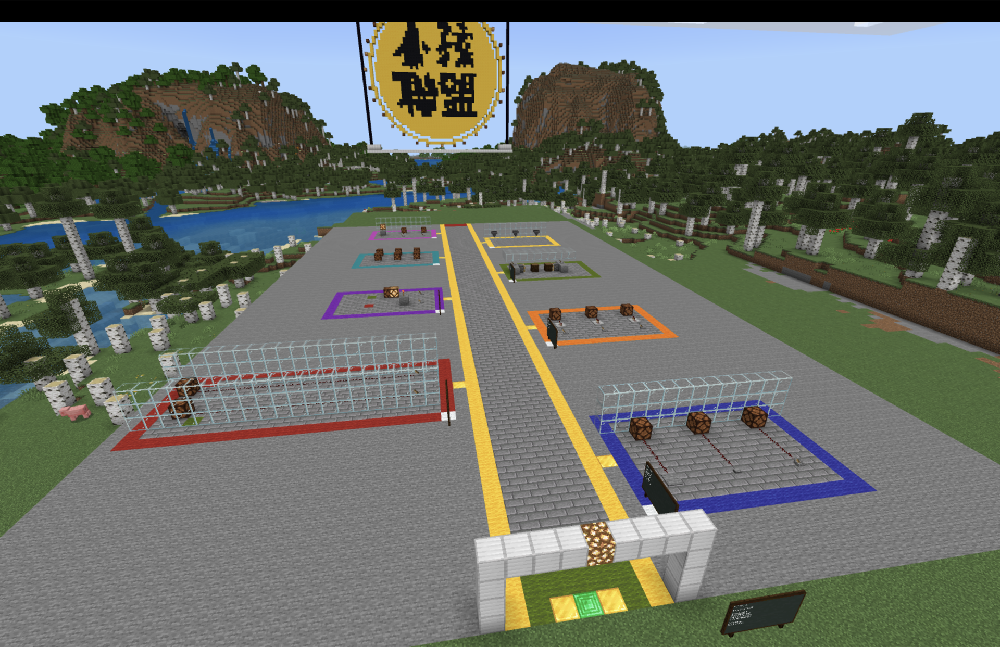
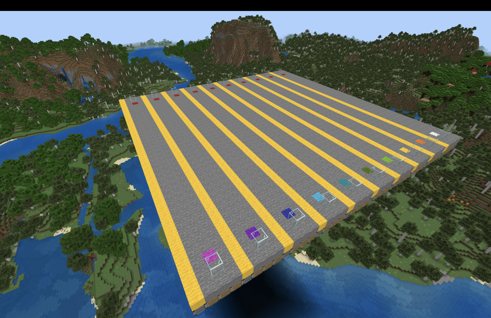
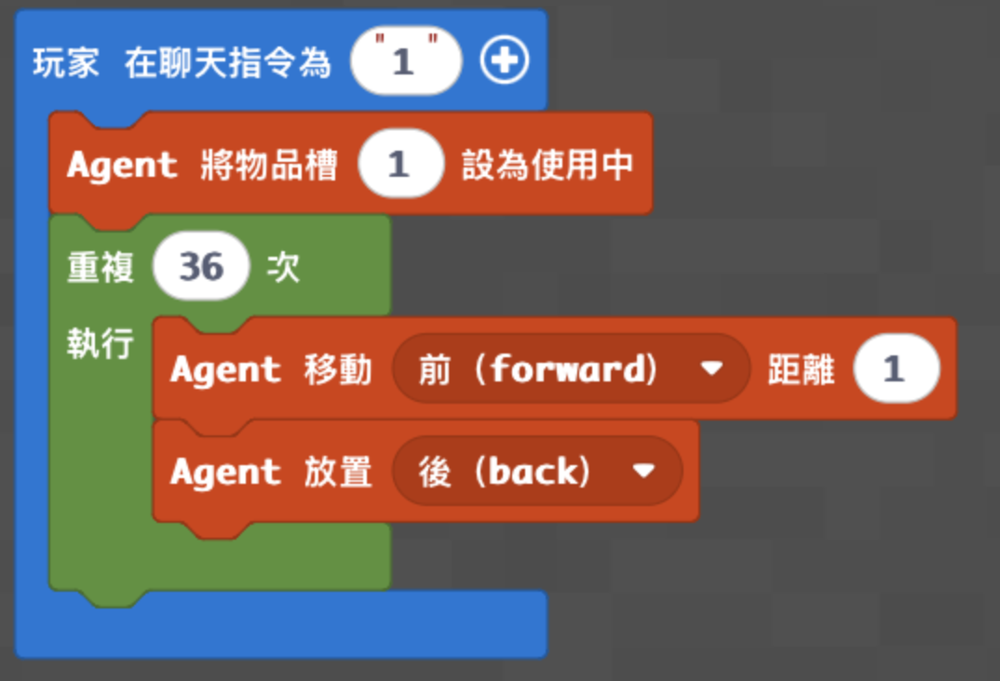
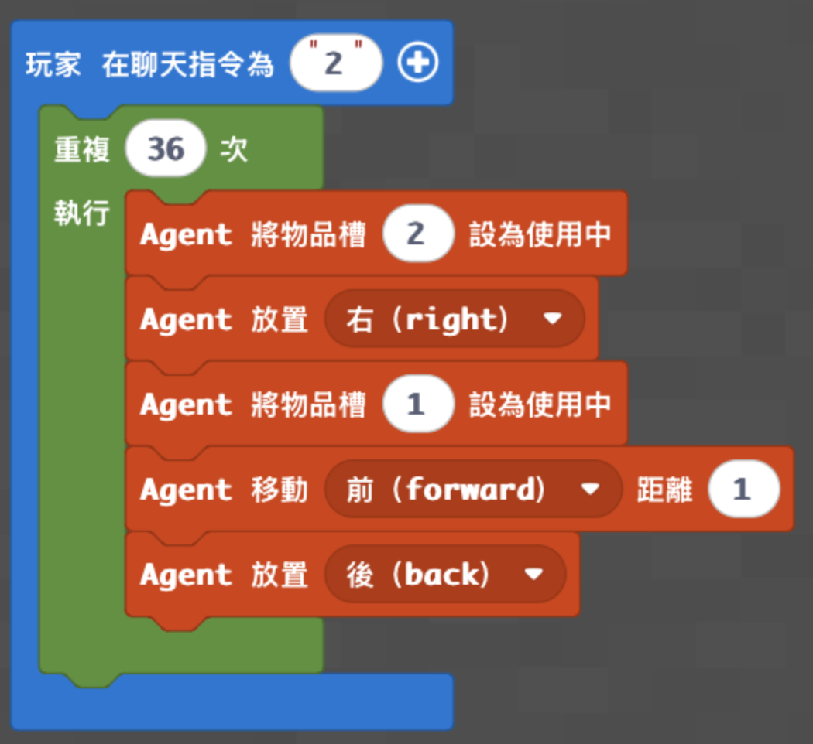
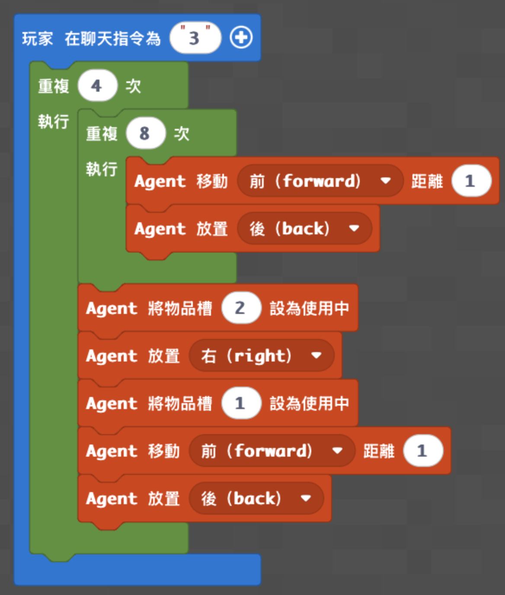

# 梯次B_迴圈：紅石工程師

## 基本資訊

- **課程名稱：** 梯次B_迴圈：紅石工程師
- **課程時間：** 09:00－12:00，共三小時
- **使用平台：** Minecraft Education、Microsoft MakeCode
- **程式概念：** Agent 控制、方向、物品欄切換、迴圈、巢狀迴圈、紅石供電
- **學生任務：** 讓 Agent 從 A 點鋪設36格動力鐵軌到 B 點，最後用礦車驗收鐵路

## 課前準備

- 開啟 [神木村v6](../shared/maps/神木村v6.mcworld)，並保留一份世界備份。
- 由老師主持世界，確認學生可以加入並使用 MakeCode；需要控制 Agent 時，將學生設為操作者。
- Agent 物品欄第1格放動力鐵軌，第2格放紅石火把，數量需足夠完成測試。
- 先在「紅石工程大道」說明動力鐵軌、紅石火把與供電，再前往正式的10線測試場。
- 紅石工程大道傳送指令：`/tp -527 66 236`
- 10線鐵路測試場傳送指令：`/tp -442 139 231`
- 每位學生使用不同顏色羊毛標記的路線，確認 Agent 面向 B 點。
- 正式測試前，確認軌道路線與右側火把位置下方是允許方塊，其餘區域下方是拒絕方塊。
- 三個程度使用三份獨立 MakeCode 專案；切換版本前先停止舊程式並清空編輯器。

## 教師備課快速總覽

| 教學階段 | 老師帶學生完成的程式 | 程式完成標準 | 完成後的遊戲或比賽 |
| --- | --- | --- | --- |
| 低階 | 用單層迴圈鋪設36格動力鐵軌 | 鐵軌從 A 點連續到達 B 點 | 放置礦車完成基礎通車測試 |
| 中階 | 在每次鋪軌時切換物品並嘗試放置火把 | 完成36格鐵軌，右側有紅石火把 | 檢查供電並比較材料使用量 |
| 高階 | 用巢狀迴圈把鐵路拆成4組，每9格供電一次 | 完成36格鐵軌，只使用4支火把 | 進行節能通車挑戰並說明4×9規律 |

## 遊戲內容與規則

1. 老師先帶學生到紅石工程大道，觀察紅石電力、動力鐵軌與紅石火把的關係。
2. 全班前往10線測試場，每位學生選擇一條不同顏色羊毛標記的路線。
3. 學生把 Agent 放在起點羊毛上方，統一面向 B 點，並依程度完成自己的鋪軌程式。
4. 程式執行完畢後，先沿路檢查有沒有漏放、超出終點或火把位置錯誤。
5. 放置礦車進行通車測試；礦車能從 A 點沿著完整軌道抵達 B 點才算過關。
6. 中階與高階學生比較紅石火把用量，說明哪一種程式較節省材料。
7. 若要安排成果挑戰，以「鐵軌完整、礦車通車、火把數量符合版本」作為判定，不以學生操作速度排名。

> 程式教學 → Agent 鋪軌 → 路線檢查 → 礦車通車 → 比較材料效率

### 不同程度如何一起參加

- 低階學生完成36格連續鐵軌即可參加通車測試，火把可由老師協助準備。
- 中階學生練習在迴圈中切換物品，觀察每格放置火把的結果。
- 高階學生使用4×9的分組規律，以4支火把完成節能鐵路。

## 上課知識點

- **紅石供電：** 動力鐵軌需要紅石訊號才能加速礦車，紅石火把可作為電源。
- **Agent 方向：** 前、後、左、右都以 Agent 的面向為基準，起點或面向錯誤會使整條鐵路偏移。
- **物品欄切換：** `agent.set_slot()` 決定 Agent 接下來放置哪一格物品。
- **固定次數迴圈：** 已知鐵路長度為36格時，可以用迴圈重複移動與放置。
- **巢狀迴圈：** 把36格拆成4組，每組先鋪8格，再完成第9格與供電。
- **程式除錯：** 從第一個錯誤位置反推原因，依序檢查材料格、起點、面向、移動與放置順序。
- **資源效率：** 完成功能之外，也能比較不同演算法使用的材料數量。

## 場地準備

### 紅石工程大道

- **地圖座標：** `-527 66 236`
- **用途：** 說明紅石元件、讓學生預測鐵軌與火把如何配合。



### 10線鐵路測試場

- **地圖座標：** `-442 139 231`
- **場地配置：** 10條互不重疊的路線；彩色羊毛是 A 點，紅色羊毛是 B 點。
- **路線長度：** 每條36格。
- **保護方式：** 軌道及火把範圍使用允許方塊，其餘區域使用拒絕方塊。
- **重置方式：** 清除鐵軌、火把與礦車，補回 Agent 物品後重新執行；若場地損壞，可重新載入備份世界或執行教師場地程式。



## 地圖檔

- **正式地圖：** [神木村v6.mcworld](../shared/maps/神木村v6.mcworld)
- 原梯次地圖 `maps/神木村8人版.mcworld` 保留為歷史備份，正式授課統一使用神木村v6。
- 本梯次場地可由下方教師程式重新生成；程式以老師站立位置為相對原點，因此換到其他地圖時不需要沿用神木村的固定座標。
- **結構方塊檔：** 目前沒有已確認可用的結構檔；場地較長且包含10條路線，優先使用教師程式生成。

## 程式示範影片

- [紅石點燈](https://www.youtube.com/watch?v=nbwJHj0DYB4)
- [紅石點燈｜正方形版](https://www.youtube.com/watch?v=wuuGF71qjdQ)
- [用紅石裝置練習物品欄切換](https://www.youtube.com/watch?v=2MD8TdhEpB0)
- [高階｜巢狀迴圈節能鐵路](https://youtu.be/QbJUFraUPdU?si=FAkuhIfF4iF2hXyK)
- [延伸｜你可能不知道的紅石10件事](https://youtu.be/eAq2rPhRoow)
- [延伸｜隱藏2×2活塞門](https://youtu.be/VuXbVEHB0xI)
- [延伸｜半自動小麥收割機](https://youtu.be/XzjnPqRDU00)
- [延伸｜紅石焚化爐](https://youtu.be/dHRh5E5UXjQ?si=VGCUvFC5SOHtwp_N)

## 低、中、高分級教學

三個程度是三份獨立專案，不可以疊在同一個專案。建立程式前先刪除 MakeCode 編輯器原本的內容，再依積木順序逐一完成。

### 低階：36格動力鐵軌

- **學習概念：** Agent 移動、物品欄、固定次數迴圈。
- **聊天指令：** `1`
- **材料設定：** Agent 第1格放動力鐵軌。
- **完成標準：** 鐵軌從 A 點連續鋪設36格並抵達 B 點。
- **MakeCode分享連結：** 待老師完成實機驗證後補入。

```python
def on_on_chat():
    agent.set_slot(1)

    for index in range(36):
        agent.move(FORWARD, 1)
        agent.place(BACK)

player.on_chat("1", on_on_chat)
```



- **測試方式：** 讓 Agent 站在 A 點面向 B 點，輸入 `1`，沿路確認36格鐵軌連續且沒有超出終點。
- **完成後活動：** 放置礦車完成基礎通車測試。

### 中階：每格放置紅石火把

- **學習概念：** 在迴圈中切換物品，依序放置火把與鐵軌。
- **聊天指令：** `2`
- **材料設定：** Agent 第1格放動力鐵軌，第2格放紅石火把。
- **完成標準：** 完成36格鐵軌，並在每次迴圈嘗試於右側放置火把。
- **MakeCode分享連結：** 待老師完成實機驗證後補入。

```python
def on_on_chat():
    for index in range(36):
        agent.set_slot(2)
        agent.place(RIGHT)

        agent.set_slot(1)
        agent.move(FORWARD, 1)
        agent.place(BACK)

player.on_chat("2", on_on_chat)
```



- **測試方式：** 輸入 `2` 後檢查鐵軌與右側火把位置，再放置礦車確認供電效果。
- **完成後活動：** 記錄實際使用的火把數量，與高階版本比較材料效率。

### 高階：巢狀迴圈節能鐵路

- **學習概念：** 巢狀迴圈、分組重複、材料效率。
- **聊天指令：** `3`
- **材料設定：** Agent 第1格放動力鐵軌，第2格放紅石火把。
- **完成標準：** 以4組「8格一般鋪設＋第9格供電」完成36格鐵路，只使用4支火把。
- **MakeCode分享連結：** 待老師完成實機驗證後補入。

```python
def on_on_chat():
    agent.set_slot(1)

    for index in range(4):
        for index2 in range(8):
            agent.move(FORWARD, 1)
            agent.place(BACK)

        agent.set_slot(2)
        agent.place(RIGHT)

        agent.set_slot(1)
        agent.move(FORWARD, 1)
        agent.place(BACK)

player.on_chat("3", on_on_chat)
```



- **測試方式：** 輸入 `3`，確認鐵路共36格、火把共4支，再用礦車完成通車測試。
- **完成後活動：** 向同學說明4×9的分組方法，並比較中階與高階的材料用量。

## 教師用：建立10線測試場

- **用途：** 在其他地圖或場地損壞時重新生成測試場。
- **聊天指令：** `9`
- **生成原點：** 老師站立位置；程式使用相對座標向前建立40格長的場地。
- **使用提醒：** 執行前確認前方至少有41×41格空間，並先備份世界；程式會清除生成範圍內原有方塊。

```python
def build_lane(lane_x, start_wool):
    blocks.fill(
        blocks.block_by_name("allow"),
        pos(lane_x - 1, -2, 0),
        pos(lane_x + 1, -2, 40),
        FillOperation.REPLACE
    )

    blocks.place(start_wool, pos(lane_x, -1, 2))
    blocks.place(RED_WOOL, pos(lane_x, -1, 37))
    blocks.place(GLASS, pos(lane_x, 0, 1))
    blocks.place(GLASS, pos(lane_x, 0, 39))

    blocks.fill(
        YELLOW_WOOL,
        pos(lane_x + 2, -1, 0),
        pos(lane_x + 2, -1, 40),
        FillOperation.REPLACE
    )


def on_on_chat():
    blocks.fill(
        AIR,
        pos(-20, 0, 0),
        pos(20, 5, 40),
        FillOperation.REPLACE
    )

    blocks.fill(
        blocks.block_by_name("deny"),
        pos(-20, -2, 0),
        pos(20, -2, 40),
        FillOperation.REPLACE
    )

    blocks.fill(
        STONE,
        pos(-20, -1, 0),
        pos(20, -1, 40),
        FillOperation.REPLACE
    )

    build_lane(-18, blocks.block_by_name("white_wool"))
    build_lane(-14, blocks.block_by_name("orange_wool"))
    build_lane(-10, blocks.block_by_name("yellow_wool"))
    build_lane(-6, blocks.block_by_name("lime_wool"))
    build_lane(-2, blocks.block_by_name("green_wool"))
    build_lane(2, blocks.block_by_name("cyan_wool"))
    build_lane(6, blocks.block_by_name("light_blue_wool"))
    build_lane(10, blocks.block_by_name("blue_wool"))
    build_lane(14, blocks.block_by_name("purple_wool"))
    build_lane(18, blocks.block_by_name("magenta_wool"))

    player.tell(
        mobs.target(LOCAL_PLAYER),
        "10線紅石鐵路測試場完成"
    )

player.on_chat("9", on_on_chat)
```

## 半日營標準流程

| 時間 | 流程大綱 |
| --- | --- |
| 09:00－09:10 | 開場、自我介紹與破冰 |
| 09:10－09:35 | 遊戲操作與自由探索 |
| 09:35－10:15 | 基礎程式教學 |
| 10:15－10:35 | 基礎功能測試與遊戲活動 |
| 10:35－10:45 | 休息時間 |
| 10:45－11:25 | 進階程式教學 |
| 11:25－11:50 | 進階功能測試與成果挑戰 |
| 11:50－12:00 | 課程複習與收尾 |

## 家長回饋公版

親愛的家長您好：

今天Minecraft半日營的主題是「紅石工程師」。孩子先認識動力鐵軌、紅石火把與Agent的方向，再使用迴圈讓Agent從A點自動鋪設36格鐵軌到B點。

完成基礎版本後，孩子進一步練習在程式中切換物品欄並放置紅石火把。進度較快的孩子也挑戰巢狀迴圈，把重複工作分成「每9格一組」，用更少的紅石火把完成節能鐵路。

最後，孩子透過礦車實際測試成果，觀察程式是否有漏放、方向錯誤或材料使用過多的情況，從遊戲中理解程式設計的規律、除錯與資源效率。

今天每位孩子都非常投入，也順利完成自己的鐵路工程！
