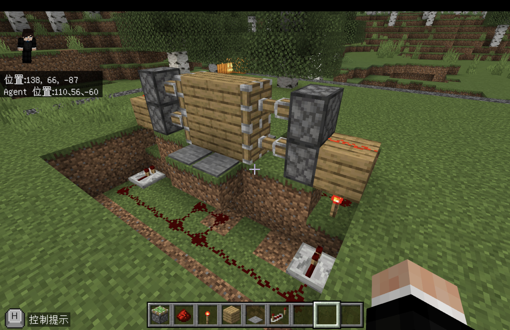
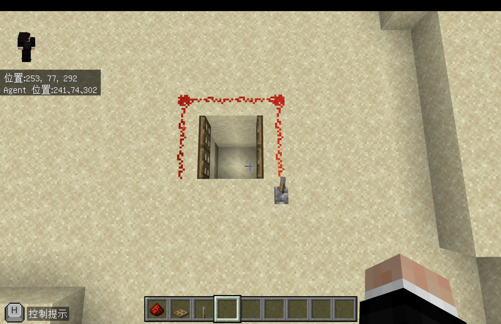
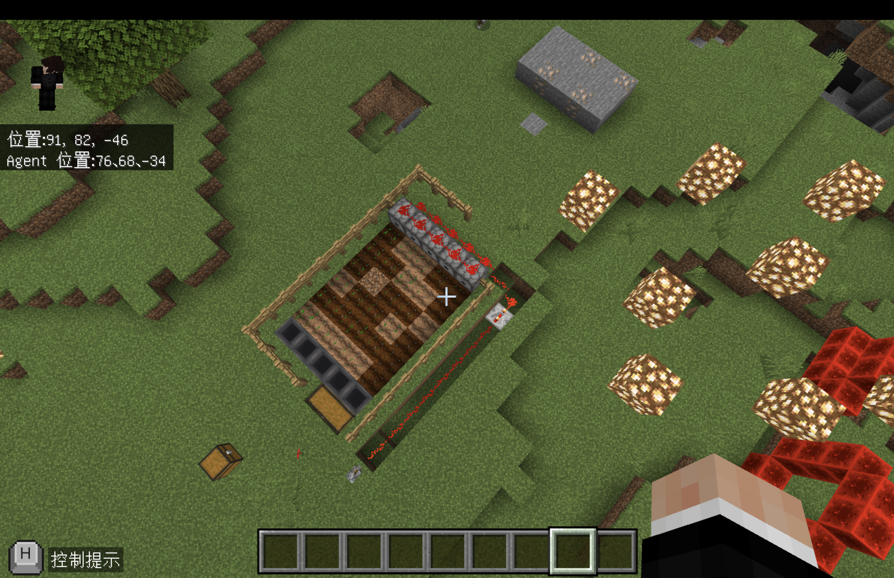
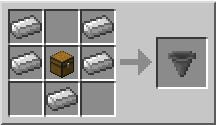
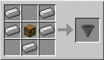
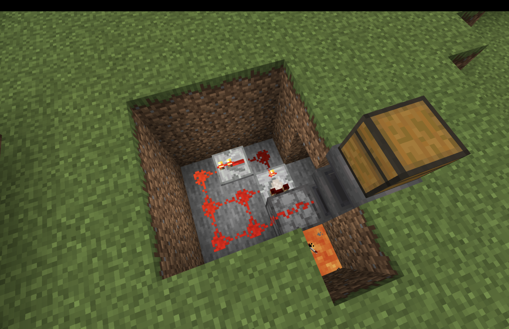
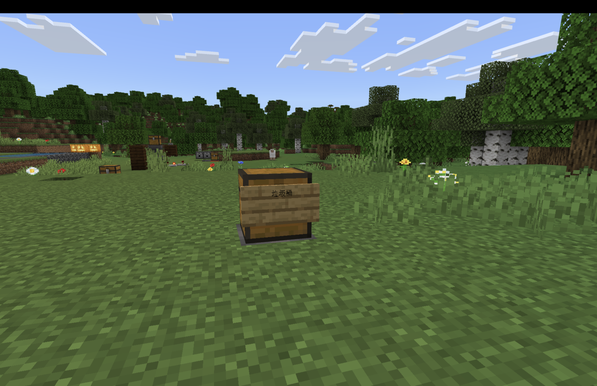

# 梯次 B｜迴圈：紅石工程師

## 基本資訊

- **課程名稱：** 梯次 B｜迴圈：紅石工程師
- **課程時間：** 09:00－12:00，共三小時
- **使用平台：** Minecraft Education、Microsoft MakeCode
- **程式概念：** Agent 控制、方向、物品欄切換、迴圈、巢狀迴圈、紅石供電
- **學生任務：** 讓 Agent 從 A 點鋪設36格動力鐵軌到 B 點，最後用礦車驗收鐵路

## 課前準備

- 開啟 [神木村v6](../shared/maps/神木村v6.mcworld)，並保留一份世界備份。
- 由老師主持世界，確認學生可以加入並使用 MakeCode；需要控制 Agent 時，將學生設為操作者。
- Agent 物品欄第1格放動力鐵軌，第2格放紅石火把，數量需足夠完成測試。
- 先在「紅石工程大道」說明動力鐵軌、紅石火把與供電，再前往正式的10線測試場。
- 紅石工程大道傳送指令：`/tp -527 66 236`
- 10線鐵路測試場傳送指令：`/tp -442 139 231`
- 每位學生使用不同顏色羊毛標記的路線，確認 Agent 面向 B 點。
- 正式測試前，確認軌道路線與右側火把位置下方是允許方塊，其餘區域下方是拒絕方塊。
- 三個程度使用三份獨立 MakeCode 專案；切換版本前先停止舊程式並清空編輯器。

## 教師備課快速總覽

| 教學階段 | 老師帶學生完成的程式 | 程式完成標準 | 完成後的遊戲或比賽 |
| --- | --- | --- | --- |
| 低階 | 用單層迴圈鋪設36格動力鐵軌 | 鐵軌從 A 點連續到達 B 點 | 放置礦車完成基礎通車測試 |
| 中階 | 在每次鋪軌時切換物品並嘗試放置火把 | 完成36格鐵軌，右側有紅石火把 | 檢查供電並比較材料使用量 |
| 高階 | 用巢狀迴圈把鐵路拆成4組，每9格供電一次 | 完成36格鐵軌，只使用4支火把 | 進行節能通車挑戰並說明4×9規律 |

## 遊戲內容與規則

1. 老師先帶學生到紅石工程大道，觀察紅石電力、動力鐵軌與紅石火把的關係。
2. 全班前往10線測試場，每位學生選擇一條不同顏色羊毛標記的路線。
3. 學生把 Agent 放在起點羊毛上方，統一面向 B 點，並依程度完成自己的鋪軌程式。
4. 程式執行完畢後，先沿路檢查有沒有漏放、超出終點或火把位置錯誤。
5. 放置礦車進行通車測試；礦車能從 A 點沿著完整軌道抵達 B 點才算過關。
6. 中階與高階學生比較紅石火把用量，說明哪一種程式較節省材料。
7. 若要安排成果挑戰，以「鐵軌完整、礦車通車、火把數量符合版本」作為判定，不以學生操作速度排名。

> 程式教學 → Agent 鋪軌 → 路線檢查 → 礦車通車 → 比較材料效率

### 不同程度如何一起參加

- 低階學生完成36格連續鐵軌即可參加通車測試，火把可由老師協助準備。
- 中階學生練習在迴圈中切換物品，觀察每格放置火把的結果。
- 高階學生使用4×9的分組規律，以4支火把完成節能鐵路。

## 上課知識點

- **紅石供電：** 動力鐵軌需要紅石訊號才能加速礦車，紅石火把可作為電源。
- **Agent 方向：** 前、後、左、右都以 Agent 的面向為基準，起點或面向錯誤會使整條鐵路偏移。
- **物品欄切換：** `agent.set_slot()` 決定 Agent 接下來放置哪一格物品。
- **固定次數迴圈：** 已知鐵路長度為36格時，可以用迴圈重複移動與放置。
- **巢狀迴圈：** 把36格拆成4組，每組先鋪8格，再完成第9格與供電。
- **程式除錯：** 從第一個錯誤位置反推原因，依序檢查材料格、起點、面向、移動與放置順序。
- **資源效率：** 完成功能之外，也能比較不同演算法使用的材料數量。

## 場地準備

### 紅石工程大道

- **地圖座標：** `-527 66 236`
- **用途：** 說明紅石元件、讓學生預測鐵軌與火把如何配合。


### 10線鐵路測試場

- **地圖座標：** `-442 139 231`
- **場地配置：** 10條互不重疊的路線；彩色羊毛是 A 點，紅色羊毛是 B 點。
- **路線長度：** 每條36格。
- **保護方式：** 軌道及火把範圍使用允許方塊，其餘區域使用拒絕方塊。
- **重置方式：** 清除鐵軌、火把與礦車，補回 Agent 物品後重新執行；若場地損壞，可重新載入備份世界或執行教師場地程式。


## 地圖檔

- **正式地圖：** [神木村v6.mcworld](../shared/maps/神木村v6.mcworld)
- 原梯次地圖 `maps/神木村8人版.mcworld` 保留為歷史備份，正式授課統一使用神木村v6。
- 本梯次場地可由下方教師程式重新生成；程式以老師站立位置為相對原點，因此換到其他地圖時不需要沿用神木村的固定座標。
- **結構方塊檔：** 目前沒有已確認可用的結構檔；場地較長且包含10條路線，優先使用教師程式生成。

## 程式示範影片

- [紅石點燈](https://www.youtube.com/watch?v=nbwJHj0DYB4)
- [紅石點燈｜正方形版](https://www.youtube.com/watch?v=wuuGF71qjdQ)
- [用紅石裝置練習物品欄切換](https://www.youtube.com/watch?v=2MD8TdhEpB0)
- [高階｜巢狀迴圈節能鐵路](https://youtu.be/QbJUFraUPdU?si=FAkuhIfF4iF2hXyK)
- [延伸｜你可能不知道的紅石10件事](https://youtu.be/eAq2rPhRoow)
- [延伸｜隱藏2×2活塞門](https://youtu.be/VuXbVEHB0xI)
- [延伸｜半自動小麥收割機](https://youtu.be/XzjnPqRDU00)
- [延伸｜紅石焚化爐](https://youtu.be/dHRh5E5UXjQ?si=VGCUvFC5SOHtwp_N)

## 延伸活動參考

以下圖片供主要鐵路任務提早完成時使用。老師依剩餘時間挑選一項展示，不需在同一堂課全部完成。

### 挖礦路線設計

比較十字挖礦與魚骨挖礦的路線，討論「如何用規律減少重複移動」。


### 紅石門與活板門

搭配活塞門示範影片，觀察紅石訊號如何控制入口開關。





### 半自動農場

先看完成配置，再依圖片辨認漏斗、發射器、柵欄與紅石中繼器所負責的功能。








### 紅石焚化爐

先確認安全範圍，再比較裝置配置與完成後外觀；由老師統一示範，不讓學生在其他建築旁自行測試。





## 低、中、高分級教學

三個程度是三份獨立專案，不可以疊在同一個專案。建立程式前先刪除 MakeCode 編輯器原本的內容，再依積木順序逐一完成。

### 低階：36格動力鐵軌

- **學習概念：** Agent 移動、物品欄、固定次數迴圈。
- **聊天指令：** `1`
- **材料設定：** Agent 第1格放動力鐵軌。
- **完成標準：** 鐵軌從 A 點連續鋪設36格並抵達 B 點。
- **MakeCode分享連結：** 待老師完成實機驗證後補入。

```python
def on_on_chat():
    agent.set_slot(1)

    for index in range(36):
        agent.move(FORWARD, 1)
        agent.place(BACK)

player.on_chat("1", on_on_chat)
```


- **測試方式：** 讓 Agent 站在 A 點面向 B 點，輸入 `1`，沿路確認36格鐵軌連續且沒有超出終點。
- **完成後活動：** 放置礦車完成基礎通車測試。

### 中階：每格放置紅石火把

- **學習概念：** 在迴圈中切換物品，依序放置火把與鐵軌。
- **聊天指令：** `2`
- **材料設定：** Agent 第1格放動力鐵軌，第2格放紅石火把。
- **完成標準：** 完成36格鐵軌，並在每次迴圈嘗試於右側放置火把。
- **MakeCode分享連結：** 待老師完成實機驗證後補入。

```python
def on_on_chat():
    for index in range(36):
        agent.set_slot(2)
        agent.place(RIGHT)

        agent.set_slot(1)
        agent.move(FORWARD, 1)
        agent.place(BACK)

player.on_chat("2", on_on_chat)
```


- **測試方式：** 輸入 `2` 後檢查鐵軌與右側火把位置，再放置礦車確認供電效果。
- **完成後活動：** 記錄實際使用的火把數量，與高階版本比較材料效率。

### 高階：巢狀迴圈節能鐵路

- **學習概念：** 巢狀迴圈、分組重複、材料效率。
- **聊天指令：** `3`
- **材料設定：** Agent 第1格放動力鐵軌，第2格放紅石火把。
- **完成標準：** 以4組「8格一般鋪設＋第9格供電」完成36格鐵路，只使用4支火把。
- **MakeCode分享連結：** 待老師完成實機驗證後補入。

```python
def on_on_chat():
    agent.set_slot(1)

    for index in range(4):
        for index2 in range(8):
            agent.move(FORWARD, 1)
            agent.place(BACK)

        agent.set_slot(2)
        agent.place(RIGHT)

        agent.set_slot(1)
        agent.move(FORWARD, 1)
        agent.place(BACK)

player.on_chat("3", on_on_chat)
```


- **測試方式：** 輸入 `3`，確認鐵路共36格、火把共4支，再用礦車完成通車測試。
- **完成後活動：** 向同學說明4×9的分組方法，並比較中階與高階的材料用量。

## 教師用：建立10線測試場

- **用途：** 在其他地圖或場地損壞時重新生成測試場。
- **聊天指令：** `9`
- **生成原點：** 老師站立位置；程式使用相對座標向前建立40格長的場地。
- **使用提醒：** 執行前確認前方至少有41×41格空間，並先備份世界；程式會清除生成範圍內原有方塊。
- [下載教師場地 Python](code/teacher-field.py)

```python
def build_lane(lane_x, start_wool):
    blocks.fill(
        blocks.block_by_name("allow"),
        pos(lane_x - 1, -2, 0),
        pos(lane_x + 1, -2, 40),
        FillOperation.REPLACE
    )

    blocks.place(start_wool, pos(lane_x, -1, 2))
    blocks.place(RED_WOOL, pos(lane_x, -1, 37))
    blocks.place(GLASS, pos(lane_x, 0, 1))
    blocks.place(GLASS, pos(lane_x, 0, 39))

    blocks.fill(
        YELLOW_WOOL,
        pos(lane_x + 2, -1, 0),
        pos(lane_x + 2, -1, 40),
        FillOperation.REPLACE
    )


def on_on_chat():
    blocks.fill(
        AIR,
        pos(-20, 0, 0),
        pos(20, 5, 40),
        FillOperation.REPLACE
    )

    blocks.fill(
        blocks.block_by_name("deny"),
        pos(-20, -2, 0),
        pos(20, -2, 40),
        FillOperation.REPLACE
    )

    blocks.fill(
        STONE,
        pos(-20, -1, 0),
        pos(20, -1, 40),
        FillOperation.REPLACE
    )

    build_lane(-18, blocks.block_by_name("white_wool"))
    build_lane(-14, blocks.block_by_name("orange_wool"))
    build_lane(-10, blocks.block_by_name("yellow_wool"))
    build_lane(-6, blocks.block_by_name("lime_wool"))
    build_lane(-2, blocks.block_by_name("green_wool"))
    build_lane(2, blocks.block_by_name("cyan_wool"))
    build_lane(6, blocks.block_by_name("light_blue_wool"))
    build_lane(10, blocks.block_by_name("blue_wool"))
    build_lane(14, blocks.block_by_name("purple_wool"))
    build_lane(18, blocks.block_by_name("magenta_wool"))

    player.tell(
        mobs.target(LOCAL_PLAYER),
        "10線紅石鐵路測試場完成"
    )

player.on_chat("9", on_on_chat)
```

## 教師用：建立紅石大道八關練習場

- **用途：** 在神木村或其他地圖建立八個紅石練習關卡、終點步道、遠方 50×50 Logo 與九面白板。
- **聊天指令 `7`：** 清空生成範圍內的多餘方塊，建立完整八關、終點步道及 Logo。
- **聊天指令 `8`：** 補建九面白板。
- **生成原點：** 老師輸入 `7` 時的站立位置，該位置會成為入口綠寶石執行站。
- **Logo 位置：** 位於終點後方約 30 格，正面朝向八關場地。
- **使用提醒：** 程式會改變大範圍地形，執行前務必備份世界並確認範圍內沒有需要保留的建築。
- [下載紅石大道八關教師 Python](code/teacher-redstone-practice-field.py)

```python
course_origin = world(0, 0, 0)
logo_running = False
logo_step = 0

logo_image = [
    "...................YYYYYYYYYYYY...................",
    "................YYYY..........YYYY................",
    "..............YY......YYYYYYY.....YY..............",
    "............YY....YYYYYYYYYYYYYYY...YY............",
    "..........YY...YYYYYYYYYYYYYYYYYYYY...YY..........",
    ".........YY..YYYYYYYYYYYYYYYYYYYYYYYY..YY.........",
    "........YY..YYYYYYYYYYYYYYYYYYYYYYYYYYY.YY........",
    ".......Y..YYYYYYYYYYYYYYYYYYYYYYYYYYYYYY..Y.......",
    "......Y..YYYYYYBBBYYYYYYYYYYYYYYYYYBYYYYY..Y......",
    ".....YY.YYYYYYYBBBYYYYYYYYBBBBYYYBBBYYYYYY.YY.....",
    "....YY.YYYYYYYYBBBYYYYYYYYBBBBBYYYBBBYYYYYY.YY....",
    "....Y..YYYYYYYYBBBBYYYYYYYYYBBBYYYYBYYYYYYYY.Y....",
    "...Y..YYYYYYYYBBBBBYYYYYYYYBBBYBBBBBBBBYYYYY..Y...",
    "...Y.YYYYYYYYYBBBBBYYYYYYYYBBYYYYBBBBYBYYYYYY.Y...",
    "..Y..YYYYYYYYBBBBBBYYYYYYYYBBYYYYBBBYYYYYYYYY..Y..",
    "..Y.YYYYYYYYYBBBBBBYBYYYYYYBBBBBBBBYBBYYYYYYYY.Y..",
    ".Y..YYYYYYYYBBBBBBBYBBYYYYBBBBBYBBBYBBYYYYYYYY..Y.",
    ".Y..YYYYYYYBBBBBBBBYBBBYYBBBBYYYBBBBBYYYYYYYYYY.Y.",
    ".Y.YYYYYYYBBBBBBBBBYYBYYYYBYBBYYYYBBBBBYYYYYYYY.Y.",
    "YY.YYYYYYBBBYBBBBBBBYYYYYYYBBBYYYYBBBBYYYYYYYYY.YY",
    "Y..YYYYYYYYYYBBBBBBBYYYYYYBBBBYYYBBBBBBYYYYYYYYY.Y",
    "Y..YYYYYYYYYYBBBBBBBYYYYYBBBBYYYBBBBBBBYYYYYYYYY.Y",
    "Y.YYYYYYYYYYBBBBBBYBYYYYYYYBBYYYBBYBYYBYYYYYYYYY.Y",
    "Y.YYYYYYYYYYYYYBYBYYYYYYYYYYYYYYYYYYYYYYYYYYYYYY.Y",
    "Y.YYYYYYYYYYYYYYYYYYYYYYYYYYYYYYYYYYYYYYYYYYYYYY.Y",
    "Y.YYYYYYBBBBBBBBBYYYYBYYYYBBBBBBYYBBBBBBYYYYYYYY.Y",
    "Y.YYYYYYBBBBBBBBBBYYBBYYYYBBBBBBYYBBYBBYYYYYYYYY.Y",
    "Y.YYYYYYBBBBBBBYBBBYBBBBYYBBBYBBBBBBYBBYYYYYYYYY.Y",
    "Y..YYYYYYYYBBBBBBBBYBBBBYBBBYYYBBBBBBBBYYYYYYYYY.Y",
    "Y..YYYYYYYYBBBBYBBBYBBBBYYBBBYBBYBBBYBBYYYYYYYYY.Y",
    "YY.YYYYYYYYBBBBYBBBBYBBBBYBBBBBBYBBBBBBYYYYYYYY..Y",
    ".Y.YYYYYYYYBBBBBBBBBBBBBBYBBBBBBBBBBBBBYYYYYYYY.Y.",
    ".Y.YYYYYYYYBBBBBBBBBBBBBBYYYBBYYYBBYYYBYYYYYYYY.Y.",
    ".Y..YYYYYYYBBBBYYBYBYYYBYYYYYYBBBBBBBBBYYYYYYY..Y.",
    "..Y.YYYYYYBBBBBBBBBBBBBBYYYBBBBBBBBBBBBYYYYYYY.Y..",
    "..Y..YYYYBBBBBBBBBBBBBBBYYYBBBBBYBBYBBYYYYYYY..Y..",
    "...Y.YYYYYBYYBBYBBBBBBBBYYYBBYBBYBBYBBYYYYYYY.Y...",
    "...Y..YYYYYYYBBYBBBBBBBBYYYYBBBBYBBYBBYYYYYY..Y...",
    "....Y..YYYYYYBBYYYBBBBYYYYBBBBBBBBBBBBBBYYYY.Y....",
    "....YY.YYYYYYYBYYYBBBBYYYYBBBBBBBBBBBBBBYYY.YY....",
    ".....YY.YYYYYYYYYYYYYYYYYYYYYYYYYYYYYYYYYY.YY.....",
    "......Y..YYYYYYYYYYYYYYYYYYYYYYYYYYYYYYYY..Y......",
    ".......Y..YYYYYYYYYYYYYYYYYYYYYYYYYYYYYY..Y.......",
    "........YY..YYYYYYYYYYYYYYYYYYYYYYYYYYY.YY........",
    ".........YY..YYYYYYYYYYYYYYYYYYYYYYYY..YY.........",
    "..........YY...YYYYYYYYYYYYYYYYYYYY...YY..........",
    "............YY...YYYYYYYYYYYYYYYY...YY............",
    "..............YY.....YYYYYYYYY....YY..............",
    "................YYYY..........YYYY................",
    "...................YYYYYYYYYYYY..................."
]

lamp_x = [
    26, 25, 24, 21, 18, 14, 9, 5,
    0, -6, -10, -15, -19, -22, -25, -26,
    -26, -26, -25, -22, -19, -15, -10, -6,
    -1, 5, 9, 14, 18, 21, 24, 25
]

lamp_y = [
    28, 33, 37, 42, 46, 49, 52, 53,
    54, 53, 52, 49, 46, 42, 37, 33,
    28, 22, 18, 13, 9, 6, 3, 2,
    2, 2, 3, 6, 9, 13, 18, 22
]


def course_pos(x, y, z):
    return positions.add(
        course_origin,
        pos(x, y, z)
    )


def build_border(x1, x2, z1, z2, border_block):
    blocks.fill(
        border_block,
        pos(x1, -1, z1),
        pos(x2, -1, z1),
        FillOperation.REPLACE
    )
    blocks.fill(
        border_block,
        pos(x1, -1, z2),
        pos(x2, -1, z2),
        FillOperation.REPLACE
    )
    blocks.fill(
        border_block,
        pos(x1, -1, z1),
        pos(x1, -1, z2),
        FillOperation.REPLACE
    )
    blocks.fill(
        border_block,
        pos(x2, -1, z1),
        pos(x2, -1, z2),
        FillOperation.REPLACE
    )


def build_station(x1, x2, z1, z2, border_block, teacher_x, teacher_z):
    blocks.fill(
        STONE_BRICKS,
        pos(x1, -1, z1),
        pos(x2, -1, z2),
        FillOperation.REPLACE
    )
    build_border(x1, x2, z1, z2, border_block)
    blocks.place(
        GOLD_BLOCK,
        pos(teacher_x, -1, teacher_z)
    )


def build_execution_station():
    blocks.fill(
        IRON_BLOCK,
        pos(-4, 0, 0),
        pos(-4, 3, 0),
        FillOperation.REPLACE
    )
    blocks.fill(
        IRON_BLOCK,
        pos(4, 0, 0),
        pos(4, 3, 0),
        FillOperation.REPLACE
    )
    blocks.fill(
        IRON_BLOCK,
        pos(-4, 3, 0),
        pos(4, 3, 0),
        FillOperation.REPLACE
    )

    blocks.place(GLOWSTONE, pos(0, 3, 0))
    blocks.place(EMERALD_BLOCK, pos(0, -1, 0))
    blocks.place(GOLD_BLOCK, pos(-1, -1, 0))
    blocks.place(GOLD_BLOCK, pos(1, -1, 0))


def build_station_1():
    build_station(-17, -5, 4, 12, BLUE_WOOL, -4, 8)

    blocks.place(
        blocks.lever(BLOCK_TOP_POINTS_EAST_WHEN_OFF),
        pos(-15, 0, 6)
    )
    blocks.place(STONE_BUTTON, pos(-11, 0, 6))
    blocks.place(STONE_PRESSURE_PLATE, pos(-7, 0, 6))

    for z in range(7, 10):
        blocks.place(REDSTONE_WIRE, pos(-15, 0, z))
        blocks.place(REDSTONE_WIRE, pos(-11, 0, z))
        blocks.place(REDSTONE_WIRE, pos(-7, 0, z))

    blocks.place(REDSTONE_LAMP, pos(-15, 0, 10))
    blocks.place(REDSTONE_LAMP, pos(-11, 0, 10))
    blocks.place(REDSTONE_LAMP, pos(-7, 0, 10))

    blocks.fill(
        GLASS,
        pos(-17, 0, 11),
        pos(-5, 2, 11),
        FillOperation.REPLACE
    )


def build_station_2():
    build_station(5, 25, 14, 22, RED_WOOL, 4, 18)

    blocks.place(
        blocks.lever(BLOCK_TOP_POINTS_EAST_WHEN_OFF),
        pos(7, 0, 17)
    )
    blocks.place(
        blocks.lever(BLOCK_TOP_POINTS_EAST_WHEN_OFF),
        pos(7, 0, 20)
    )

    for x in range(8, 23):
        blocks.place(REDSTONE_WIRE, pos(x, 0, 17))

    for x2 in range(8, 24):
        blocks.place(REDSTONE_WIRE, pos(x2, 0, 20))

    blocks.place(REDSTONE_LAMP, pos(23, 0, 17))
    blocks.place(REDSTONE_LAMP, pos(24, 0, 20))

    blocks.place(GREEN_WOOL, pos(22, -1, 16))
    blocks.place(RED_WOOL, pos(23, -1, 21))

    blocks.fill(
        GLASS,
        pos(6, 0, 16),
        pos(25, 2, 16),
        FillOperation.REPLACE
    )
    blocks.fill(
        GLASS,
        pos(6, 0, 21),
        pos(25, 2, 21),
        FillOperation.REPLACE
    )


def build_station_3():
    build_station(-17, -5, 24, 32, ORANGE_WOOL, -4, 28)

    blocks.place(
        blocks.lever(BLOCK_TOP_POINTS_EAST_WHEN_OFF),
        pos(-15, 0, 26)
    )
    blocks.place(
        blocks.lever(BLOCK_TOP_POINTS_EAST_WHEN_OFF),
        pos(-11, 0, 26)
    )
    blocks.place(
        blocks.lever(BLOCK_TOP_POINTS_EAST_WHEN_OFF),
        pos(-7, 0, 26)
    )

    blocks.place(REDSTONE_WIRE, pos(-15, 0, 27))
    blocks.place(REDSTONE_WIRE, pos(-11, 0, 27))
    blocks.place(REDSTONE_WIRE, pos(-7, 0, 27))

    blocks.place(
        blocks.repeater(SOUTH, 1),
        pos(-15, 0, 28)
    )
    blocks.place(
        blocks.repeater(SOUTH, 2),
        pos(-11, 0, 28)
    )
    blocks.place(
        blocks.repeater(SOUTH, 4),
        pos(-7, 0, 28)
    )

    blocks.place(REDSTONE_WIRE, pos(-15, 0, 29))
    blocks.place(REDSTONE_WIRE, pos(-11, 0, 29))
    blocks.place(REDSTONE_WIRE, pos(-7, 0, 29))

    blocks.place(REDSTONE_LAMP, pos(-15, 0, 30))
    blocks.place(REDSTONE_LAMP, pos(-11, 0, 30))
    blocks.place(REDSTONE_LAMP, pos(-7, 0, 30))


def build_station_4():
    build_station(5, 17, 34, 42, PURPLE_WOOL, 4, 38)

    blocks.place(
        blocks.lever(BLOCK_TOP_POINTS_EAST_WHEN_OFF),
        pos(7, 0, 37)
    )
    blocks.place(REDSTONE_WIRE, pos(8, 0, 37))
    blocks.place(STONE, pos(9, 0, 37))
    blocks.place(REDSTONE_TORCH, pos(9, 1, 37))
    blocks.place(REDSTONE_LAMP, pos(10, 1, 37))

    blocks.place(
        blocks.lever(BLOCK_TOP_POINTS_EAST_WHEN_OFF),
        pos(7, 0, 40)
    )
    blocks.place(REDSTONE_WIRE, pos(8, 0, 40))
    blocks.place(REDSTONE_WIRE, pos(9, 0, 40))
    blocks.place(REDSTONE_WIRE, pos(10, 0, 40))
    blocks.place(REDSTONE_LAMP, pos(11, 0, 40))

    blocks.place(RED_WOOL, pos(13, -1, 37))
    blocks.place(GREEN_WOOL, pos(13, -1, 40))


def build_station_5():
    build_station(-17, -5, 44, 52, GREEN_WOOL, -4, 48)

    blocks.fill(
        STONE,
        pos(-13, 0, 47),
        pos(-13, 0, 49),
        FillOperation.REPLACE
    )
    blocks.fill(
        STONE,
        pos(-6, 0, 47),
        pos(-6, 0, 49),
        FillOperation.REPLACE
    )

    blocks.place(
        blocks.block_with_data(STICKY_PISTON, 5),
        pos(-12, 0, 48)
    )
    blocks.place(
        blocks.block_with_data(STICKY_PISTON, 4),
        pos(-7, 0, 48)
    )

    blocks.place(BLUE_WOOL, pos(-11, 0, 48))
    blocks.place(RED_WOOL, pos(-8, 0, 48))

    blocks.place(
        blocks.lever(BLOCK_TOP_POINTS_EAST_WHEN_OFF),
        pos(-13, 1, 48)
    )
    blocks.place(
        blocks.lever(BLOCK_TOP_POINTS_EAST_WHEN_OFF),
        pos(-6, 1, 48)
    )

    blocks.fill(
        GLASS,
        pos(-14, 2, 47),
        pos(-5, 2, 49),
        FillOperation.REPLACE
    )


def build_station_6():
    build_station(5, 17, 54, 62, CYAN_WOOL, 4, 58)

    blocks.place(STONE_PRESSURE_PLATE, pos(8, 0, 57))
    blocks.place(STONE_PRESSURE_PLATE, pos(11, 0, 57))
    blocks.place(STONE_PRESSURE_PLATE, pos(14, 0, 57))

    blocks.place(REDSTONE_LAMP, pos(8, 0, 58))
    blocks.place(REDSTONE_LAMP, pos(11, 0, 58))
    blocks.place(REDSTONE_LAMP, pos(14, 0, 58))

    blocks.place(STONE_PRESSURE_PLATE, pos(8, 0, 60))
    blocks.place(STONE_PRESSURE_PLATE, pos(11, 0, 60))
    blocks.place(STONE_PRESSURE_PLATE, pos(14, 0, 60))

    blocks.place(REDSTONE_LAMP, pos(8, 0, 61))
    blocks.place(REDSTONE_LAMP, pos(11, 0, 61))
    blocks.place(REDSTONE_LAMP, pos(14, 0, 61))


def build_station_7():
    build_station(-17, -5, 64, 72, YELLOW_WOOL, -4, 68)

    blocks.place(CHEST, pos(-14, 0, 68))
    blocks.place(HOPPER, pos(-14, 1, 68))
    blocks.place(CHEST, pos(-14, 2, 68))

    blocks.place(CHEST, pos(-10, 0, 68))
    blocks.place(HOPPER, pos(-10, 1, 68))
    blocks.place(CHEST, pos(-10, 2, 68))

    blocks.place(CHEST, pos(-6, 0, 68))
    blocks.place(HOPPER, pos(-6, 1, 68))
    blocks.place(CHEST, pos(-6, 2, 68))

    blocks.fill(
        GLASS,
        pos(-16, 0, 71),
        pos(-5, 2, 71),
        FillOperation.REPLACE
    )


def build_station_8():
    build_station(5, 17, 74, 82, MAGENTA_WOOL, 4, 78)

    blocks.place(
        blocks.lever(BLOCK_TOP_POINTS_EAST_WHEN_OFF),
        pos(7, 0, 76)
    )
    blocks.place(REDSTONE_WIRE, pos(7, 0, 77))
    blocks.place(REDSTONE_WIRE, pos(7, 0, 78))
    blocks.place(REDSTONE_WIRE, pos(7, 0, 79))
    blocks.place(REDSTONE_LAMP, pos(7, 0, 80))

    blocks.place(
        blocks.lever(BLOCK_TOP_POINTS_EAST_WHEN_OFF),
        pos(11, 0, 76)
    )
    blocks.place(REDSTONE_WIRE, pos(11, 0, 77))
    blocks.place(
        blocks.repeater(SOUTH, 4),
        pos(11, 0, 78)
    )
    blocks.place(REDSTONE_WIRE, pos(11, 0, 79))
    blocks.place(REDSTONE_LAMP, pos(11, 0, 80))

    blocks.place(
        blocks.lever(BLOCK_TOP_POINTS_EAST_WHEN_OFF),
        pos(15, 0, 76)
    )
    blocks.place(REDSTONE_WIRE, pos(15, 0, 77))
    blocks.place(STONE, pos(15, 0, 78))
    blocks.place(REDSTONE_TORCH, pos(15, 1, 78))
    blocks.place(REDSTONE_LAMP, pos(15, 1, 79))

    blocks.fill(
        GLASS,
        pos(6, 0, 81),
        pos(16, 2, 81),
        FillOperation.REPLACE
    )


def prepare_boards():
    blocks.place(WOOL, course_pos(-6, -1, 1))
    blocks.place(WOOL, course_pos(-5, -1, 4))
    blocks.place(WOOL, course_pos(5, -1, 14))
    blocks.place(WOOL, course_pos(-5, -1, 24))
    blocks.place(WOOL, course_pos(5, -1, 34))
    blocks.place(WOOL, course_pos(-5, -1, 44))
    blocks.place(WOOL, course_pos(5, -1, 54))
    blocks.place(WOOL, course_pos(-5, -1, 64))
    blocks.place(WOOL, course_pos(5, -1, 74))

    mobs.give(
        mobs.target(LOCAL_PLAYER),
        blocks.block_with_data(
            blocks.block_by_name("board"),
            2
        ),
        9
    )

    player.tell(
        mobs.target(LOCAL_PLAYER),
        "已給你9面大型白板，白色羊毛是放置位置"
    )


def clear_course_area():
    blocks.fill(
        AIR,
        pos(-26, 0, 0),
        pos(26, 30, 18),
        FillOperation.REPLACE
    )
    blocks.fill(
        AIR,
        pos(-26, 0, 19),
        pos(26, 30, 37),
        FillOperation.REPLACE
    )
    blocks.fill(
        AIR,
        pos(-26, 0, 38),
        pos(26, 30, 56),
        FillOperation.REPLACE
    )
    blocks.fill(
        AIR,
        pos(-26, 0, 57),
        pos(26, 30, 75),
        FillOperation.REPLACE
    )
    blocks.fill(
        AIR,
        pos(-26, 0, 76),
        pos(26, 30, 88),
        FillOperation.REPLACE
    )

    blocks.fill(
        AIR,
        pos(-32, 0, 89),
        pos(32, 30, 95),
        FillOperation.REPLACE
    )


def clear_logo_area():
    blocks.fill(
        AIR,
        course_pos(-32, 0, 96),
        course_pos(32, 13, 130),
        FillOperation.REPLACE
    )
    blocks.fill(
        AIR,
        course_pos(-32, 14, 96),
        course_pos(32, 27, 130),
        FillOperation.REPLACE
    )
    blocks.fill(
        AIR,
        course_pos(-32, 28, 96),
        course_pos(32, 41, 130),
        FillOperation.REPLACE
    )
    blocks.fill(
        AIR,
        course_pos(-32, 42, 96),
        course_pos(32, 55, 130),
        FillOperation.REPLACE
    )
    blocks.fill(
        AIR,
        course_pos(-32, 56, 96),
        course_pos(32, 60, 130),
        FillOperation.REPLACE
    )


def build_ground():
    blocks.fill(
        blocks.block_by_name("deny"),
        pos(-26, -2, 0),
        pos(26, -2, 88),
        FillOperation.REPLACE
    )
    blocks.fill(
        STONE,
        pos(-26, -1, 0),
        pos(26, -1, 88),
        FillOperation.REPLACE
    )

    blocks.fill(
        blocks.block_by_name("deny"),
        pos(-32, -2, 89),
        pos(32, -2, 130),
        FillOperation.REPLACE
    )
    blocks.fill(
        STONE,
        pos(-32, -1, 89),
        pos(32, -1, 130),
        FillOperation.REPLACE
    )


def build_main_road():
    blocks.fill(
        STONE_BRICKS,
        pos(-2, -1, 0),
        pos(2, -1, 116),
        FillOperation.REPLACE
    )
    blocks.fill(
        YELLOW_WOOL,
        pos(-3, -1, 0),
        pos(-3, -1, 116),
        FillOperation.REPLACE
    )
    blocks.fill(
        YELLOW_WOOL,
        pos(3, -1, 0),
        pos(3, -1, 116),
        FillOperation.REPLACE
    )

    blocks.fill(
        GREEN_WOOL,
        pos(-2, -1, 0),
        pos(2, -1, 2),
        FillOperation.REPLACE
    )
    blocks.fill(
        RED_WOOL,
        pos(-2, -1, 86),
        pos(2, -1, 88),
        FillOperation.REPLACE
    )

    blocks.fill(
        STONE_BRICKS,
        pos(-12, -1, 106),
        pos(12, -1, 116),
        FillOperation.REPLACE
    )
    blocks.fill(
        YELLOW_WOOL,
        pos(-12, -1, 106),
        pos(-12, -1, 116),
        FillOperation.REPLACE
    )
    blocks.fill(
        YELLOW_WOOL,
        pos(12, -1, 106),
        pos(12, -1, 116),
        FillOperation.REPLACE
    )


def build_logo_pixels():
    for row_index in range(50):
        row = logo_image[row_index]
        x = 0

        while x < 50:
            color = row[x]

            if color == ".":
                x += 1
            else:
                start_x = x

                while x < 50 and row[x] == color:
                    x += 1

                if color == "Y":
                    blocks.fill(
                        YELLOW_WOOL,
                        course_pos(25 - x, 52 - row_index, 121),
                        course_pos(24 - start_x, 52 - row_index, 123),
                        FillOperation.REPLACE
                    )
                else:
                    blocks.fill(
                        blocks.block_with_data(WOOL, 15),
                        course_pos(25 - x, 52 - row_index, 121),
                        course_pos(24 - start_x, 52 - row_index, 123),
                        FillOperation.REPLACE
                    )


def build_logo_lamps():
    for index in range(32):
        blocks.place(
            REDSTONE_LAMP,
            course_pos(lamp_x[index], lamp_y[index], 120)
        )
        blocks.place(
            OBSIDIAN,
            course_pos(lamp_x[index], lamp_y[index], 121)
        )


def build_logo():
    blocks.fill(
        IRON_BLOCK,
        course_pos(-29, 0, 118),
        course_pos(28, 0, 125),
        FillOperation.REPLACE
    )

    blocks.fill(
        OBSIDIAN,
        course_pos(-28, 1, 122),
        course_pos(-28, 55, 122),
        FillOperation.REPLACE
    )
    blocks.fill(
        OBSIDIAN,
        course_pos(27, 1, 122),
        course_pos(27, 55, 122),
        FillOperation.REPLACE
    )
    blocks.fill(
        OBSIDIAN,
        course_pos(-28, 55, 122),
        course_pos(27, 55, 122),
        FillOperation.REPLACE
    )

    blocks.fill(
        IRON_BLOCK,
        course_pos(-29, 0, 120),
        course_pos(-25, 2, 124),
        FillOperation.REPLACE
    )
    blocks.fill(
        IRON_BLOCK,
        course_pos(24, 0, 120),
        course_pos(28, 2, 124),
        FillOperation.REPLACE
    )

    build_logo_pixels()
    build_logo_lamps()

    blocks.place(
        GLOWSTONE,
        course_pos(-28, 55, 122)
    )
    blocks.place(
        GLOWSTONE,
        course_pos(27, 55, 122)
    )
    blocks.place(
        GLOWSTONE,
        course_pos(0, 55, 122)
    )


def logo_animation():
    global logo_step

    if logo_running:
        for index2 in range(32):
            if index2 % 4 == logo_step:
                blocks.place(
                    REDSTONE_BLOCK,
                    course_pos(
                        lamp_x[index2],
                        lamp_y[index2],
                        121
                    )
                )
            else:
                blocks.place(
                    OBSIDIAN,
                    course_pos(
                        lamp_x[index2],
                        lamp_y[index2],
                        121
                    )
                )

        logo_step = (logo_step + 1) % 4
        loops.pause(180)
    else:
        loops.pause(100)


def on_build_chat():
    global course_origin
    global logo_running
    global logo_step

    logo_running = False
    loops.pause(300)

    course_origin = player.position()
    logo_step = 0

    clear_course_area()
    clear_logo_area()
    build_ground()
    build_main_road()

    build_execution_station()
    build_station_1()
    build_station_2()
    build_station_3()
    build_station_4()
    build_station_5()
    build_station_6()
    build_station_7()
    build_station_8()
    prepare_boards()
    build_logo()

    logo_running = True

    player.tell(
        mobs.target(LOCAL_PLAYER),
        "紅石大道八關與小孩聯盟Logo完成"
    )


def on_board_chat():
    prepare_boards()


loops.forever(logo_animation)
player.on_chat("7", on_build_chat)
player.on_chat("8", on_board_chat)
```

## 半日營標準流程

| 時間 | 流程大綱 |
| --- | --- |
| 09:00－09:10 | 開場、自我介紹與破冰 |
| 09:10－09:35 | 遊戲操作與自由探索 |
| 09:35－10:15 | 基礎程式教學 |
| 10:15－10:35 | 基礎功能測試與遊戲活動 |
| 10:35－10:45 | 休息時間 |
| 10:45－11:25 | 進階程式教學 |
| 11:25－11:50 | 進階功能測試與成果挑戰 |
| 11:50－12:00 | 課程複習與收尾 |

## 家長回饋公版

親愛的家長您好：

今天Minecraft半日營的主題是「紅石工程師」。孩子先認識動力鐵軌、紅石火把與Agent的方向，再使用迴圈讓Agent從A點自動鋪設36格鐵軌到B點。

完成基礎版本後，孩子進一步練習在程式中切換物品欄並放置紅石火把。進度較快的孩子也挑戰巢狀迴圈，把重複工作分成「每9格一組」，用更少的紅石火把完成節能鐵路。

最後，孩子透過礦車實際測試成果，觀察程式是否有漏放、方向錯誤或材料使用過多的情況，從遊戲中理解程式設計的規律、除錯與資源效率。

孩子今天完成的程度為【低階／中階／高階】，課堂表現【請填寫具體表現，例如：能自行檢查 Agent 面向或材料格】。在通車測試中完成【請填寫成果】，並能說明【請填寫孩子掌握的概念】。

回家後可以請孩子分享：「為什麼高階程式可以用更少的紅石火把完成36格鐵路？」幫助孩子用自己的話整理今天的學習。
