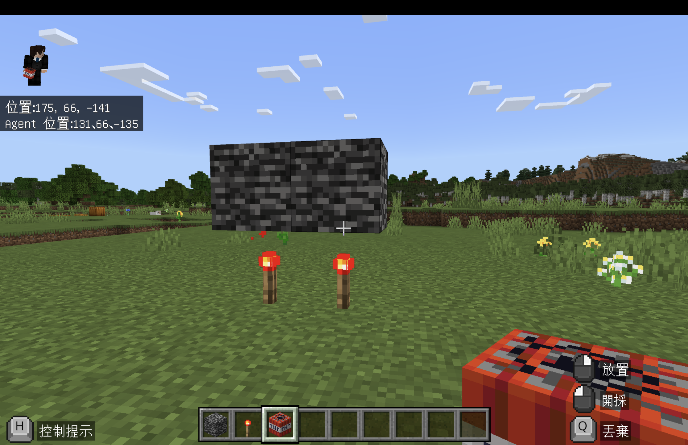
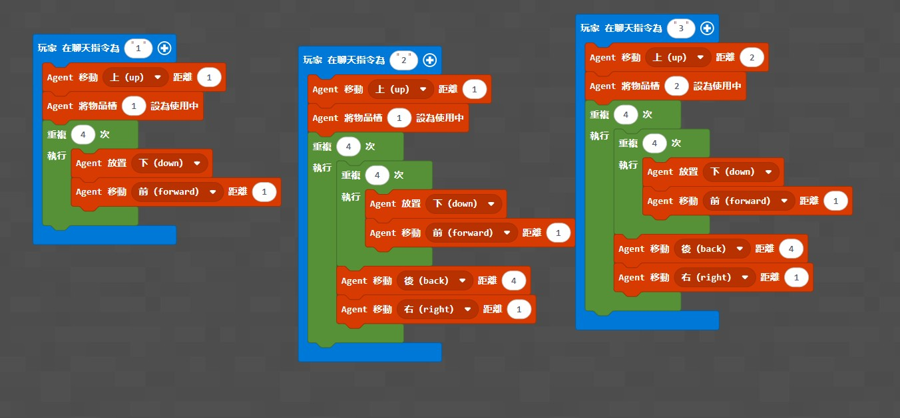
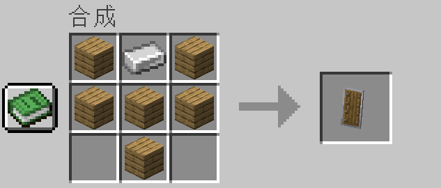

# 梯次 C｜巢狀迴圈：怪物攻城戰

## 基本資訊

- **課程名稱：** 梯次 C｜巢狀迴圈：怪物攻城戰
- **課程時間：** 09:00－12:00，共三小時
- **使用平台：** Minecraft Education、Microsoft MakeCode
- **程式概念：** Agent 控制、方向、物品欄、單層迴圈、巢狀迴圈、分層建造
- **學生任務：** 用 Agent 建立4×4紅石火把層與基岩保護層，再使用完成的結構進行老師控制的 TNT 防禦測試

> 本梯次會使用 TNT 與怪物。老師必須先備份世界、劃定獨立測試區，並統一控制難度、怪物生成、TNT 放置與測試時機。學生不可在場外使用 TNT。

## 課前準備

- 開啟 [神木村v6](../shared/maps/神木村v6.mcworld)，並另存一份世界備份。
- 由老師主持世界，確認學生可以加入並使用 MakeCode；需要控制 Agent 時，將學生設為操作者。
- 為每位學生或每組分配互不重疊的建造區，區域之間至少保留安全距離。
- Agent 物品欄第1格放紅石火把，第2格放基岩；TNT 由老師保管，完成結構驗收後才發放或放置。
- 準備盾牌、三叉戟及老師選定的怪物；正式活動前先讓學生在安全區練習防禦。
- 老師依活動需要將世界難度設為非和平，並確認「TNT可爆炸」設定；這些全域設定只由老師操作。
- 課前先在備份世界測試紅石火把、基岩與TNT的相對高度，確認TNT放上去後的啟動方式與安全距離。
- 三個程度使用三份獨立 MakeCode 專案；切換版本前先停止舊程式並清空編輯器。
- 現有文字程式依原積木截圖還原，尚未在 Minecraft Education 實機驗證；正式授課前需切換積木並完成一次完整測試。

## 教師備課快速總覽

| 教學階段 | 老師帶學生完成的程式 | 程式完成標準 | 完成後的遊戲或比賽 |
| --- | --- | --- | --- |
| 低階 | 用單層迴圈向下放置4格 | Agent 完成方向一致的4格直線 | 進行直線完整度與方向驗收 |
| 中階 | 用4×4巢狀迴圈建立紅石火把層 | 第一層共16格，沒有缺格或錯列 | 完成底層供電區驗收 |
| 高階 | 抬高Agent並用4×4巢狀迴圈建立基岩層 | 第二層共16格，與第一層對齊 | 由老師加入TNT與怪物進行防禦測試 |

## 遊戲內容與規則

1. 學生先練習 Minecraft 操作、Agent 方向、盾牌防禦與三叉戟投擲。
2. 每位學生或每組進入自己的建造區，將 Agent 放在指定起點並統一面向。
3. 低階先完成4格直線；中階建立4×4紅石火把層；高階再建立與底層對齊的4×4基岩層。
4. 每完成一層都要先停止程式，由學生逐格檢查16格是否完整，再請老師驗收。
5. 全班退到安全線外，老師才在基岩層上放置少量TNT，並在測試區生成指定怪物。
6. TNT啟動後，學生觀察怪物是否被清除、基岩層是否保留，以及分層建造是否成功。
7. 每回合結束後先停止操作，由老師清除剩餘TNT與怪物，再決定是否開始下一回合。
8. 成果以「程式結構完整、上下層對齊、能說明巢狀迴圈」判定。

> 程式教學 → 分層建造 → 逐格驗收 → 老師進行TNT測試 → 觀察防禦結果

### 不同程度如何一起參加

- 低階學生完成4格直線後，可協助同組檢查方向與材料。
- 中階學生完成紅石火把層，能參加分層結構的底層驗收。
- 高階學生完成基岩層，並向同組說明外層與內層迴圈各控制什麼。
- TNT與怪物測試由老師統一執行，因此所有學生都能安全觀察成果。

## 上課知識點

- **Agent 方向：** 前、後、右、下都以 Agent 面向為基準，起點或面向錯誤會使整個平面偏移。
- **單層迴圈：** 低階把「放置、前進」重複4次，形成一條直線。
- **巢狀迴圈：** 內層迴圈負責每列4格，外層迴圈負責4列，最後得到4×4平面。
- **位置重置：** 每列完成後，Agent後退4格回到列首，再向右移動1格開始下一列。
- **分層建造：** 相同的4×4演算法可透過高度與物品欄差異，建立不同材料的上下層。
- **基岩特性：** 基岩不會被一般TNT炸毀，可作為爆炸測試的保護層。
- **程式除錯：** 先找出第一個放錯的方塊，再檢查Agent高度、材料格、面向、迴圈次數與每列重置位置。
- **安全設計：** 程式能完成建造不代表可以立即啟爆；實際測試仍需場地隔離、主持人控制與世界備份。

## 場地準備

- **神木村參考座標：** 玩家約在 `175, 66, -141`，Agent約在 `191, 66, -135`。
- **建造區：** 每組至少預留8×8格，4×4程式結構置中，四周保留觀察與安全空間。
- **起點標記：** 使用不同顏色羊毛標記Agent起點與面向，所有組別保持相同方向。
- **安全線：** TNT測試時，全班退到老師指定的基岩牆或安全線外。
- **重置方式：** 優先重新載入世界備份；小範圍測試則由老師清除TNT與怪物，再補回紅石火把和基岩。
- **其他地圖：** 可在空曠處使用相同相對起點建造，不需要沿用神木村座標。



## 地圖檔

- **正式地圖：** [神木村v6.mcworld](../shared/maps/神木村v6.mcworld)
- 原梯次地圖 `maps/神木村8人版.mcworld` 保留為歷史備份，正式授課統一使用神木村v6。
- **結構方塊檔：** 目前沒有已確認可用的結構檔；學生的4×4分層結構本身就是本課程式成果，不建議課前直接生成取代學生程式。
- 若老師只需要快速重置場地，可在備份世界預先保留一組完成範例，再複製世界供下一梯次使用。

## 程式示範影片

- [炸彈超人](https://youtu.be/myJWrgwbCOg?si=c_RTYefBB1p-_wZ8)
- [經典遊戲｜超任炸彈超人](https://youtu.be/ZXCQpmKxAsM)
- [Minecraft轟炸超人](https://youtu.be/x5csci93tIM)
- [延伸｜盾牌10件事](https://youtu.be/P9F3_spudkg)
- [延伸｜三叉戟10件事](https://youtu.be/8kKI2y7VnAI)
- [延伸｜三叉戟中文Minecraft Wiki](https://zh.minecraft.wiki/w/%E4%B8%89%E5%8F%89%E6%88%9F?variant=zh-tw)

## 低、中、高分級教學

三個程度是三份獨立專案，不可以疊在同一個專案。建立程式前先刪除 MakeCode 編輯器原本的內容，再依積木順序逐一完成。

### 低階：4格直線放置

- **學習概念：** Agent高度、物品欄、單層迴圈、放置與移動順序。
- **聊天指令：** `1`
- **材料設定：** Agent第1格放紅石火把。
- **完成標準：** Agent向上1格後，向下放置4格連續材料。
- **MakeCode分享連結：** https://makecode.com/_5dV0cwFo8L5g

```python
def on_on_chat():
    agent.move(UP, 1)
    agent.set_slot(1)
    for index in range(4):
        agent.place(DOWN)
        agent.move(FORWARD, 1)
player.on_chat("1", on_on_chat)
```



- **測試方式：** 輸入 `1`，確認4格材料連續、方向一致，而且Agent最後停在直線末端前方。
- **完成後活動：** 逐格檢查直線，並請學生預測如何把一列擴展成4×4平面。

### 中階：4×4紅石火把層

- **學習概念：** 巢狀迴圈、列與行、每列位置重置。
- **聊天指令：** `2`
- **材料設定：** Agent第1格放紅石火把。
- **完成標準：** 建立4列、每列4格，共16格的第一層平面。
- **MakeCode分享連結：** https://makecode.com/_iwqHhj0itRKE

```python
def on_on_chat():
    agent.move(UP, 1)
    agent.set_slot(1)
    for index in range(4):
        for index2 in range(4):
            agent.place(DOWN)
            agent.move(FORWARD, 1)
        agent.move(BACK, 4)
        agent.move(RIGHT, 1)
player.on_chat("2", on_on_chat)
```


- **測試方式：** 輸入 `2`，逐列確認各有4格、相鄰列平移1格，最後得到完整4×4平面。
- **完成後活動：** 進行16格底層完整度驗收，找出第一個缺格或偏移的位置並修正。

### 高階：抬高的4×4基岩層

- **學習概念：** 重用巢狀迴圈、調整高度、切換材料、上下層對齊。
- **聊天指令：** `3`
- **材料設定：** Agent第2格放基岩。
- **完成標準：** Agent向上2格後建立第二個4×4平面，並與紅石火把層對齊。
- **MakeCode分享連結：** https://makecode.com/_5VHAqbUeJ3js

```python
def on_on_chat():
    agent.move(UP, 2)
    agent.set_slot(2)
    for index in range(4):
        for index2 in range(4):
            agent.place(DOWN)
            agent.move(FORWARD, 1)
        agent.move(BACK, 4)
        agent.move(RIGHT, 1)
player.on_chat("3", on_on_chat)
```


- **測試方式：** 輸入 `3`，確認高度、材料、16格完整度及上下兩層對齊。
- **完成後活動：** 全班退出安全區，由老師在基岩上方加入少量TNT與怪物，測試程式建造的保護層。

> 三份文字程式依原積木截圖還原；原圖已證明積木結構存在，但文字版仍需在正式授課前切換積木並實機驗證。

## 裝備延伸

- 盾牌用於練習正面防禦，三叉戟只在老師指定的安全區投擲。
- TNT測試結束且場地安全時，老師可安排短時間怪物防守。



## 半日營標準流程

| 時間 | 流程大綱 |
| --- | --- |
| 09:00－09:10 | 開場、自我介紹與破冰 |
| 09:10－09:35 | 遊戲操作與自由探索 |
| 09:35－10:15 | 基礎程式教學 |
| 10:15－10:35 | 基礎功能測試與遊戲活動 |
| 10:35－10:45 | 休息時間 |
| 10:45－11:25 | 進階程式教學 |
| 11:25－11:50 | 進階功能測試與成果挑戰 |
| 11:50－12:00 | 課程複習與收尾 |

## 家長回饋公版

親愛的家長您好：

今天Minecraft半日營的主題是「怪物攻城戰」。孩子先複習Minecraft操作與Agent方向，再透過程式讓Agent自動建立分層防禦結構。

課程中，孩子從4格直線開始，進一步使用巢狀迴圈完成4×4平面，理解內層迴圈負責每列長度、外層迴圈負責列數。進度較快的孩子還會調整Agent高度與物品欄，在另一層建立對齊的基岩保護層。

完成程式後，孩子逐格驗收自己的建造成果，並在老師控制下觀察TNT與怪物測試，理解程式結構如何實際用於防禦任務，也練習從第一個錯誤位置進行除錯。

孩子今天完成的程度為【低階／中階／高階】，課堂表現【請填寫具體表現，例如：能自行檢查 Agent 轉向或上下層對齊】。在防禦測試中完成【請填寫成果】，並能說明【請填寫孩子掌握的概念】。

回家後可以請孩子分享：「內層迴圈與外層迴圈分別負責建造哪一個方向？」幫助孩子用自己的話整理今天的學習。
