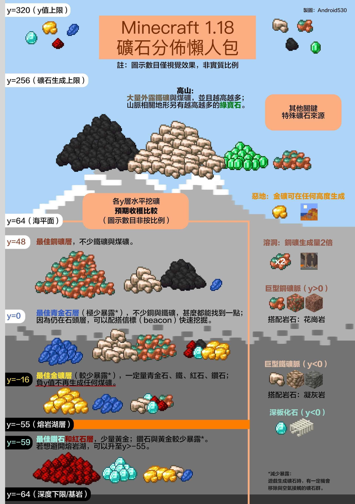
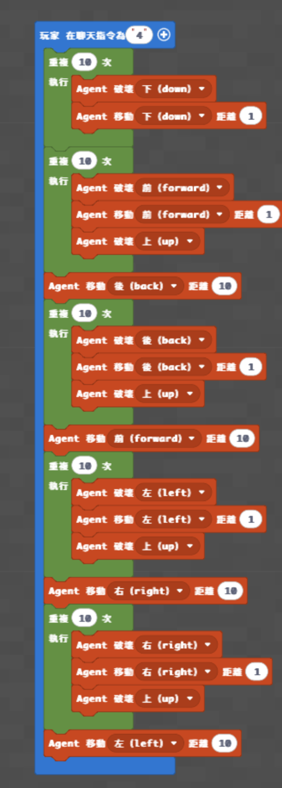
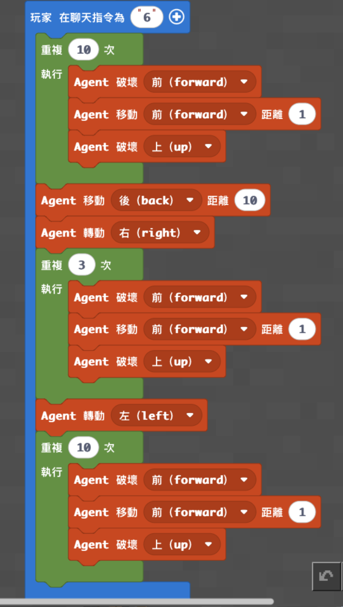
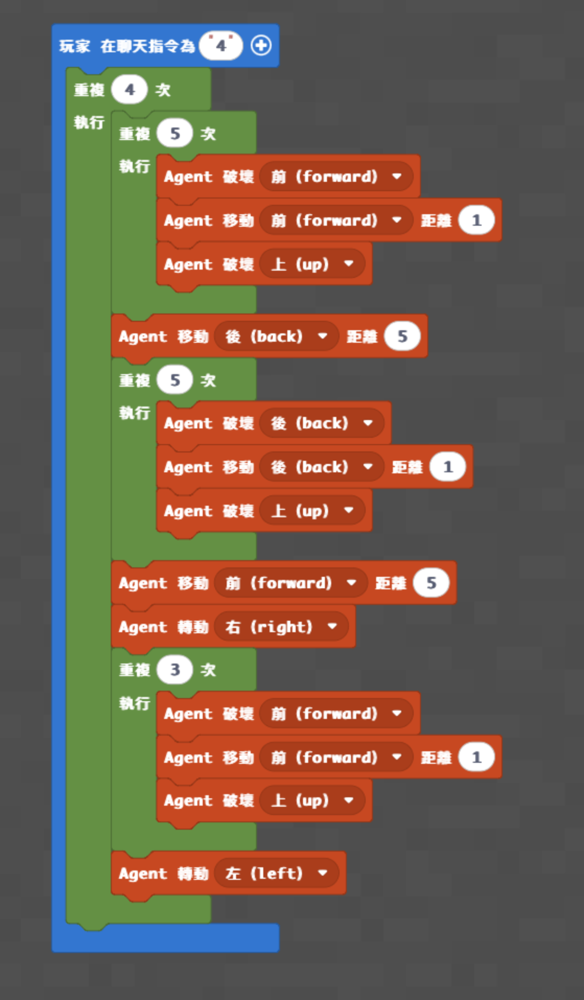
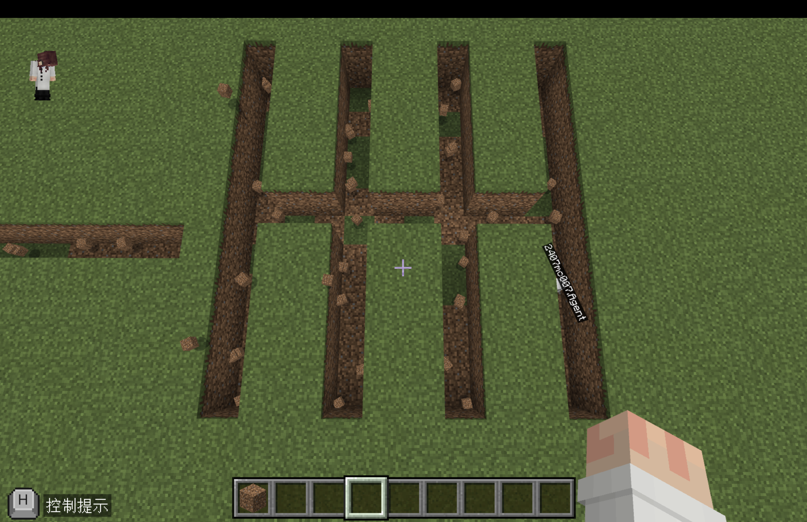
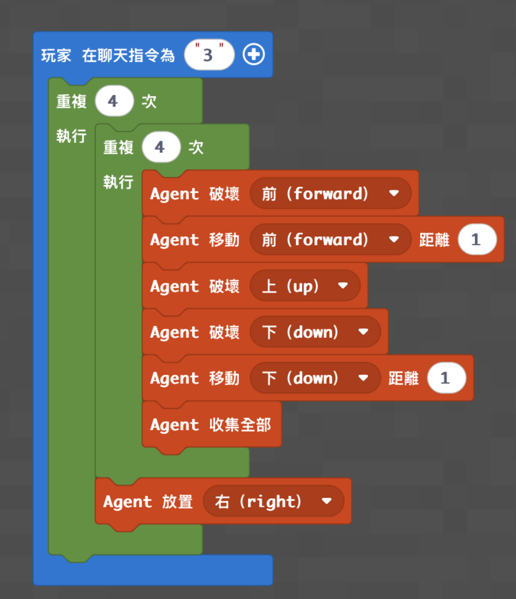

# 梯次D_麥塊程式礦坑達人

- 課程時間：09:00－12:00
- 遊戲版本：Minecraft Education
- 程式平台：Microsoft MakeCode Python
- 核心概念：Agent 控制、方向、迴圈、巢狀迴圈、自動挖掘、礦坑安全
- 程式狀態：只有樓梯挖礦找到文字程式碼；十字挖礦與魚骨挖礦的文字程式碼目前缺少；現有程式尚未在 Minecraft Education 實機驗證

> **來源差異警告：** 樓梯挖礦的原始文字程式開頭包含 `agent.collect_all()`，原積木截圖沒有這個積木。這行又在挖掘開始前執行，不能視為挖完後自動回收礦物。本版本的 `low.py` 忠實保留文字程式，舊截圖也照原樣保存；老師課前必須實機確認。

## 課前準備

- 使用地圖：[下載神木村8人版.mcworld](maps/神木村8人版.mcworld)
- 由老師開啟神木村世界，讓全班加入同一個世界。
- 學生執行程式時，將學生權限設置為操作者（皇冠）。
- 課前確認每台電腦能開啟 Minecraft Education、進入 MakeCode，並能貼上或建立程式。
- 準備安全、彼此分開的挖礦起點，避免不同學生的 Agent 挖到同一條礦道。
- 複習礦坑安全：準備火把、避免垂直向下挖掘，並確認學生知道如何沿樓梯返回地面。
- 樓梯挖礦程式會使用 Agent 右方物品欄材料放置火把；老師課前要確認正確物品欄與 Agent 面向。原頁沒有記錄火把應放在哪一格，目前缺少。
- 準備各種十字鎬所需材料；原教案只寫「做每種鎬子」，沒有列出正式清單與數量，目前缺少。
- 若要進行附魔活動，準備黑曜石、書、鑽石、書櫃、青金石、木棍、鐵磚與鐵錠，並事先建好怪物場。
- 十字挖礦、魚骨初階及魚骨進階只有積木截圖，沒有可複製的 Python；正式上課前不可把它們當成已完成的程式檔。

## 教師備課快速總覽

| 教學階段 | 老師帶學生完成的程式 | 程式完成標準 | 完成後的遊戲或活動 |
|---|---|---|---|
| **程式一：樓梯挖礦並在右側放火把** | 使用巢狀迴圈讓 Agent 持續向前、向下挖掘，分段在右側放置火把 | 輸入 `3` 後，Agent 能完成樓梯狀通道並在右側放置照明 | 學生親自走進礦道，採集煤炭與鐵礦；競賽規則目前缺少 |
| **程式二：十字挖礦法** | 原頁只有積木截圖，文字程式碼目前缺少 | **目前無法用 GitHub 程式檔完成；待補碼與實測** | 進入十字礦道採集資源；競賽規則目前缺少 |
| **程式三：魚骨挖礦法** | 初階與進階都有積木截圖，但文字程式碼目前缺少 | **目前無法用 GitHub 程式檔完成；待補碼與實測** | 觀看魚骨挖礦影片、進入礦道、製作各種十字鎬；規則目前缺少 |

## 遊戲內容

### 一、Minecraft 操作與礦坑安全暖身

第一次玩的學生先練習：

- 移動、跳躍、轉動視角與切換物品。
- 使用十字鎬破壞方塊並撿取掉落物。
- 放置火把及辨認回到地面的方向。
- 召喚 Agent，確認 Agent 的前、後、左、右、上、下方向。

老師說明不可直接垂直向下挖掘，並示範樓梯式通道如何降低掉落風險。

### 二、程式一完成後：進入自己的樓梯礦道

1. 把 Agent 放在老師指定的礦道起點並確認面向。
2. 準備右側放置火把所需的材料；原教案沒有記錄物品欄格位，課前需由老師實測確認。
3. 在聊天欄輸入 `3`，觀察 Agent 是否持續向前與向下挖出樓梯通道。
4. 檢查 Agent 是否分段在右側放置火把。
5. 程式完成後，學生親自走進自己開挖的礦道，採集煤炭與鐵礦。

原教案沒有記錄採集時間、資源計分、個人或分組方式、勝負條件及礦道重置方法；採礦競賽規則**目前缺少**。

### 三、程式二：十字挖礦法

原程式頁保留了完整積木截圖，但 Python 程式碼區塊是空白。本次只保存圖片，不從圖片自行轉寫程式。

原家長回饋記錄的玩法是：Agent 開挖十字礦坑後，學生親自進入礦道採集煤炭與鐵礦。實際長度、開始指令、測試方法及競賽規則**目前缺少**。

### 四、程式三：魚骨挖礦法

魚骨挖礦包含初階版與進階版，兩頁都只有積木截圖，沒有文字程式碼。

原半日營頁記錄：

- 先觀看魚骨挖礦與礦物指南影片。
- 使用魚骨礦道採集資源。
- 製作每一種十字鎬。

原教案沒有列出十字鎬清單、材料數量、採集時間、資源得分或勝負條件；活動規則**目前缺少**。

### 五、原教案連結的附魔活動

原半日營頁連結的附魔資料主要內容是製作並附魔鑽石劍、進入怪物場戰鬥、最後使用鐵砧修復武器，並不是挖礦工具或十字鎬活動。此內容與礦坑主題的銜接方式**目前需要確認**，本次先照原資料保留：

1. 老師提供黑曜石、書、鑽石、書櫃及青金石，介紹附魔台。
2. 老師提供木棍、鑽石及青金石，讓學生製作鑽石劍並附魔。
3. 老師把學生傳送進事先完成的怪物場，打完全部怪物才能出去。
4. 武器損耗後，學生使用鐵磚與鐵錠合成鐵砧並修復武器。

原教案沒有記錄怪物數量、時間、計分、分組、排名與重置方法；競賽細節**目前缺少**。

## 程式內容

### 程式示範影片

- 樓梯挖礦：[13 通往地心 2－鋪設道路](https://www.youtube.com/watch?v=FUCTJrbtGcE)
- 魚骨挖礦初階：[A_05 魚骨挖礦法](https://youtu.be/R_x55AyWBao?list=PL3600H0DVFhTenKqNp7UFrT13vPh8vW-f)

### 其他參考資料

- [Minecraft 1.21 礦物挖礦指南](https://youtu.be/F42QEtbTsCk)
- [Minecraft 新手附魔教學](https://youtu.be/aV1TDbfdcAo)

### 程式一：樓梯挖礦並在右側放火把

**備課警告：** 文字程式比原積木截圖多一行開頭的 `agent.collect_all()`；以下檔案忠實保留文字程式，但仍屬尚未實機驗證版本。

老師帶學生完成：

- 使用聊天指令 `3` 啟動程式。
- 使用外層迴圈重複四個挖掘區段。
- 每個區段使用內層迴圈重複四次向前與向下挖掘。
- 同時破壞上方與下方，維持可通行的樓梯高度。
- 每個區段完成後，在 Agent 右側放置照明材料。

**教學重點：** 說明巢狀迴圈如何組成固定長度的樓梯區段，以及照明如何配合自動挖掘。

**完成標準：** Agent 能開出可步行的樓梯通道，並分段在右側放置照明。

**功能測試：** 輸入 `3`，先從地表觀察 Agent 是否向前與向下，再由老師確認樓梯高度、火把位置及回程安全。

**完成後活動：** 學生走進自己的礦道，實際採集煤炭與鐵礦。

- [開啟低階完整程式碼](code/low.py)

### 程式二：十字挖礦法

原頁只有積木截圖，Python 程式碼區塊為空白。

**程式碼目前缺少，待後續討論與實機驗證。**

- [查看中階缺少項目註記](code/medium.py)

### 程式三：魚骨挖礦法初階與進階

兩個原頁都有積木截圖，但 Python 程式碼區塊皆為空白。

**程式碼目前缺少，待後續討論與實機驗證。**

- [查看高階缺少項目註記](code/high.py)

## 半日營標準流程

| 時間 | 流程大綱 |
|---|---|
| **09:00－09:10** | 開場、自我介紹與破冰 |
| **09:10－09:35** | 遊戲操作與自由探索 |
| **09:35－10:15** | 基礎程式教學 |
| **10:15－10:35** | 基礎功能測試與遊戲活動 |
| **10:35－10:45** | 休息時間 |
| **10:45－11:25** | 進階程式教學 |
| **11:25－11:50** | 進階功能測試與成果挑戰 |
| **11:50－12:00** | 課程複習與收尾 |

## 分級教學設計

本梯次原本有四個挖礦程式頁，本次整理成三個教學層級；魚骨初階與進階合併為高階延伸。由於中階與高階缺少文字碼，目前只有低階能從 GitHub 直接複製，尚未達到「全班預設完成中階」的正式交付標準。

| 層級 | 適合學生 | 對應程式 | 程式碼狀態 | 完成後活動 |
|---|---|---|---|---|
| **低** | 年紀較小、第一次玩 Minecraft、第一次寫程式 | 樓梯挖礦並在右側放火把 | 有文字碼，尚未實機驗證 | 進入樓梯礦道採集煤炭與鐵礦 |
| **中（原定全班目標）** | 大部分學生 | 十字挖礦法 | **目前缺少文字碼** | 進入十字礦道採集資源 |
| **高** | 進度快、年紀較大、操作熟練或參加過多次 | 魚骨挖礦初階與進階 | **目前缺少文字碼** | 魚骨礦道採集、製作各種十字鎬 |

## 實際程式碼

貼上前先刪除 MakeCode Python 編輯器原有內容。樓梯挖礦文字程式來自原教案，**尚未在 Minecraft Education 實機驗證**；其餘版本目前只有缺少項目註記，不是可執行程式。

### 低階程式

- 程式名稱：挖樓梯往下放火把右
- 聊天指令：`3`
- [開啟完整程式碼](code/low.py)

### 中階程式（原定全班目標）

- 程式名稱：十字挖礦法
- 狀態：**文字程式碼目前缺少**
- [查看缺少項目註記](code/medium.py)

### 高階程式

- 程式名稱：魚骨挖礦法初階與進階
- 狀態：**文字程式碼目前缺少**
- [查看缺少項目註記](code/high.py)

## 家長回饋

### 樓梯挖礦原回饋

查看原回饋

親愛的家長您好：

今天是 Minecraft 半日營的「**礦坑達人**」！

課程一開始，我們先帶孩子們複習礦坑探險時的重要安全觀念，包含如何準備照明用的火把、如何避免垂直下挖造成掉落損傷，並示範樓梯式挖礦法，讓大家能安全地下探收集資源。

進入程式設計單元後，我們使用了三個基礎指令：「召喚」、「轉動」與「前進」，讓孩子們操控機器人（Agent）開始自動挖掘樓梯。

今天的程式重點是使用巢狀迴圈，讓機器人重複進行「破壞 → 移動 → 放置火把」的動作，不僅能自動形成安全的樓梯通道，也會在牆邊裝上火把照明。

最後，我們讓孩子們親自走進自己開挖的礦道中探險，實際採集煤炭與鐵礦，體驗自動化挖礦帶來的便利與成就感！

每位孩子今天都表現非常棒，能夠運用迴圈與順序邏輯，創造屬於自己的安全礦坑。

### 十字挖礦法原回饋

查看原回饋

親愛的家長您好：

今天是 Minecraft 半日營的「礦坑達人」！

課程一開始，我們先帶孩子們複習礦坑探險時的重要安全觀念，並示範十字式挖礦法，讓大家能安全地下探收集資源。

進入程式設計單元後，我們使用「召喚」、「轉動」與「前進」等基礎指令，讓孩子們操控機器人開始自動挖掘礦坑。程式重點是使用迴圈，讓機器人重複進行「破壞 → 移動」。

最後，我們讓孩子們親自走進自己開挖的礦道中探險，實際採集煤炭與鐵礦，體驗自動化挖礦帶來的便利與成就感！

每位孩子今天都表現非常棒，能夠運用迴圈與順序邏輯，創造屬於自己的安全礦坑。

## 教師課後確認

- [ ] 全班至少完成可執行的樓梯挖礦版本。
- [ ] 學生能說明礦坑安全與樓梯式下探的原因。
- [ ] 學生能說明巢狀迴圈如何組成挖掘區段。
- [ ] 學生實際走進自己的礦道並採集資源。
- [ ] 老師確認文字程式與積木截圖的 `agent.collect_all()` 差異。
- [ ] 老師記錄十字挖礦與魚骨挖礦文字碼仍待補充。
- [ ] 老師記錄採礦競賽、十字鎬清單與附魔銜接方式仍待確認。
- [ ] 下課前完成今日程式概念複習。
