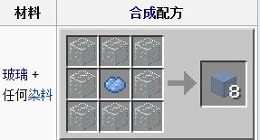
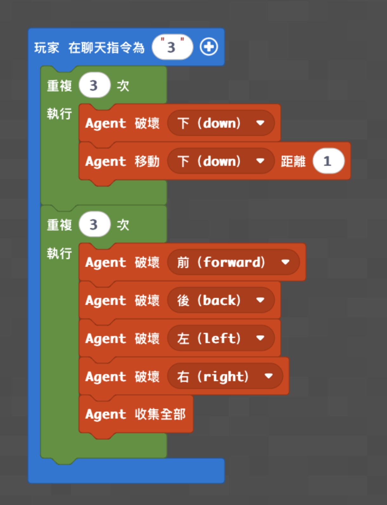
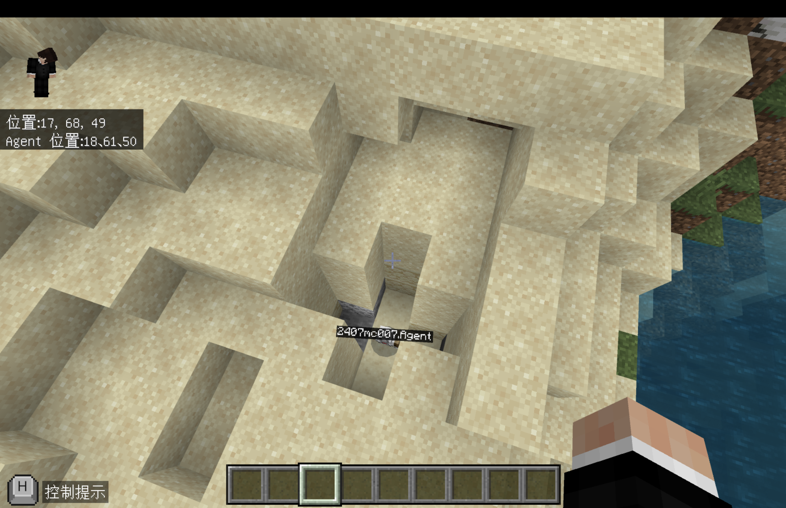
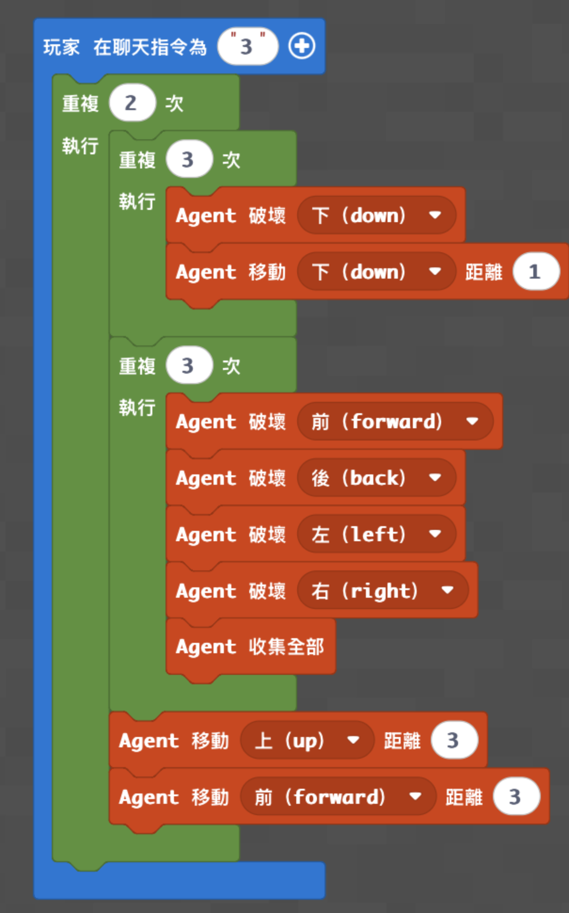
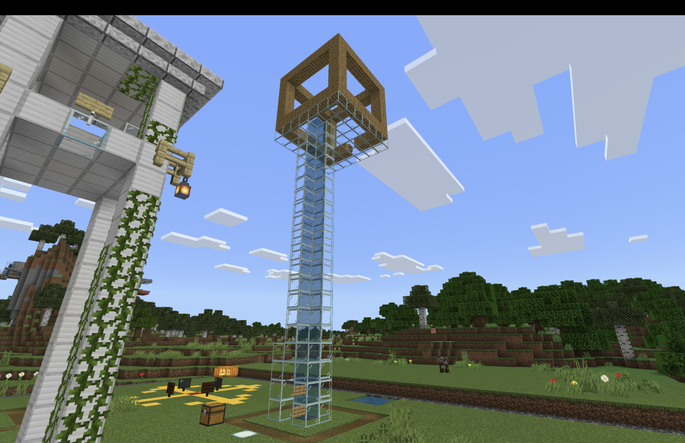
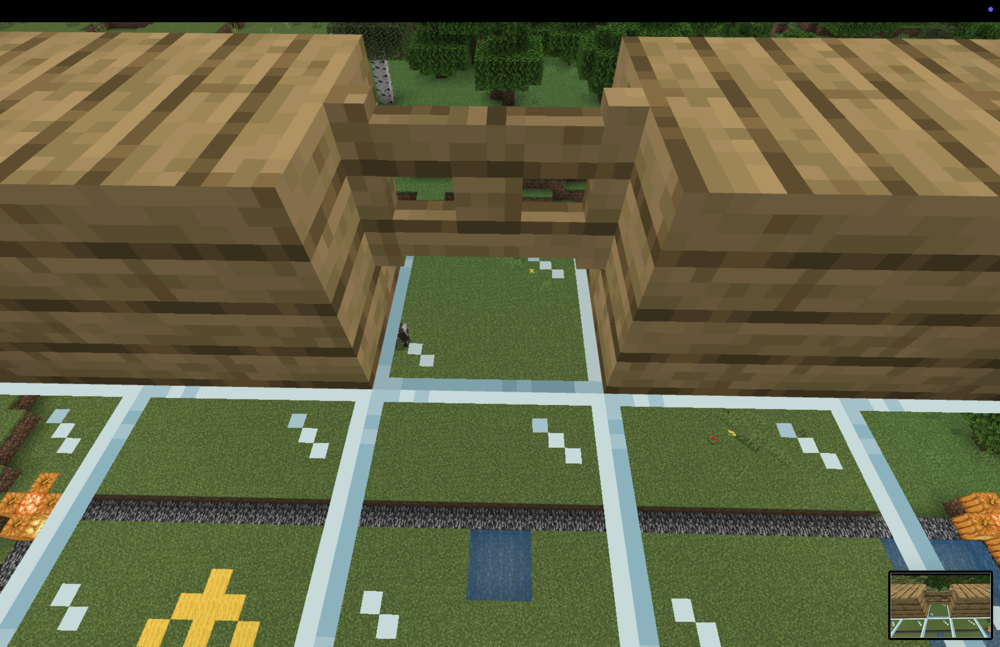

# 梯次 E｜巢狀迴圈：沙漠荒野

- 課程時間：09:00－12:00
- 遊戲版本：Minecraft Education
- 程式平台：Microsoft MakeCode（Python／積木）
- 核心概念：Agent 控制、方向、迴圈、巢狀迴圈、自動收集、材料再利用

## 課程目標

學生先控制 Agent 自動挖掘與收集沙子，再把沙子燒成玻璃，完成染色玻璃、空中橋或天空建築。課程會把「取得材料」和「使用材料」連成一個完整任務，讓學生理解自動化程式如何支援 Minecraft 的實際建造。

## 課前準備

- 正式上課地圖：[神木村 v6](../shared/maps/神木村v6.mcworld)
- 備用舊版地圖：[神木村 8 人版](maps/神木村8人版.mcworld)
- 確認每台電腦能加入老師世界、開啟 MakeCode 並控制 Agent。
- 在世界中找一塊厚度至少 6 格的沙地，分成互不重疊的挖掘區，每區至少 8×8 格。
- 每位學生或每組準備熔爐、燃料、工作台、花朵或染料，以及建造區所需的水與海草。
- 高階學生須把玻璃放入 Agent 第 1 格，並在空中橋起點確認 Agent 面向。
- 老師先備份乾淨世界；需要重置時重新開啟備份，避免殘留深坑或半成品建築。

> 低、中階程式來自既有教案與積木截圖；高階程式為本次公版新增。三份程式皆需由老師在當期 Minecraft Education 版本做一次課前實機測試。

## 半日營流程

| 時間 | 教學內容 |
|---|---|
| 09:00－09:10 | 開場、分組與任務說明 |
| 09:10－09:35 | Minecraft 操作、Agent 六個方向與沙地分區 |
| 09:35－10:15 | 低階挖沙程式與材料收集 |
| 10:15－10:35 | 熔煉玻璃、染色玻璃與功能除錯 |
| 10:35－10:45 | 休息 |
| 10:45－11:25 | 中階擴大挖掘或高階玻璃造橋 |
| 11:25－11:50 | 天空建造挑戰與成果驗收 |
| 11:50－12:00 | 程式概念複習與收尾 |

## 遊戲內容｜沙子變成天空之城

### 遊戲準備

- 每位學生或每組使用自己的沙地與建造區，不跨區挖掘或建造。
- 練習回合先執行一次程式，確認 Agent 不會卡住、掉入水中或挖到別人的區域。
- 正式挑戰前把沙子、玻璃與染色玻璃數量清點一次。
- 只計算使用自己程式取得的沙子所製作出的玻璃。

### 學生任務

1. 完成低階或中階挖沙程式並收集沙子。
2. 把沙子放入熔爐製成玻璃，再用染料製作至少一種染色玻璃。
3. 使用玻璃完成空中橋、觀景台或天空房屋；高階學生使用自己的造橋程式完成橋面。
4. 讓同組成員實際走過空中橋，確認沒有缺口且能安全抵達建築。

### 計分與結束

- 正式建造時間為 20 分鐘。
- 使用自己取得的玻璃完成可通行橋面：10 分。
- 使用至少兩種玻璃顏色：5 分。
- 完成一個可進入的天空建築或觀景台：10 分。
- 能說明外層與內層迴圈分工：5 分。
- 橋面有缺口、使用別組材料或進入別組區域，不計該項分數。
- 時間到後停止建造，由各組帶老師走過橋面；總分最高者完成進階挑戰，同分則並列。



## 分級程式

### 低階｜單點挖沙機器人

**任務：** 讓 Agent 向下挖三格，再重複清除前、後、左、右的沙子並收集掉落物。

**完成標準：** 輸入 `3` 後，Agent 能完成單一挖掘點，學生可取得沙子並燒成玻璃。

**知識點：** Agent 六個方向、指令順序、兩段迴圈、沙子受重力影響後繼續落下。

**Python 程式碼：** [下載／查看 low.py](code/low.py)

```python
def on_on_chat():
    for index in range(3):
        agent.destroy(DOWN)
        agent.move(DOWN, 1)
    for index2 in range(3):
        agent.destroy(FORWARD)
        agent.destroy(BACK)
        agent.destroy(LEFT)
        agent.destroy(RIGHT)
        agent.collect_all()
player.on_chat("3", on_on_chat)
```





**MakeCode 分享連結：** https://makecode.com/_1MwJ2AJkH51R

### 中階｜雙點挖沙機器人

**任務：** 使用外層迴圈完成兩個挖掘點；每次挖完後回到地面、向前移動，再開始下一個位置。

**完成標準：** 輸入 `3` 後，Agent 能完成兩個相隔 3 格的挖掘點並收集材料。

**知識點：** 巢狀迴圈、工作區移動、回到地表、把一個完整流程重複使用。

**Python 程式碼：** [下載／查看 medium.py](code/medium.py)

```python
def on_on_chat():
    for index in range(2):
        for index2 in range(3):
            agent.destroy(DOWN)
            agent.move(DOWN, 1)
        for index3 in range(3):
            agent.destroy(FORWARD)
            agent.destroy(BACK)
            agent.destroy(LEFT)
            agent.destroy(RIGHT)
            agent.collect_all()
        agent.move(UP, 3)
        agent.move(FORWARD, 3)
player.on_chat("3", on_on_chat)
```



**MakeCode 分享連結：** https://makecode.com/_UsRUDsc3wRai

### 高階｜自動建造玻璃空中橋

**任務：** 把收集到的沙子製成玻璃，放進 Agent 第 1 格，再使用巢狀迴圈建造 3 格寬、12 排長的橋面。

**完成標準：** 輸入 `3` 後，Agent 能完成連續無缺口的玻璃橋，學生可實際走到天空建造區。

**知識點：** 巢狀迴圈、物品欄選擇、每排寬度、回到同一側、材料取得與建造的程式閉環。

**Python 程式碼：** [下載／查看 high.py](code/high.py)

```python
def on_on_chat():
    agent.set_slot(1)
    agent.move(UP, 1)
    for index in range(12):
        for index2 in range(3):
            agent.place(DOWN)
            agent.move(RIGHT, 1)
        agent.move(LEFT, 3)
        agent.move(FORWARD, 1)
player.on_chat("3", on_on_chat)
```

**積木程式圖片：** 待補（現有附件沒有這份新增高階程式的積木截圖）





**MakeCode 分享連結：** https://makecode.com/_9PfXyeEYfUbE

## 場地、座標與保存

### 地圖內座標

- 原執行截圖記錄玩家約在 `(17, 68, 49)`、Agent 約在 `(16, 61, 50)`；這只能作為舊世界的挖沙參考點。
- 正式使用神木村 v6 時，老師必須重新確認該位置是否仍為足夠厚的沙地，不可直接把舊座標當成固定起點。
- 每區至少保留 8×8 格；中階程式的 Agent 會向前移動，因此各區前方還需保留 6 格以上。
- 高階橋面需要前方 12 格、左右 3 格的無障礙空間，並避免跨入其他學生區域。

### 場地生成與重置

- 本課主要場地是自然沙地與學生建築，不需要另外提供教師場地生成 Python。
- 本課沒有已確認的結構方塊檔；沙坑與天空作品會隨學生程式改變，使用乾淨世界備份重置最簡單。
- 若沙地不足，老師可在課前於分區鋪設至少 8×8×6 的沙層；不要讓學生程式在共用區大量生成或清除方塊。
- 若需保留天空作品，可分區匯出世界，或用結構方塊分段保存並記錄相同基準點與載入偏移。

## 上課知識點與講解方式

- **沙子的重力：** 側邊沙子被破壞後，上方沙子會掉下來，因此同一方向重複破壞仍可能取得新方塊。
- **方向：** `DOWN/UP` 控制深度，`FORWARD/BACK` 與 `LEFT/RIGHT` 是成對方向。
- **迴圈：** 低階用兩段迴圈完成下降與收集；中階把整個挖掘流程放入外層迴圈。
- **巢狀迴圈：** 中階的內層負責一個挖掘點，外層負責換到下一個工作區；高階的內層負責橋寬，外層負責橋長。
- **基準位置：** 建完一排後向左移動相同格數，Agent 才會回到下一排的起點。
- **除錯順序：** 先看 Agent 面向，再看是否有足夠沙層或玻璃，最後檢查迴圈次數及返回距離。
- **材料再利用：** 沙子不是終點；程式取得的材料要經過熔煉、染色與建造，才完成整個任務。

## 程式示範影片

- [取得沙子：巢狀迴圈](https://youtu.be/N1fw4wxvzAA?list=PL3600H0DVFhSzXec8B_GPnGsuRxV6wqmv)
- [沙漠神殿知識](https://youtu.be/QhrR3vRyIf8)
- [玻璃知識](https://youtu.be/LAbHHS00DQk)
- [一桶水建造高速電梯](https://youtu.be/Q2zePjnD-FE)
- [玻璃－中文 Minecraft Wiki](https://zh.minecraft.wiki/w/%E7%8E%BB%E7%92%83?variant=zh-tw)

## 家長回饋公版

親愛的家長您好：

今天孩子參加 Minecraft 半日營「沙漠荒野」，使用 MakeCode 控制 Agent 自動挖掘與收集沙子，再把沙子燒成玻璃，完成染色玻璃、空中橋或天空建築。

程式課程的重點是 Agent 的六個方向、指令順序、迴圈與巢狀迴圈。孩子完成了＿＿＿＿程式，並把程式取得的材料實際用在＿＿＿＿作品中，體驗從資源採集到建造成果的完整流程。

今天孩子在＿＿＿＿方面表現良好；遇到＿＿＿＿時，也能透過檢查 Agent 面向、工作區、材料數量與迴圈次數進行除錯。回家後可以請孩子分享內層與外層迴圈分別負責什麼，以及沙子如何一步步變成天空建築。
