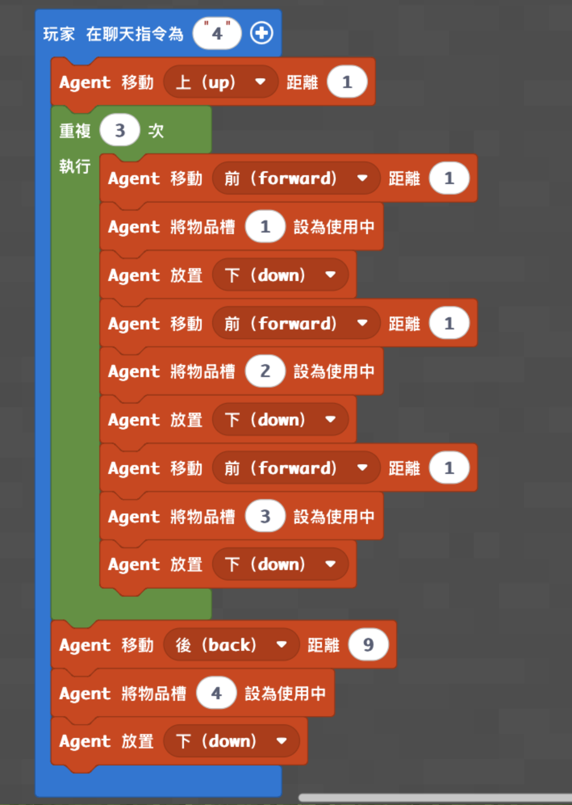
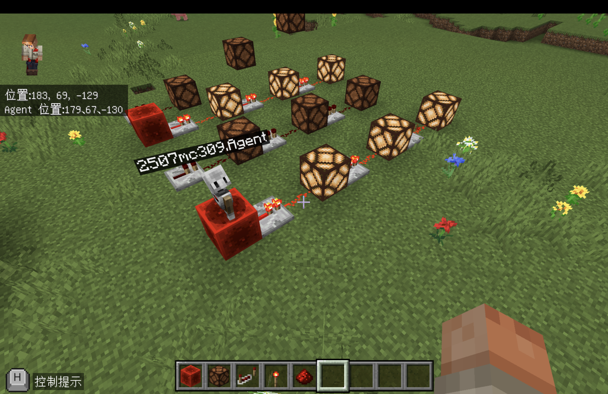
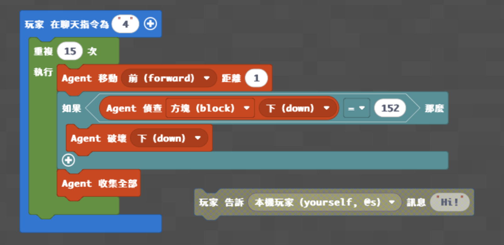
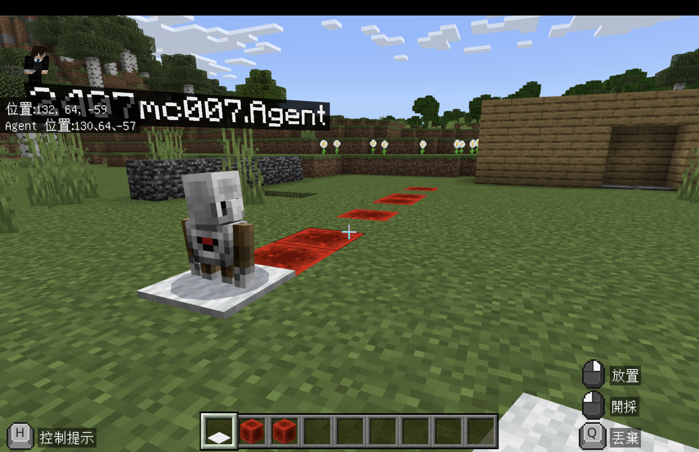
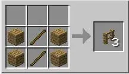
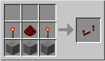
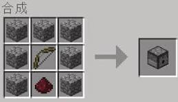

# 梯次 F｜條件判斷：紅石樂園

- 課程時間：09:00－12:00
- 遊戲版本：Minecraft Education
- 程式平台：Microsoft MakeCode（Python／積木）
- 核心概念：Agent 控制、物品欄切換、迴圈、條件判斷、方塊偵測、紅石訊號

## 課程目標

學生先使用 Agent 排列紅石元件，觀察元件順序、方向與供電方式；接著撰寫條件判斷程式，讓 Agent 沿測試路線辨識紅石方塊，只在條件成立時破壞並收集。進度快的學生再加入 `else`，替非目標方塊留下分類標記，完成可直接驗收的紅石巡邏挑戰。

## 課前準備

- 正式上課地圖：[神木村 v6](../shared/maps/神木村v6.mcworld)
- 備用舊版地圖：[神木村 8 人版](maps/神木村8人版.mcworld)
- 確認每台電腦能加入老師世界、開啟 MakeCode 並控制 Agent。
- 把學生權限設為操作者，並替每位學生或每組劃分互不重疊的紅石實驗區。
- 低階程式把以下物品依序放入 Agent 物品欄：第 1 格紅石方塊、第 2 格紅石燈、第 3 格紅石中繼器、第 4 格紅石火把。
- 中、高階各準備一條 15 格測試路線，在安全方塊中混放紅石方塊；高階另把黃色羊毛或其他醒目方塊放入 Agent 第 1 格，並保留路線右側空間。
- 老師先備份乾淨世界；每回合結束後補回被挖除的紅石方塊與分類標記，或重新開啟備份。


## 半日營流程

| 時間 | 教學內容 |
|---|---|
| 09:00－09:10 | 開場、分組與紅石任務說明 |
| 09:10－09:35 | Minecraft 操作、Agent 方向、紅石元件與訊號方向 |
| 09:35－10:15 | 低階紅石燈排列程式與功能測試 |
| 10:15－10:35 | 紅石燈驗收、除錯與小組挑戰 |
| 10:35－10:45 | 休息 |
| 10:45－11:25 | 中階條件判斷；進度快者完成高階 `if/else` 分類 |
| 11:25－11:50 | 紅石巡邏辨識賽與成果驗收 |
| 11:50－12:00 | 程式概念複習與收尾 |

## 遊戲內容｜紅石巡邏辨識賽

### 遊戲準備

- 低階區：每組一條至少 12 格長的直線，起點上方與前方保持淨空。
- 中階區：每組一條 15 格路線，在安全方塊中混放 5 個紅石方塊；所有組別的目標數量相同。
- 高階區：使用相同的 15 格路線，並清空路線右側，讓 Agent 放置非目標方塊的分類標記。
- 練習回合先確認 Agent 面向、物品欄內容與起點；正式回合開始後不可手動修改路線。

### 學生任務

1. 低階學生輸入 `4`，讓 Agent 排出三組紅石元件並回到起點放置紅石火把，再檢查排列順序及可亮起的燈。
2. 中階學生輸入 `4`，讓 Agent 走完 15 格，只挖除路線中的紅石方塊。
3. 高階學生輸入 `4`，讓 Agent 挖除紅石方塊；遇到其他方塊時，在右側放置分類標記。
4. 程式停止後，學生依結果說明哪個條件成立、哪個分支被執行，以及錯誤發生在哪一格。

### 計分與結束

- 各程度分開計分，正式回合以一次程式執行為限。
- 低階：每個正確位置 1 分，紅石火把回到起點並成功放置 1 分；最高 10 分。
- 中階：正確挖除一個紅石方塊 2 分，漏挖一個扣 1 分，誤挖安全方塊扣 2 分。
- 高階：沿用中階計分；每個非目標位置有正確右側標記再得 1 分。
- Agent 走完 15 格或停止移動即結束；同分時，以能正確說明判斷條件與除錯方法者優先。
- 下一回合由老師補回 5 個目標方塊、移除標記並讓 Agent 回到相同起點。

## 分級程式

### 低階｜紅石燈排列機器人

**任務：** 使用一次迴圈，讓 Agent 依序放置紅石方塊、紅石燈與中繼器，共完成三組排列，最後回到起點放置紅石火把。

**完成標準：** 輸入 `4` 後，Agent 能完成九格排列並在起點放置第 4 格物品。

**知識點：** 指令順序、Agent 方向、物品欄切換、重複三次、中繼器具有方向。

**Python 程式碼：** [下載／查看 low.py](code/low.py)

```python
def on_on_chat():
    agent.move(UP, 1)
    for index in range(3):
        agent.move(FORWARD, 1)
        agent.set_slot(1)
        agent.place(DOWN)
        agent.move(FORWARD, 1)
        agent.set_slot(2)
        agent.place(DOWN)
        agent.move(FORWARD, 1)
        agent.set_slot(3)
        agent.place(DOWN)
    agent.move(BACK, 9)
    agent.set_slot(4)
    agent.place(DOWN)
player.on_chat("4", on_on_chat)
```





**功能測試：** 先檢查四個物品欄，再確認排列順序、Agent 返回距離與中繼器方向；若燈未亮，依序檢查供電位置、中繼器朝向與紅石元件間距。

**MakeCode 分享連結：** https://makecode.com/_E9PHhviquXK6

### 中階｜紅石方塊辨識機器人

**任務：** 讓 Agent 沿 15 格路線移動，偵測下方方塊；只有方塊 ID 等於 `152` 時才破壞，並收集掉落物。

**完成標準：** 輸入 `4` 後，Agent 能走完測試路線，只挖除紅石方塊並保留其他方塊。

**知識點：** `if` 條件判斷、比較運算、方塊偵測、條件成立才執行、迴圈中的重複檢查。

**Python 程式碼：** [下載／查看 medium.py](code/medium.py)

```python
def on_on_chat():
    for index in range(15):
        agent.move(FORWARD, 1)
        if agent.inspect(AgentInspection.BLOCK, DOWN) == 152:
            agent.destroy(DOWN)
        agent.collect_all()
player.on_chat("4", on_on_chat)
```





**功能測試：** 在 15 格路線中放入已知數量的紅石方塊，執行後清點被挖除的格數與 Agent 收集數量。

**MakeCode 分享連結：** https://makecode.com/_8VmFUYbq3Wyh

### 高階｜雙向分類巡邏機器人

**任務：** 延伸成 `if/else`。遇到紅石方塊時挖除並收集；遇到其他方塊時，使用 Agent 第 1 格物品在路線右側放置標記。

**完成標準：** 輸入 `4` 後，Agent 能走完 15 格；紅石方塊被挖除，其他位置旁都有分類標記。

**知識點：** `if/else` 互斥分支、把辨識結果轉成不同動作、以視覺標記驗證程式結果。

**Python 程式碼：** [下載／查看 high.py](code/high.py)

```python
def on_on_chat():
    agent.set_slot(1)
    for index in range(15):
        agent.move(FORWARD, 1)
        if agent.inspect(AgentInspection.BLOCK, DOWN) == 152:
            agent.destroy(DOWN)
            agent.collect_all()
        else:
            agent.place(RIGHT)
player.on_chat("4", on_on_chat)
```

**積木程式圖片：** 待補（現有附件沒有這份新增高階程式的積木截圖）

**功能測試：** 清點紅石方塊是否全被挖除，再檢查每個安全方塊右側是否有一個標記；若標記方向相反，先調整 Agent 起始面向再執行。

**MakeCode 分享連結：** https://makecode.com/_c3wHWj6uq0z8

## 場地、座標與保存

### 地圖內座標

- 低階既有執行畫面記錄：玩家約在 `(188, 69, -129)`，Agent 約在 `(179, 67, -130)`。
- 中階既有執行畫面記錄：玩家約在 `(132, 64, -59)`，Agent 約在 `(130, 64, -57)`。
- 自動農場參考位置：玩家約在 `(91, 82, -46)`，Agent 約在 `(76, 68, -34)`。
- 活塞門參考位置：玩家約在 `(138, 66, -87)`，Agent 約在 `(110, 56, -60)`。
- 上述座標來自舊版執行畫面，只作為找場地的參考；正式使用神木村 v6 時，老師需重新確認地形與 Agent 面向。

### 場地建立與重置

- 本課沒有已確認的結構方塊檔，也不需要大型固定地形；用直線方塊即可快速建立測試路線。
- 中、高階路線的基準點是 Agent 起點：程式先向前一格再偵測，因此第一個受測方塊要放在 Agent 正前方一格的下方。
- 每條路線固定 15 格，並記錄起點、面向與 5 個紅石方塊的位置；下一回合依相同記錄補回即可。
- 最可靠的保存方式是保留一份乾淨世界備份。若多人同時使用，先複製世界再開課，避免不同班級互相影響。

## 上課知識點與講解方式

- **紅石訊號：** 紅石方塊、紅石火把都能提供訊號；紅石燈收到訊號會亮，中繼器則有固定傳遞方向。
- **物品欄切換：** `set_slot` 就像叫 Agent 換工具；數字必須和老師放入的物品格位一致。
- **迴圈：** 低階把三個元件的排列重複三次；中、高階把「移動、偵測、判斷」重複 15 次。
- **條件判斷：** `if` 是「如果下方是紅石方塊，才挖除」；不是目標時，程式會跳過該動作。
- **`if/else`：** 高階將兩種結果分流；同一格只會執行「挖除」或「放標記」其中一個分支。
- **方塊 ID：** 程式用 `152` 辨識紅石方塊。老師可把它比喻為方塊的身分證號碼。
- **除錯順序：** 先看 Agent 是否朝向路線，再看受測方塊是否位於下方，最後檢查 ID、迴圈次數與物品欄。
- **程式閉環：** 排列程式要實際測試紅石訊號；辨識程式要用實際路線驗收正確率，不能只以積木完成作為終點。

## 紅石建造延伸

以下活動保留給提早完成的小組。它們是手動紅石建造，不取代低、中、高三份 Agent 程式。

### 半自動農場

- 建造範圍：6×5。
- 材料：漏斗 5、箱子 2、柵欄 30、種子 30、發射器 5、紅石粉 20、紅石中繼器 1、拉桿 1。
- 老師另準備發射器所需的弓 5 把，以及漏斗所需的鐵 30 個。
- 完成後拉動拉桿，檢查發射器與收集系統是否能正常運作。









### 2×2 紅石活塞門

老師先依影片完成一次示範並準備黏性活塞、紅石粉、紅石火把、中繼器、壓力板與建材。學生完成後站上壓力板或啟動紅石訊號，驗收門能否完整開關。


## 程式示範影片

- [用紅石裝置練習物品欄切換](https://www.youtube.com/watch?v=2MD8TdhEpB0)
- [IF 判斷：如果符合條件就挖方塊](https://www.youtube.com/watch?v=FgE41-f3lec)
- [你可能不知道的紅石 10 件事](https://youtu.be/eAq2rPhRoow)
- [紅石小學堂：認識紅石](https://youtu.be/OmNe2nzbSew)
- [半自動小麥收割機](https://youtu.be/XzjnPqRDU00)
- [隱藏 2×2 活塞門](https://youtu.be/VuXbVEHB0xI)

## 家長回饋公版

親愛的家長您好：

今天孩子參加 Minecraft 半日營「紅石樂園」，先認識紅石元件與訊號方向，再使用 MakeCode 控制 Agent 排列紅石裝置，並透過條件判斷辨識路線中的紅石方塊。

程式課程的重點是 Agent 方向、物品欄切換、迴圈與 `if` 條件判斷。孩子完成了＿＿＿＿程式，並在＿＿＿＿挑戰中實際測試自己的程式，觀察條件成立時 Agent 如何執行指定動作。

今天孩子在＿＿＿＿方面表現良好；遇到＿＿＿＿時，也能透過檢查 Agent 面向、方塊位置、物品欄與判斷條件進行除錯。回家後可以請孩子分享：電腦如何判斷「是不是目標方塊」，以及 `if` 和 `else` 分別會做什麼。
