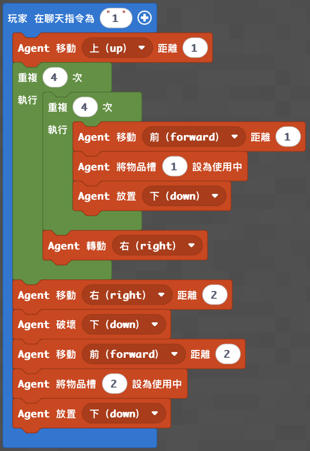

# 梯次 G｜迴圈與方向：怪物專家

## 基本資訊

- 課程時間：09:00－12:00
- 遊戲版本：Minecraft Education
- 程式平台：Microsoft MakeCode（Python／積木）
- 核心概念：Agent 控制、迴圈、巢狀迴圈、方向與轉向、物品欄切換、自動建造

## 課程目標

學生使用 Agent 自動建造終界門、地獄門或附魔台，理解同一組放置指令如何搭配移動、轉向與迴圈完成不同結構。每個程度完成後都要實際啟動或使用自己的作品：終界門要成功亮起、地獄門要能進入探索、附魔台要用來附魔武器並進行怪物場挑戰。


## 課前準備

- 正式上課地圖：[神木村 v8](../shared/maps/神木村v8.mcworld)
- 備用舊版地圖：[神木村 8 人版](maps/神木村8人版.mcworld)
- 確認每台電腦能加入老師世界、開啟 MakeCode 並控制 Agent。
- 替每位學生或每組保留至少 10×10 格的平坦建造區，各區間隔至少 5 格。
- 低階：Agent 第 1 格放終界傳送門框；終界之眼由玩家手動放置。
- 中階：Agent 第 1 格放黑曜石、第 2 格放打火石；在地獄端預先建立安全平台與返回傳送門。
- 高階：Agent 第 1 格放書櫃、第 2 格放附魔台；另準備青金石、鑽石劍或製作材料。
- 怪物場由老師課前建好，設定清楚的入口、出口與安全觀戰區；依班級程度控制怪物種類與數量。
- 老師保留乾淨世界備份。傳送門或附魔區需重置時，優先重新開啟備份，不讓學生在共用場地反覆堆疊結構。


## 教師備課快速總覽

| 教學階段 | 老師帶學生完成的程式 | 程式完成標準 | 完成後的遊戲或比賽 |
| --- | --- | --- | --- |
| 低階 | Agent 蓋終界門 | 完成 12 個正確朝向的框架並啟動 | 終界門啟動驗收 |
| 中階 | Agent 蓋地獄門 | 完成門框、點燃並可安全往返 | 地獄探索任務 |
| 高階 | Agent 蓋附魔台 | 完成書櫃外框、附魔台與武器附魔 | 附魔怪物場挑戰 |

## 半日營標準流程

| 時間 | 教學內容 |
|---|---|
| 09:00－09:10 | 開場、分組與怪物專家任務說明 |
| 09:10－09:35 | Minecraft 操作、Agent 面向、移動與轉向 |
| 09:35－10:15 | 低階終界門程式與啟動驗收 |
| 10:15－10:35 | 傳送門除錯與終界門啟動賽 |
| 10:35－10:45 | 休息 |
| 10:45－11:25 | 中階地獄門或高階附魔台程式 |
| 11:25－11:50 | 地獄探索／附魔怪物場挑戰 |
| 11:50－12:00 | 成果分享、程式概念複習與收尾 |

## 遊戲內容｜怪物世界通行證

### 遊戲準備

- 各程度分開驗收與計分，不以程式長短互相比較。
- 正式回合前只進行一次練習，確認 Agent 起點、面向、材料格位與建造區淨空。
- 終界門只進行啟動驗收；除非老師已準備安全返回方式，學生不可進入終界。
- 地獄端放置一個清楚可見的任務標記或寶箱，距離傳送門不超過 15 格，並封鎖岩漿與高落差區域。
- 怪物場每組使用相同的怪物數量；學生使用自己在附魔台完成的武器參加。

### 學生任務

1. 低階：讓 Agent 建好 12 個終界門框，學生手動放入終界之眼，成功啟動傳送門。
2. 中階：讓 Agent 建好並點燃地獄門，穿越傳送門取得任務標記，再從同一扇門返回。
3. 高階：讓 Agent 建好書櫃與附魔台，使用自己的附魔台強化武器，再進入怪物場完成清場。
4. 每組完成後向老師說明：哪一段迴圈負責哪一邊、Agent 的起點與面向為什麼重要。

### 計分與結束

- 低階：12 個框架位置正確 12 分；成功啟動再得 5 分。
- 中階：門框完整 10 分、成功點燃 5 分、取得標記並安全返回 10 分。
- 高階：書櫃外框完成 10 分、附魔台位置正確 5 分、完成附魔 5 分、怪物場清場 10 分。
- 誤入他組建造區、手動補門框或在正式回合切換創造模式，不計該功能分數。
- 傳送門成功啟動、地獄任務返回或怪物場清空即結束；同分時，以能完整說明路徑與除錯方式者優先。

## 低、中、高分級教學

### 低階｜Agent 蓋終界門

**任務：** 使用一個外層迴圈完成四邊，每邊依序放置三個終界傳送門框，再向右轉進入下一邊。

**完成標準：** 輸入 `3` 後，Agent 能放置 12 個框架；學生手動放入終界之眼後，傳送門能成功啟動。

**知識點：** 重複四次、移動與放置順序、右轉、框架必須朝向中心。

**Python 程式碼：** [下載／查看 low.py](code/low.py)

```python
def on_on_chat():
    agent.set_slot(1)
    for index in range(4):
        agent.place(FORWARD)
        agent.move(RIGHT, 1)
        agent.place(FORWARD)
        agent.move(RIGHT, 1)
        agent.place(FORWARD)
        agent.turn(RIGHT_TURN)
player.on_chat("3", on_on_chat)
```


**功能測試：** 檢查 12 個框架是否都朝向中心，再逐一放入終界之眼；任何一格方向錯誤都無法啟動，可用來帶學生理解面向與起點。

**MakeCode 分享連結：** https://makecode.com/_edW5vH9dxYhJ

### 中階｜Agent 蓋地獄門

**任務：** 使用四段迴圈分別建造下、右、上、左四邊，切換到第 2 格後，讓 Agent 回到門框內使用打火石。

**完成標準：** 輸入 `3` 後，Agent 能建造完整黑曜石門框並成功點燃紫色傳送門。

**知識點：** 四個不同方向、不同迴圈次數、物品欄切換、二維路徑規劃、依順序回到點火位置。

**Python 程式碼：** [下載／查看 medium.py](code/medium.py)

```python
def on_on_chat():
    agent.set_slot(1)
    for index in range(4):
        agent.place(FORWARD)
        agent.move(RIGHT, 1)
    for index2 in range(4):
        agent.place(FORWARD)
        agent.move(UP, 1)
    for index3 in range(5):
        agent.place(FORWARD)
        agent.move(LEFT, 1)
    for index4 in range(5):
        agent.place(FORWARD)
        agent.move(DOWN, 1)
    agent.set_slot(2)
    agent.move(RIGHT, 1)
    agent.move(UP, 1)
    agent.place(FORWARD)
player.on_chat("3", on_on_chat)
```


**功能測試：** 逐邊檢查黑曜石是否連續，再確認 Agent 切換到打火石並在門框內點火；啟動後實際進入老師準備的安全任務區並返回。

**MakeCode 分享連結：** https://makecode.com/_Vg82DrL6fiHq

### 高階｜Agent 蓋附魔台

**任務：** 使用巢狀迴圈繞四邊放置書櫃，再移動到中心清除地面並放置附魔台。

**完成標準：** 輸入 `1` 後，Agent 能完成書櫃外框並在中央放置附魔台；學生可使用它完成武器附魔。

**知識點：** 巢狀迴圈、四邊與每邊的分工、轉向、中心定位、物品欄切換。

**Python 程式碼：** [下載／查看 high.py](code/high.py)

```python
def on_on_chat():
    agent.move(UP, 1)
    for index in range(4):
        for index2 in range(4):
            agent.move(FORWARD, 1)
            agent.set_slot(1)
            agent.place(DOWN)
        agent.turn(RIGHT_TURN)
    agent.move(RIGHT, 2)
    agent.destroy(DOWN)
    agent.move(FORWARD, 2)
    agent.set_slot(2)
    agent.place(DOWN)
player.on_chat("1", on_on_chat)
```




**功能測試：** 確認書櫃沒有重疊、四邊能閉合、中心地面已清除，並使用自己完成的附魔台附魔武器。

**MakeCode 分享連結：** https://makecode.com/_Y32W6zgWc4rW

## 場地、座標與保存

### 地圖內座標

- 既有附件沒有記錄終界門、地獄門、附魔區或怪物場的可靠座標，因此公版不填入推測數字。
- 老師選定神木村 v8 的平坦區後，記錄各組建造區的基準座標與 Agent 面向；建議用告示牌標示「起點」與箭頭。
- 低階基準點：Agent 站在方形外側，面向將要放置框架的位置。
- 中階基準點：Agent 站在門框左下角起點的前方，`FORWARD` 朝向門框平面。
- 高階基準點：Agent 位於書櫃外框起點，前方與右側至少保留 6 格空間。

### 場地建立與重置

- 本課建築由學生程式直接生成，不需要另外提供教師場地生成 Python。
- 本課沒有已確認的結構方塊檔；傳送門與附魔台尺寸小，使用乾淨世界備份或手動清除即可重置。
- 若老師要長期固定位置，可記錄「起點座標＋Agent 面向＋各組間距」，比只記建築中心座標更容易重現。
- 地獄端的安全平台與返回門應包含在世界備份中；每次開課前先測試雙向傳送與學生返回路線。

## 上課知識點與講解方式

- **指令順序：** 「先放再移」與「先移再放」會錯開一格；可讓學生用身體走路模擬 Agent。
- **方向是相對的：** `FORWARD` 取決於 Agent 面向，不是地圖固定的北方；起點正確但面向錯誤，整棟建築仍會轉向或位移。
- **迴圈：** 低階用一次迴圈完成四邊；中階用四段迴圈處理不同方向；高階把「四邊」和「每邊四格」拆成外、內層。
- **不同迴圈次數：** 地獄門四邊的長度不同，轉角也可能重疊，因此左右與上下不一定使用相同數字。
- **物品欄切換：** 同一支程式先使用建材，再換成點火或功能方塊；格位錯誤會讓結構完整但功能失敗。
- **中心定位：** 高階程式完成外框後，用已知位移回到中心；這就是用相對座標定位。
- **功能驗收：** 門框好看不代表成功；傳送門必須啟動、附魔台必須真的完成附魔，才算程式完成。
- **除錯順序：** 先看材料格位，再看 Agent 起點與面向，接著逐邊核對迴圈次數，最後檢查點火或中心位置。

## 附魔與怪物場活動

- 附魔台合成材料：書 1、鑽石 2、黑曜石 4。
- 學生使用書櫃、附魔台與青金石完成武器附魔。
- 怪物場以分組方式進行，每組使用相同怪物數量；清空場地後由老師開啟出口。
- 武器有損耗時，可再使用鐵磚 3 與鐵錠 4 合成鐵砧，示範修復或合併附魔。


## 程式示範影片

- [Agent 自動蓋終界傳送門](https://www.youtube.com/watch?v=QtqZxpNwxWE)
- [Agent 自動蓋地獄傳送門](https://youtu.be/EVcu0TxWyJk?list=PL3600H0DVFhSzXec8B_GPnGsuRxV6wqmv)
- [Agent 自動蓋附魔台](https://youtu.be/UpeoVeZAGRM?list=PL3600H0DVFhSzXec8B_GPnGsuRxV6wqmv)
- [附魔書櫃數量實測](https://youtu.be/UlZLMOro9lc)
- [Minecraft 新手附魔教學](https://youtu.be/aV1TDbfdcAo)
- [三叉戟 10 件事](https://youtu.be/8kKI2y7VnAI)
- [三叉戟－中文 Minecraft Wiki](https://zh.minecraft.wiki/w/%E4%B8%89%E5%8F%89%E6%88%9F?variant=zh-tw)
- [殭屍 10 件事](https://youtu.be/GtLJFKVdm_c)
- [骷髏 10 件事](https://youtu.be/IMCaMZgZpNo)
- [5 個生存小技巧](https://youtu.be/B6t0tI-fVqc)
- [成為 Minecraft 高手的 50 個小技巧](https://youtu.be/6fq7pQ2umyw)

## 家長回饋公版

親愛的家長您好：

今天孩子參加 Minecraft 半日營「怪物專家」，使用 MakeCode 控制 Agent 自動建造＿＿＿＿，並把完成的作品實際用於傳送門啟動、地獄探索或附魔怪物場挑戰。

程式課程的重點是 Agent 的方向與轉向、迴圈、物品欄切換，以及利用相對位置完成大型結構。孩子完成了＿＿＿＿程式，也能觀察每一段迴圈負責的建造位置，理解起點與面向會如何改變結果。

今天孩子在＿＿＿＿方面表現良好；遇到＿＿＿＿時，也能透過檢查材料格位、Agent 起點、面向與迴圈次數進行除錯。回家後可以請孩子分享：程式如何讓 Agent 繞完四邊，以及完成的傳送門或附魔台在挑戰中發揮了什麼作用。
