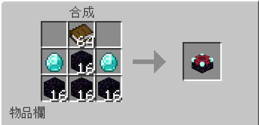
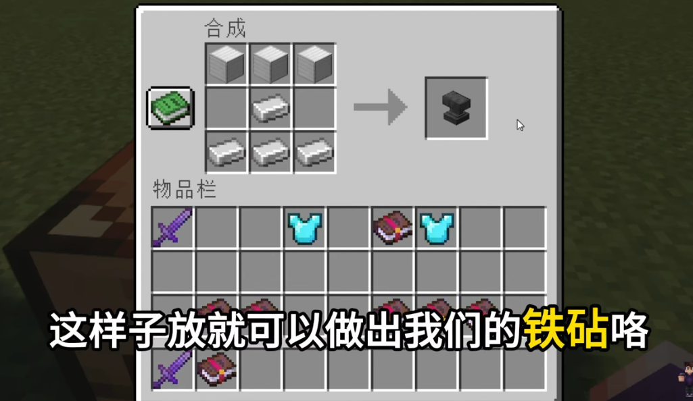
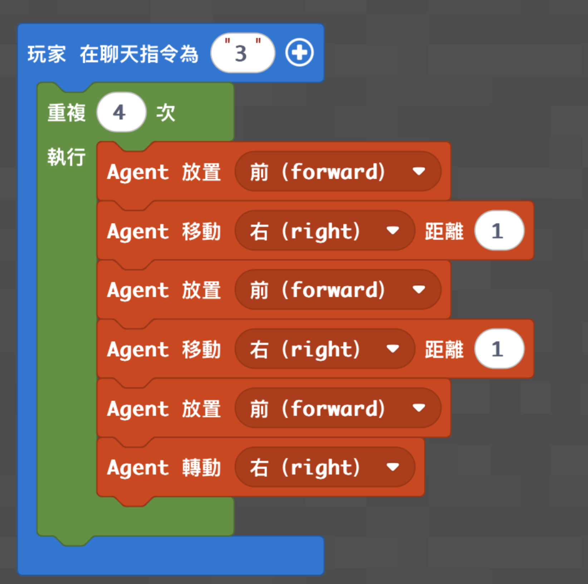
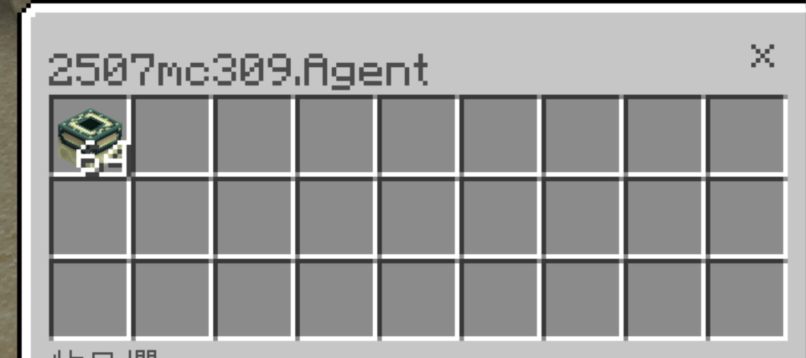
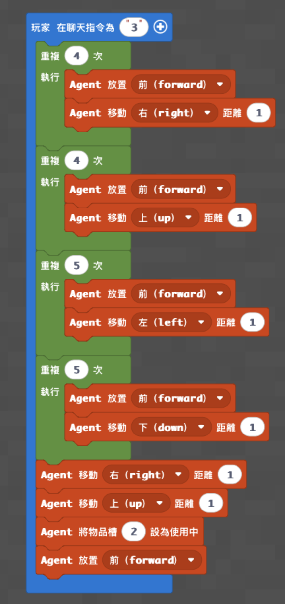
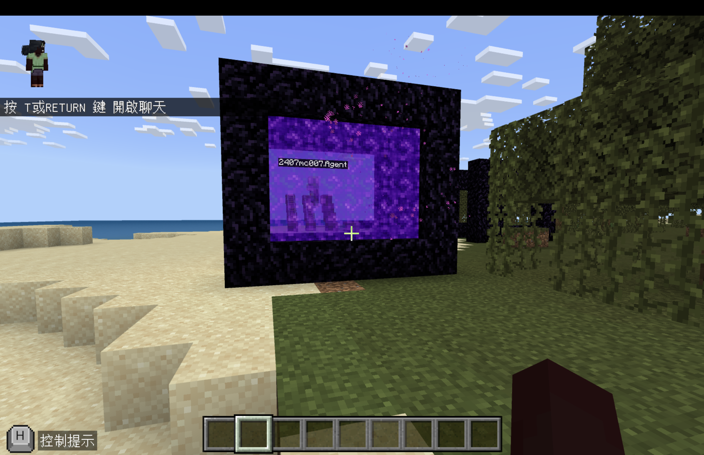
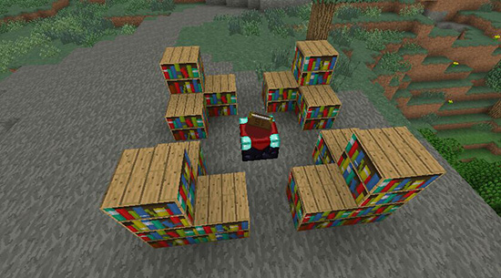
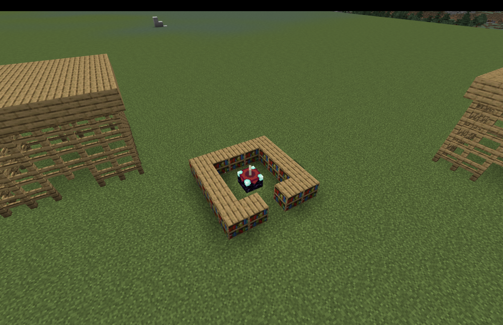

# 梯次G_迴圈與方向：怪物專家

- 課程時間：09:00－12:00
- 遊戲版本：Minecraft Education
- 程式平台：Microsoft MakeCode Python
- 核心概念：Agent 控制、迴圈、巢狀迴圈、方向與轉向、物品欄切換、自動建造
- 程式狀態：已從原教案保留三份文字程式碼，尚未在 Minecraft Education 實機驗證

> **來源差異警告：** 地獄門的 Notion 文字程式使用聊天指令 `1`，四段迴圈皆為 4 次；原積木截圖則顯示聊天指令 `3`，後兩段迴圈為 5 次。本版本的 `medium.py` 忠實保留文字程式，舊截圖也照原樣保存。尚未確認哪個版本才是正式授課版本，老師不可只照截圖抄寫，課前必須實機測試。

## 課前準備

- 使用地圖：[下載神木村8人版.mcworld](maps/神木村8人版.mcworld)
- 由老師開啟神木村世界，讓全班加入同一個世界。
- 學生執行程式時，將學生權限設置為操作者（皇冠）。
- 課前確認每台電腦能開啟 Minecraft Education、進入 MakeCode，並能貼上或建立程式。
- 準備平坦、無障礙物的建造區，避免不同學生的 Agent 互相干擾。
- 終界門：Agent 物品欄第 1 格放終界傳送門框；終界之眼要由玩家手動放置。
- 地獄門：Agent 物品欄第 1 格放黑曜石、第 2 格放打火石；Agent 從門框左下角的起始位置前方執行。
- 附魔台：Agent 物品欄第 1 格放書櫃、第 2 格放附魔台，並清除中心格的方塊。
- 附魔活動：準備黑曜石、書、鑽石、書櫃、青金石、木棍、鐵磚與鐵錠。
- 若要進行原教案的附魔活動，老師需事先建好怪物場，並確認學生能被傳送進場及在打完怪物後離場。
- 三支程式分開使用。切換版本前先停止舊程式，並清除 MakeCode 編輯器原有內容。

## 教師備課快速總覽

| 教學階段 | 老師帶學生完成的程式 | 程式完成標準 | 完成後的遊戲或活動 |
|---|---|---|---|
| **程式一：Agent 蓋終界門** | 使用迴圈讓 Agent 放置 12 個終界傳送門框並完成四邊結構 | 輸入 `3` 後，Agent 能繞行四邊並完成終界門框；玩家手動放置終界之眼後能啟動 | 功能測試；正式遊戲或競賽**目前缺少** |
| **程式二：Agent 蓋地獄門** | 使用四段迴圈完成門框四邊，再切換物品欄使用打火石 | 輸入 `1` 後，Agent 能完成黑曜石門框並看到紫色傳送門 | 功能測試；正式遊戲或競賽**目前缺少** |
| **程式三：Agent 蓋附魔台** | 使用巢狀迴圈繞圈放置書櫃，最後在中心放置附魔台 | 輸入 `1` 後，書櫃圍繞建造完成，中心位置有附魔台 | 製作並附魔鑽石劍、進入怪物場、使用鐵砧修復武器 |

## 遊戲內容

### 一、Minecraft 操作暖身

第一次玩的學生先練習：

- 移動、跳躍及轉動視角。
- 開啟物品欄並切換物品。
- 召喚 Agent，確認 Agent 面向及玩家看到的前、後、左、右方向。
- 練習把指定材料放進 Agent 正確的物品欄格位。

熟練的學生可以先協助確認建造區是否平坦，程式教學開始前回到集合地點。

### 二、程式一完成後：終界門功能測試

1. 將終界傳送門框放在 Agent 物品欄第 1 格。
2. 確認 Agent 周圍有足夠的平坦空間。
3. 在聊天欄輸入 `3`，觀察 Agent 是否放置 12 個框架並完成四邊。
4. Agent 無法放置終界之眼，由學生手動放置並確認終界門是否啟動。

原教案沒有記錄啟動後要進行的遊戲、任務、回合時間、得分或勝負條件；遊戲內容**目前缺少**。

### 三、程式二完成後：地獄門功能測試

1. 將黑曜石放在 Agent 物品欄第 1 格，打火石放在第 2 格。
2. 把 Agent 放在門框左下角起始位置的前方。
3. 在聊天欄輸入 `1`，觀察 Agent 是否依序完成右、上、左、下四邊。
4. 確認 Agent 會切換到第 2 格，移動到門框內並使用打火石。
5. 看到紫色傳送門後，才算完成程式功能測試。

原教案只記錄建造與啟動，沒有記錄進入地獄後的任務、競賽或勝負條件；遊戲內容**目前缺少**。

### 四、程式三完成後：附魔與怪物場活動

1. 學生使用自己完成的程式建造書櫃與附魔台。
2. 老師提供黑曜石、書、鑽石、書櫃及青金石，介紹附魔台需要的材料與使用方式。
3. 老師提供木棍、鑽石及青金石，讓學生製作鑽石劍並進行附魔。
4. 老師把全班傳送到課前準備好的怪物場；原教案規則為必須打完全部怪物才能出去。
5. 武器產生損耗後，老師提供鐵磚與鐵錠，讓學生合成鐵砧並修復武器。

原教案沒有記錄怪物數量、時間、個人或分組方式、計分、排名及重置方法；競賽細節**目前缺少**。

### 五、三叉戟資料

原教案的遊戲區另外連結了三叉戟影片與 Wiki，但沒有記錄學生要做的活動、材料、規則或完成條件，因此只保留為參考資料，實際遊戲內容**目前缺少**。

## 程式內容

### 程式示範影片

- 低階：[43 機器人自動蓋終界傳送門](https://www.youtube.com/watch?v=QtqZxpNwxWE)
- 中階：[44 機器人蓋地獄傳送門](https://youtu.be/EVcu0TxWyJk?list=PL3600H0DVFhSzXec8B_GPnGsuRxV6wqmv)
- 高階：[45 機器人蓋附魔台](https://youtu.be/UpeoVeZAGRM?list=PL3600H0DVFhSzXec8B_GPnGsuRxV6wqmv)

### 其他參考資料

- [附魔書櫃數量實測](https://youtu.be/UlZLMOro9lc)
- [Minecraft 新手附魔教學](https://youtu.be/aV1TDbfdcAo)
- [三叉戟 10 件事](https://youtu.be/8kKI2y7VnAI)
- [三叉戟－中文 Minecraft Wiki](https://zh.minecraft.wiki/w/%E4%B8%89%E5%8F%89%E6%88%9F?variant=zh-tw)
- [殭屍 10 件事](https://youtu.be/GtLJFKVdm_c)
- [骷髏 10 件事](https://youtu.be/IMCaMZgZpNo)
- [5 個生存小技巧](https://youtu.be/B6t0tI-fVqc)
- [成為 Minecraft 高手的 50 個小技巧](https://youtu.be/6fq7pQ2umyw)

### 程式一：Agent 蓋終界門

老師帶學生完成：

- 使用聊天指令 `3` 啟動程式。
- 每一邊連續放置三個終界傳送門框。
- 使用迴圈重複四次，並在每一邊完成後向右轉。
- 由學生手動放置終界之眼啟動傳送門。

**教學重點：** 使用迴圈取代四段重複指令，理解 Agent 的移動、轉向及建造方向。

**完成標準：** Agent 放置 12 個終界傳送門框並完成四邊，玩家手動放置終界之眼後能啟動。

**功能測試：** 輸入 `3`，檢查框架是否朝向中心；如果終界之眼無法啟動，先檢查框架方向。

**完成後活動：** 正式遊戲或競賽目前缺少。

- [開啟低階完整程式碼](code/low.py)

### 程式二：Agent 蓋地獄門

**備課警告：** 本段文字程式與原積木截圖的聊天指令及迴圈次數不一致；以下教學說明以文字程式 `medium.py` 為準，但仍屬尚未實機驗證版本。

老師帶學生完成：

- 使用聊天指令 `1` 啟動程式。
- 分別使用四個迴圈處理右、上、左、下四個方向。
- 使用 `agent.set_slot()` 在黑曜石與打火石之間切換。
- 讓 Agent 回到門框內部並使用打火石啟動傳送門。

**教學重點：** 不同方向需要不同的移動指令；程式執行順序與 Agent 起點會直接影響建築結果。

**完成標準：** Agent 能建造完整黑曜石門框並成功啟動紫色傳送門。

**功能測試：** 輸入 `1`，逐段檢查四邊建造、物品欄切換、回到門內與點火。

**完成後活動：** 正式遊戲或競賽目前缺少。

- [開啟中階完整程式碼](code/medium.py)

### 程式三：Agent 蓋附魔台

老師帶學生完成：

- 使用聊天指令 `1` 啟動程式。
- 使用外層迴圈完成四個方向。
- 使用內層迴圈讓 Agent 每一邊移動並放置四個書櫃。
- 移動到中心、清除中心格並放置附魔台。

**教學重點：** 使用巢狀迴圈處理四邊重複建造，並練習轉向、物品欄切換及中心位置判斷。

**完成標準：** Agent 能完成書櫃外框，並在中央放置附魔台。

**功能測試：** 輸入 `1`，確認書櫃不會重疊、四邊能閉合，中心格清除後附魔台能放置。

**完成後活動：** 製作及附魔鑽石劍，進入怪物場戰鬥，最後使用鐵砧修復武器。

- [開啟高階完整程式碼](code/high.py)

## 半日營標準流程

| 時間 | 流程大綱 |
|---|---|
| **09:00－09:10** | 開場、自我介紹與破冰 |
| **09:10－09:35** | 遊戲操作與自由探索 |
| **09:35－10:15** | 基礎程式教學 |
| **10:15－10:35** | 基礎功能測試與遊戲活動 |
| **10:35－10:45** | 休息時間 |
| **10:45－11:25** | 進階程式教學 |
| **11:25－11:50** | 進階功能測試與成果挑戰 |
| **11:50－12:00** | 課程複習與收尾 |

## 分級教學設計

本梯次使用三個不同的自動建造程式作為程度安排，不把低、中、高功能疊在同一個 MakeCode 專案。全班預設目標是完成中階；進度較快的學生可繼續完成附魔台程式與既有的附魔活動。

| 層級 | 適合學生 | 對應程式 | 完成後活動 |
|---|---|---|---|
| **低** | 年紀較小、第一次玩 Minecraft、第一次寫程式 | Agent 蓋終界門 | 啟動功能測試；正式遊戲目前缺少 |
| **中（全班預設）** | 大部分學生 | Agent 蓋地獄門 | 啟動功能測試；正式遊戲目前缺少 |
| **高** | 進度快、年紀較大、操作熟練或參加過多次 | Agent 蓋附魔台 | 附魔鑽石劍、怪物場戰鬥及鐵砧修復 |

## 實際程式碼

以下三份程式是獨立版本。貼上前先刪除 MakeCode Python 編輯器原有內容，不要將三份程式疊在同一個專案。三份程式均來自原教案，**尚未在 Minecraft Education 實機驗證**。

### 低階程式

- 程式名稱：Agent 蓋終界門
- 聊天指令：`3`
- [開啟完整程式碼](code/low.py)

### 中階程式（全班預設）

- 程式名稱：Agent 蓋地獄門
- 聊天指令：`1`
- [開啟完整程式碼](code/medium.py)

### 高階程式

- 程式名稱：Agent 蓋附魔台
- 聊天指令：`1`
- [開啟完整程式碼](code/high.py)

## 家長回饋

### 地獄門原回饋

查看原回饋

今天是 Minecraft 半日營的「麥塊程式怪物專家」！

今天孩子們體驗了主題「建造地獄門」，並透過程式操控機器人自動建造並啟動一個地獄門。

孩子們在今天的課程中，學會了編寫程式讓 Agent 執行一系列複雜的建造步驟：使用程式讓 Agent 依序放置黑曜石方塊，精準地建造出地獄門的框架（5×5 的長方形）；學會物品欄切換技巧，準確地將黑曜石和打火石放置到正確格子；最後讓 Agent 走到門框底部內部並使用打火石，成功點燃地獄門，看到紫色傳送門出現。

孩子們今天的表現都非常棒，都有完成指定任務！

### 終界門原回饋

查看原回饋

今天是 Minecraft 半日營的「麥塊程式怪物專家」！

孩子們在今天的課程中，學會了編寫程式讓 Agent 執行一系列複雜的建造步驟：使用程式讓 Agent 依序繞一圈放置 12 個終界框架，精準地完成傳送門的基座結構；使用迴圈取代重複性的放置與轉向操作；準確計算 Agent 的行進路徑與轉向角度，確保 12 個框架正確對準中心。

孩子們很棒，都有完成指定的任務～

### 程式頁原回饋與注意事項

Agent 蓋地獄門

機器人自動蓋地獄傳送門。

透過程式控制機器人放置、移動，並使用迴圈依序完成下界傳送門的四邊框架。程式核心是利用多個獨立迴圈處理不同方向的位移（右、上、左、下），並在結構完成後，讓 Agent 精確計算位移回到門框內部的正確座標點火，強化學生對二維空間路徑規劃與執行順序的邏輯思維。

注意：物品欄第 1 格需放黑曜石，第 2 格需放打火石；Agent 必須從門框左下角的起始位置前方啟動程式。

Agent 蓋終界門

今天的程式挑戰是由機器人自動蓋出終界傳送門。孩子們透過程式控制機器人前進、轉向、放置，並使用迴圈取代重複操作，體驗如何用程式快速建造大型結構。

Agent 會依照指令繞一圈放置 12 個終界框架，完成終界門基座，讓學生理解方向判斷與轉向的重要性。

注意：物品欄第 1 格需放終界傳送門框；Agent 無法放置終界之眼，需要玩家手動放置以啟動終界門。

Agent 蓋附魔台

機器人自動蓋附魔台。

透過程式控制機器人在地面上繞圈放置書架，並在中心放置附魔台，學習迴圈結合轉向的建築邏輯。

注意：物品欄第 1 格需放書櫃方塊，第 2 格需放附魔台；執行前需清除中心格的方塊。

## 教師課後確認

- [ ] 全班完成低階或中階版本。
- [ ] 進度較快的學生有完成高階附魔台程式。
- [ ] 學生能說明迴圈如何取代重複建造指令。
- [ ] 學生能辨認 Agent 的方向與正確起點。
- [ ] 學生實際使用程式完成傳送門或附魔台功能測試。
- [ ] 完成附魔台的學生有進行附魔、怪物場及修復武器活動。
- [ ] 老師記錄終界門、地獄門的正式遊戲，以及附魔競賽細節仍待補充。
- [ ] 下課前完成今日程式概念複習。
