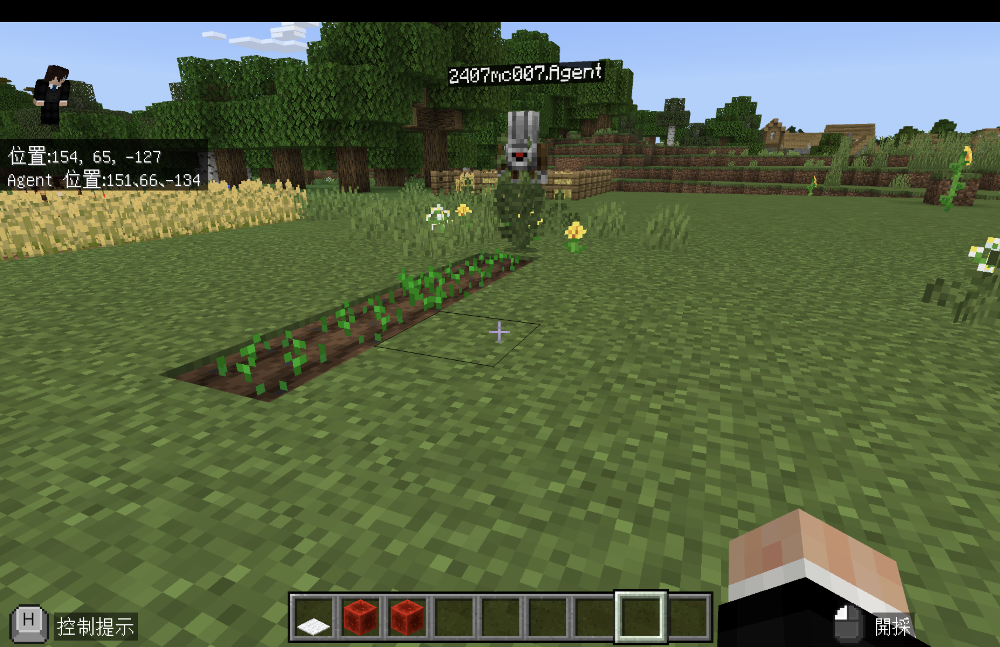
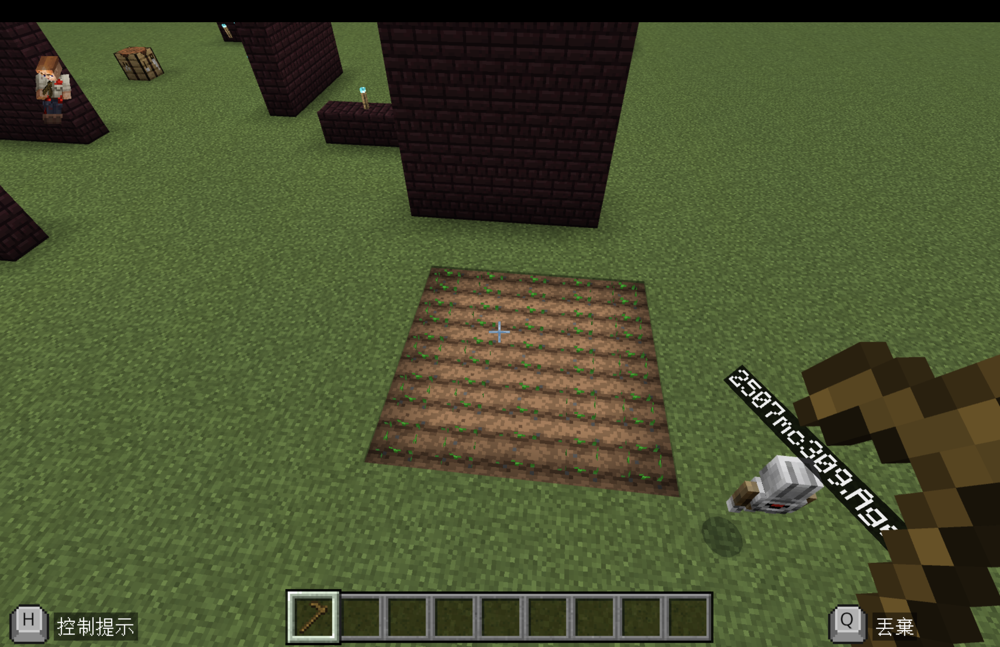
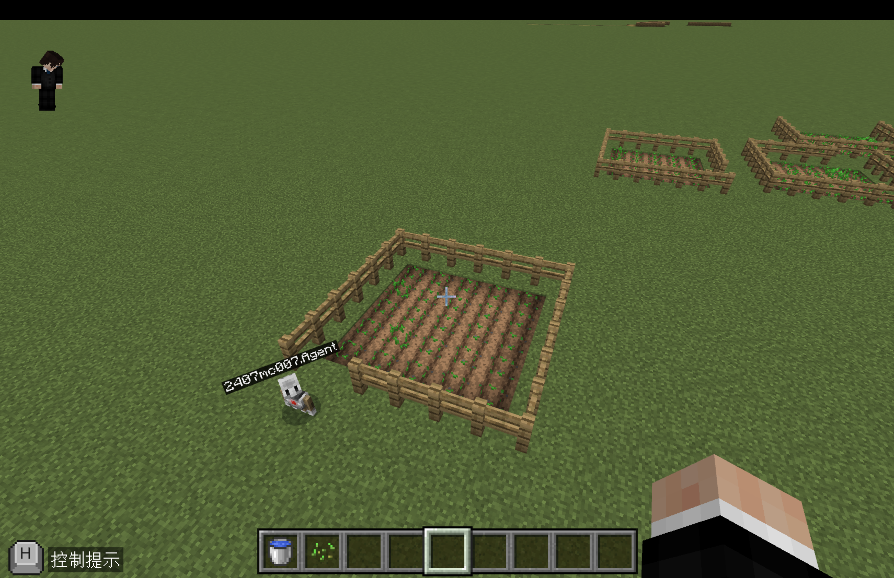
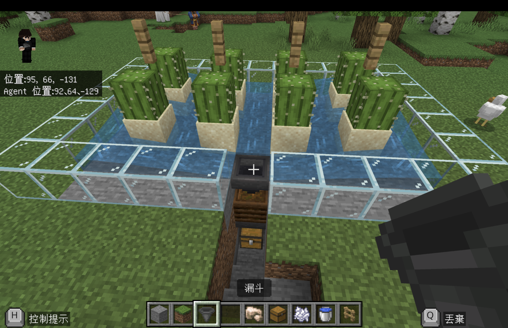
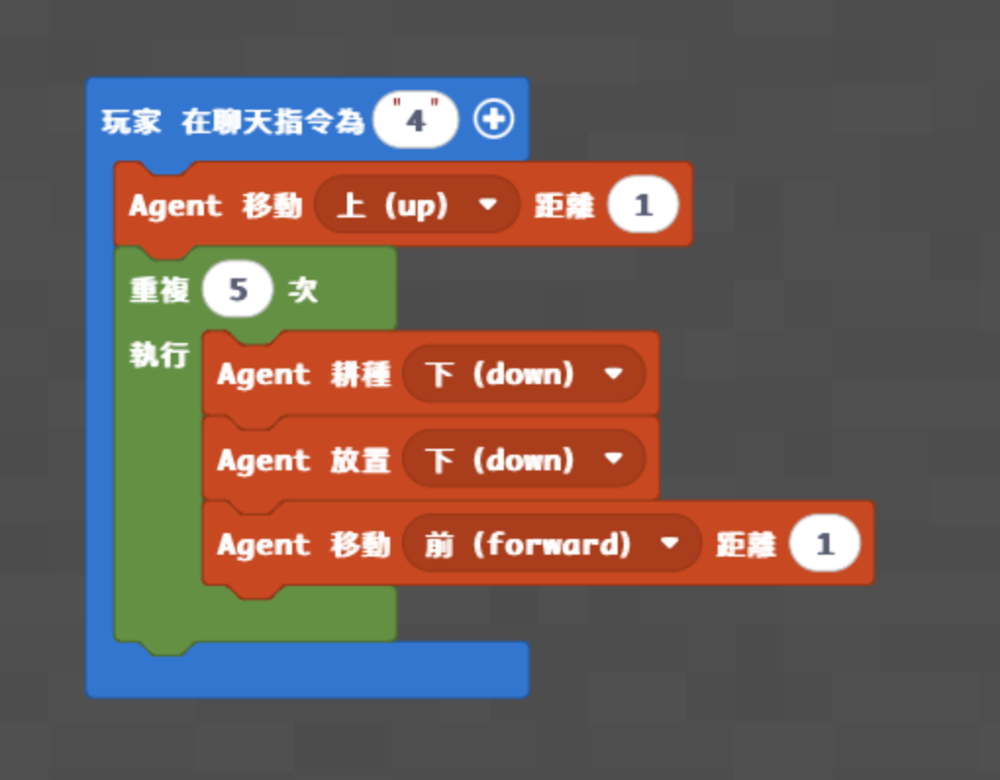
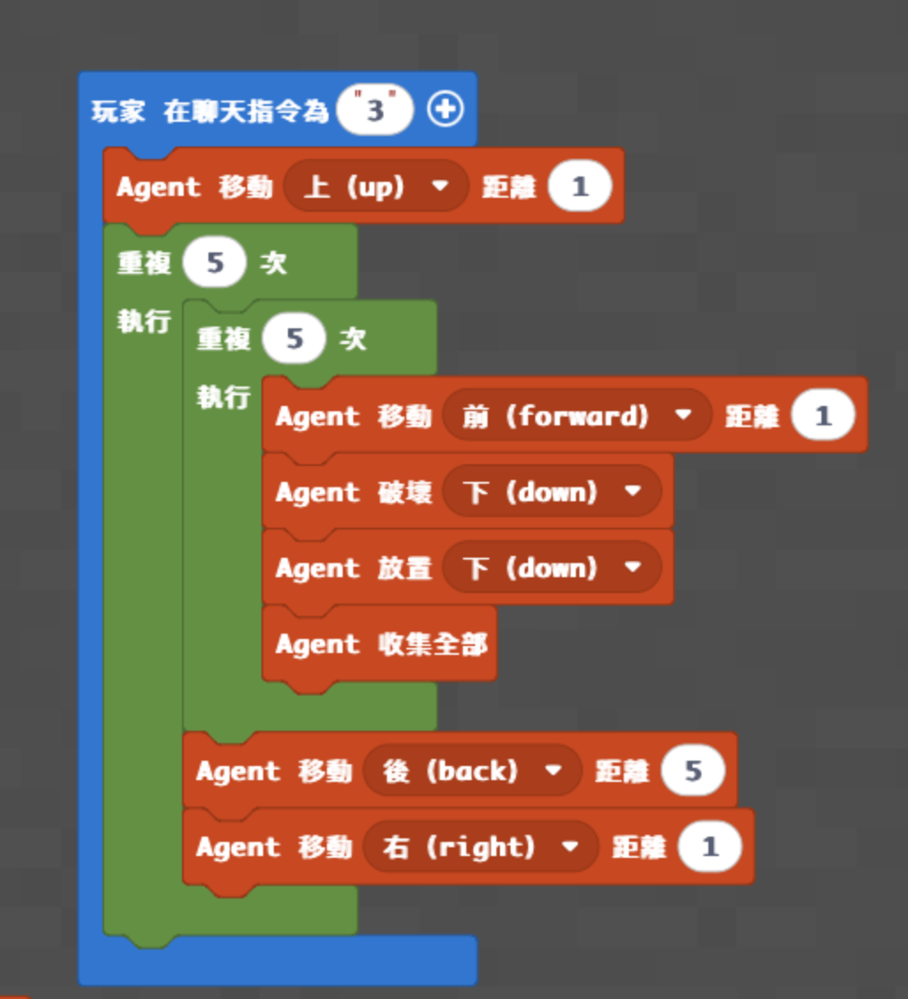
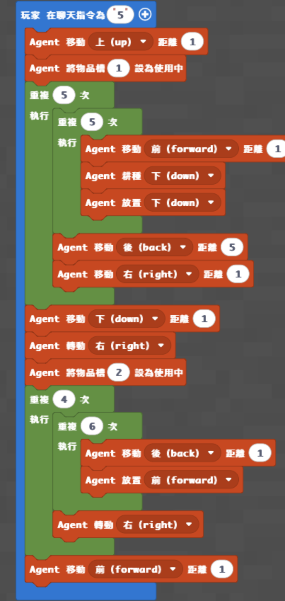

# 梯次H_麥塊程式新夢幻農場

- 課程時間：09:00－12:00
- 遊戲版本：Minecraft Education
- 程式平台：Microsoft MakeCode
- 核心概念：Agent 控制、耕地、播種、收集、迴圈、巢狀迴圈、物品欄切換
- 程式狀態：三個原始程式都有積木截圖與示範影片，但都沒有可複製的文字程式碼，尚未在 Minecraft Education 實機驗證

## 課前準備

- 使用地圖：[下載神木村8人版.mcworld](maps/神木村8人版.mcworld)
- 由老師開啟神木村世界，讓全班加入同一個世界。
- 學生執行程式時，將學生權限設置為操作者（皇冠）。
- 課前確認每台電腦能開啟 Minecraft Education、進入 MakeCode，並能建立積木程式。
- 替每位學生劃分互不重疊的農場區，預留直線農地、5×5 農田及外圍柵欄空間。
- 準備泥土或草地、種子、水、鋤頭與柵欄；學生先練習耕地、放置種子及查看作物成長階段。
- 低階「耕地一條」沒有設定 Agent 物品欄的積木；老師課前要確認種子應放在哪一格並設成使用中。
- 中階「自動採集並耕種」原頁寫明要先做好 5×5 農田；老師課前需準備成熟作物或測試用農田，並確認 Agent 放置的是種子。
- 高階程式使用 Agent 第 1、2 格物品，但原資料沒有用文字記錄內容；正式上課前必須依積木截圖與實機測試確認。
- 主頁註記「視情況決定要不要放柵欄」，因此高階柵欄應視時間與學生進度安排。
- 若安排仙人掌骨粉機、養狗或養羊活動，需另外準備材料；原資料沒有完整材料清單，目前缺少。
- 三個 `code/` 檔案都只是缺少項目註記，不可直接貼入 MakeCode 當作已完成程式。

## 教師備課快速總覽

| 教學階段 | 老師帶學生完成的程式 | 程式完成標準 | 完成後的遊戲或比賽 |
|---|---|---|---|
| **程式一：耕地一條** | 使用迴圈讓 Agent 重複耕地、放置種子並前進 | 輸入 `4` 後，Agent 完成一條 5 格農田並種下種子 | 學生驗收自己的 5 格農田；正式競賽規則目前缺少 |
| **程式二：自動採集並耕種** | 使用 5×5 巢狀迴圈，讓 Agent 逐格破壞、放置、收集並換行 | 輸入 `3` 後，Agent 完成整片 5×5 農田的收割與重新種植 | 使用自己完成的程式處理 5×5 農田並檢查漏種格數；時間與計分目前缺少 |
| **程式三：耕種放置種子、圍柵欄** | 先以巢狀迴圈完成 5×5 農田，再切換物品欄並沿外圍放置柵欄 | 輸入 `5` 後，農地播種完成且柵欄能包圍農田 | 驗收農田完整度與柵欄缺口；正式挑戰規則目前缺少 |

## 遊戲內容

### 一、Minecraft 操作與農場暖身

第一次玩的學生先練習：

- 移動、跳躍、轉動視角與切換物品欄。
- 使用鋤頭把泥土變成耕地。
- 在耕地放置種子，辨認幼苗與成熟作物。
- 召喚 Agent，確認 Agent 的方向與物品欄。

老師說明作物需要耕地、水與成長時間，並示範手動收割後重新播種的流程。

### 二、程式一完成後：5 格農田驗收

1. 老師指定平坦、連續的五格地面作為每位學生的起點。
2. 確認 Agent 面向正確，並把種子放入正在使用的物品欄。
3. 學生完成積木後，在聊天欄輸入 `4`。
4. 觀察 Agent 是否先向上移動，再重複五次「耕地下方、向下放置、前進一格」。
5. 學生沿著自己完成的農田逐格驗收，記錄是否有未耕或漏種。

原資料沒有記錄種子格位、測試時間、計分、勝負條件及重置方式；正式遊戲規則**目前缺少**。

### 三、程式二完成後：5×5 自動收割與重新播種

1. 老師先準備一片 5×5 農田，並依課前實測放入成熟作物或測試方塊。
2. 學生把 Agent 放在農田起點，確認面向與種子物品欄。
3. 完成積木後，在聊天欄輸入 `3`。
4. Agent 使用兩層迴圈逐格前進，破壞下方作物、放置種子並收集掉落物。
5. 每完成一排，Agent 後退五格並向右移動一格，開始下一排。
6. 程式結束後，學生實際走進自己的農田，檢查 25 格是否都完成重新播種。

原資料沒有記錄成熟作物配置、種子格位、掉落物計分、回合時間、勝負條件及農田重置方式；正式比賽規則**目前缺少**。

### 四、程式三完成後：農田與柵欄完整度驗收

1. 確認 Agent 第 1、2 格的物品與數量；原資料沒有文字說明，老師須先實測。
2. 學生完成積木後，在聊天欄輸入 `5`。
3. Agent 先以兩層迴圈完成 5×5 耕地與播種。
4. Agent 切換物品欄並沿外圍放置柵欄。
5. 學生進入自己完成的農場，逐格檢查農地與柵欄是否有缺口。

主頁註記可視情況決定是否放柵欄。原資料沒有記錄柵欄門、所需數量、完成時間、計分、勝負與重置方式；正式挑戰規則**目前缺少**。

### 五、原教案活動：仙人掌骨粉機

原資料保留一張仙人掌農場成果圖與一支建造影片。圖中可見沙子、仙人掌、柵欄、水流、漏斗、堆肥桶及箱子，但沒有正式步驟與材料數量。

此活動沒有使用前三個 Agent 程式，也沒有記錄骨粉產量、測試時間、勝負或重置方法；目前屬手動建造延伸，尚未形成程式閉環。

### 六、原教案活動：養狗與染色項圈

原資料記錄：

- 提供狼生成蛋與骨頭。
- 使用骨頭馴服狼。
- 使用命名牌與鐵砧替狼命名。
- 使用染料替項圈染色。

此活動沒有對應的 Agent 程式，也沒有記錄材料數量、挑戰規則與結束條件；與農場程式的關聯**目前缺少**。

### 七、原教案活動：養羊與染色羊毛

原資料只有綿羊介紹影片，沒有建造步驟、材料、任務、程式或圖片。活動內容、與農場程式的關聯及遊戲規則**目前缺少**。

## 程式示範影片

- 耕地一條：[A_01 耕種並放種子](https://youtu.be/dDmJ1pzSbxM?list=PL3600H0DVFhTenKqNp7UFrT13vPh8vW-f)
- 自動採集並耕種：[20 機器人收割農作物](https://www.youtube.com/watch?v=4Gz8_x-En_E)
- 自動採集並耕種補充：[5 種出一片田](https://youtu.be/BebGaUguNQo?list=PL3600H0DVFhSzXec8B_GPnGsuRxV6wqmv)
- 耕種並圍柵欄：[19 綜合練習－種田與柵欄](https://www.youtube.com/watch?v=3GHG1HH6Vzo)

### 其他參考影片

- [仙人掌農場](https://youtu.be/OgoEZOrjXUU)
- [你可能不知道的狼 10 件事](https://youtu.be/p9NplgkiC3g)
- [你可能不知道的綿羊 10 件事](https://youtu.be/ns35nWpNx3E)

## 程式內容

### 程式一：耕地一條

老師帶學生完成：

- 使用聊天指令 `4` 啟動程式。
- 先讓 Agent 向上移動一格。
- 使用迴圈重複五次。
- 每次讓 Agent 耕種下方、向下放置種子，再向前移動一格。

**教學重點：** 說明順序會影響耕地與播種結果，並用迴圈取代五次重複指令。

**完成標準：** Agent 完成一條連續五格的耕地，五格都有種子。

**功能測試：** 輸入 `4`，檢查 Agent 起點、面向、五格耕地及漏種格數。

**完成後活動：** 學生驗收自己建立的五格農田。

**文字程式碼目前缺少，待確認種子物品欄並實機驗證。**

- [查看低階缺少項目註記](code/low.py)

### 程式二：自動採集並耕種

老師帶學生完成：

- 使用聊天指令 `3` 啟動程式。
- 先讓 Agent 向上移動一格。
- 使用兩層各五次的巢狀迴圈處理 5×5 農田。
- 每格依序前進、破壞下方、向下放置並收集全部物品。
- 每排完成後，Agent 後退五格並向右移動一格。

**教學重點：** 說明內層迴圈處理一排、外層迴圈切換到下一排，組成 5×5 的二維路線。

**完成標準：** Agent 走完 25 格並完成收割、收集與重新播種。

**功能測試：** 輸入 `3`，檢查 Agent 是否走完整片農田、是否漏種，以及收集到的物品。

**完成後活動：** 學生進入自己的 5×5 農田，驗收 25 格重新播種結果。

**文字程式碼目前缺少，待確認農田配置與種子物品欄並實機驗證。**

- [查看中階缺少項目註記](code/medium.py)

### 程式三：耕種放置種子、圍柵欄

老師帶學生完成：

- 使用聊天指令 `5` 啟動程式。
- 選擇 Agent 第 1 格物品，使用 5×5 巢狀迴圈耕地與播種。
- 完成農地後調整 Agent 的高度與方向。
- 切換 Agent 第 2 格物品，使用迴圈沿外圍放置柵欄。
- 最後讓 Agent 向前移動一格離開路線。

**教學重點：** 整合巢狀迴圈、方向控制與物品欄切換，把耕地、播種、圍欄合成一個自動化流程。

**完成標準：** 5×5 農田完成播種，外圍柵欄連續且沒有不必要的缺口。

**功能測試：** 輸入 `5`，檢查第 1、2 格物品、Agent 轉向、農地範圍及柵欄路線。

**完成後活動：** 學生走進自己的農場，驗收農地與柵欄完整度。

**文字程式碼目前缺少，待確認兩個物品欄內容與柵欄路線並實機驗證。**

- [查看高階缺少項目註記](code/high.py)

## 半日營標準流程

| 時間 | 流程大綱 |
|---|---|
| **09:00－09:10** | 開場、自我介紹與破冰 |
| **09:10－09:35** | 遊戲操作與自由探索 |
| **09:35－10:15** | 基礎程式教學 |
| **10:15－10:35** | 基礎功能測試與遊戲活動 |
| **10:35－10:45** | 休息時間 |
| **10:45－11:25** | 進階程式教學 |
| **11:25－11:50** | 進階功能測試與成果挑戰 |
| **11:50－12:00** | 課程複習與收尾 |

## 分級教學設計

三個程式可形成低、中、高的自然進階，但目前都缺少文字碼，尚未達到「全班預設完成中階」的正式交付標準。

| 層級 | 適合學生 | 對應程式 | 程式碼狀態 | 完成後活動 |
|---|---|---|---|---|
| **低** | 年紀較小、第一次玩 Minecraft、第一次寫程式 | 耕地一條 | **文字碼目前缺少** | 驗收五格農田與漏種格數 |
| **中（原定全班目標）** | 大部分學生 | 自動採集並耕種 | **文字碼目前缺少** | 5×5 農田收割與重新播種驗收 |
| **高** | 進度快、年紀較大、操作熟練或參加過多次 | 耕種放置種子、圍柵欄 | **文字碼目前缺少** | 驗收 5×5 農田與外圍柵欄 |

## 實際程式碼

目前三個檔案都只是缺少項目註記，不是可執行程式。正式上課前必須補上完整、獨立的 MakeCode Python 並實機驗證。

### 低階程式

- 程式名稱：耕地一條
- 聊天指令：`4`
- [查看缺少項目註記](code/low.py)

### 中階程式（原定全班目標）

- 程式名稱：自動採集並耕種
- 聊天指令：`3`
- [查看缺少項目註記](code/medium.py)

### 高階程式

- 程式名稱：耕種放置種子、圍柵欄
- 聊天指令：`5`
- [查看缺少項目註記](code/high.py)

## 家長回饋

查看原回饋

親愛的家長您好

今天的主題是 麥塊程式新夢幻農場

我們學習如何透過程式控制機器人（Agent）進行農地自動化開發，從耕種到放置，體驗如何利用程式設計打造出一座農場。

學習重點

1. 掌握自動化耕作邏輯，結合耕地與放置指令，讓機器人能自動將普通泥土轉變為可種植的農田並放置種子。

2. 運用迴圈結構處理大面積土地，將重複的播種與移動動作編寫成自動化腳本，實現高效的自動化種植。

今天每位孩子表現得非常棒，都有順利完成程式建構任務！

## 教師課後確認

- [ ] 已確認三個聊天指令與 Agent 起點、方向和高度。
- [ ] 已確認低階與中階種子物品欄。
- [ ] 已確認高階第 1、2 格物品及柵欄路線。
- [ ] 已補上低、中、高三份可執行文字程式碼。
- [ ] 已在 Minecraft Education 實機測試耕地、放置、破壞、收集與巢狀迴圈。
- [ ] 學生完成程式後，實際走進自己建立的農田進行功能驗收。
- [ ] 若安排仙人掌、養狗或養羊，已說明它們是額外遊戲活動，沒有直接使用 Agent 程式。
- [ ] 已保留課程資訊圖、所有程式與成果圖片、示範影片及家長回饋。
- [ ] 課末已複習順序、迴圈、巢狀迴圈與農場自動化。
