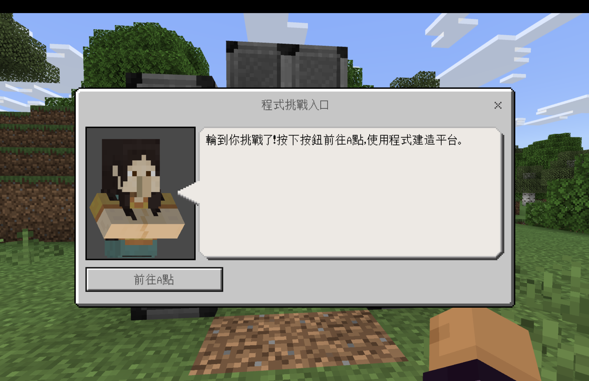
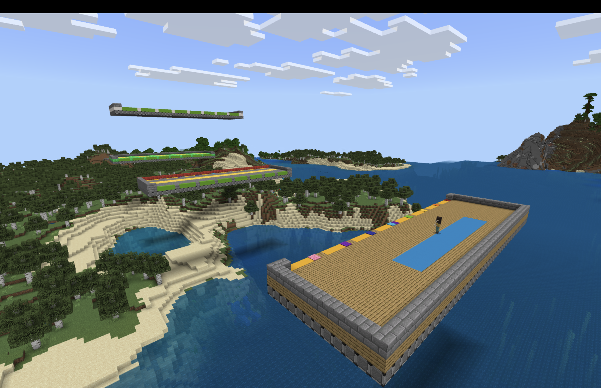
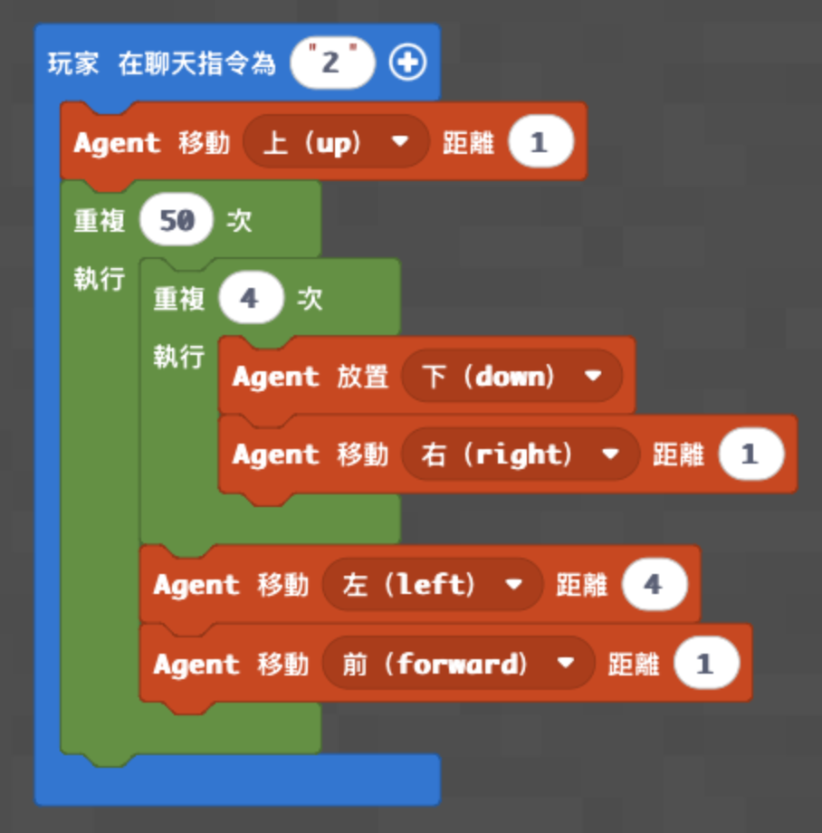
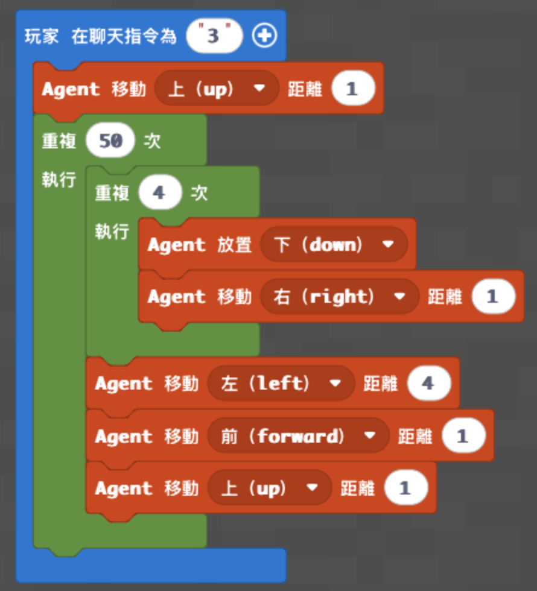
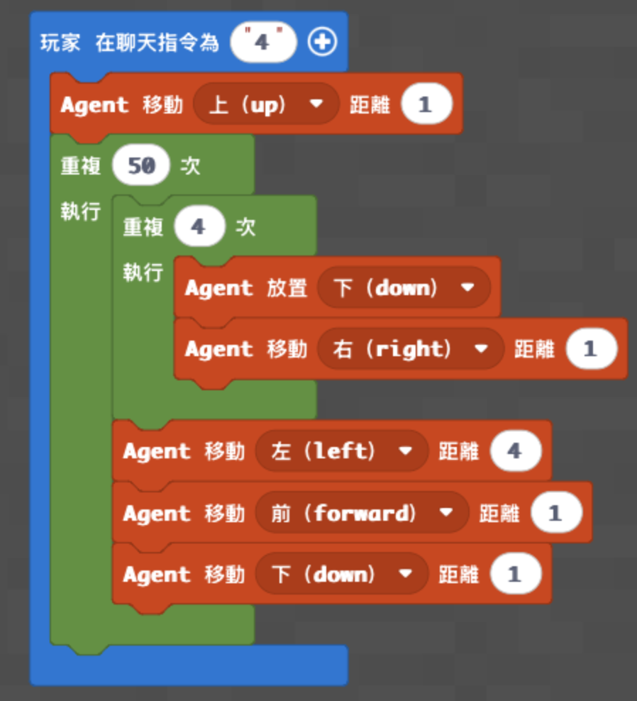

# 梯次 K｜巢狀迴圈：程式造橋闖關

- 課程時間：09:00－12:00
- 遊戲版本：Minecraft Education
- 程式平台：Microsoft MakeCode
- 核心概念：Agent 控制、方向、迴圈、巢狀迴圈、自動建造

## 課程目標

學生使用內層迴圈建立四格寬的平台，再用外層迴圈延伸 50 排。依完成程度挑戰水平、往上或往下的橋梁，最後實際走過自己的作品抵達終點。

## 課前準備

- 正式地圖：[神木村 v6](../shared/maps/神木村v6.mcworld)
- 備用地圖：[神木村 v3](maps/神木村v3.mcworld)
- 每台電腦確認能加入同一世界、按 C 開啟 MakeCode 並建立空白專案。
- 確認神木村「程式挑戰入口」NPC 的「前往 A 點」按鈕可用，B、C、D 點 NPC 能返回神木村。
- 八位學生各分配一條獨立跑道；確認每條跑道的 Agent 起點與面向。
- 依地圖設定準備足量建材；若 Agent 需要物品欄，統一放入第 1 格並先測試。
- 只把正在闖關的學生切換成創造模式，回到神木村後立即切回生存模式。
- 老師保留一份未使用的 `.mcworld`，並課前完整測試三條 50 排路線。

## 半日營流程

| 時間 | 教學內容 |
|---|---|
| 09:00－09:10 | 開場、A～D 點闖關說明 |
| 09:10－09:35 | Minecraft 操作、NPC 與 Agent 起點練習 |
| 09:35－10:15 | 低階：水平平台與巢狀迴圈 |
| 10:15－10:35 | 水平平台測試、A 點到 B 點闖關 |
| 10:35－10:45 | 休息 |
| 10:45－11:25 | 中階或高階：往上／往下平台 |
| 11:25－11:50 | 正式造橋闖關與成果驗收 |
| 11:50－12:00 | 分享、迴圈與方向回顧 |

## 場地與闖關動線

學生先在神木村點擊「程式挑戰入口」NPC 前往 A 點。低階由 A 點往 B 點；中階由 B 點往 C 點；高階由 C 點往 D 點。中、高階學生可以沿已完成的平台抵達起點，也可由老師個別傳送。



場地具有八條獨立跑道，並以 A～D 點串接水平、上坡與下坡挑戰。既有資料沒有記錄固定座標，因此本梯次以 NPC 傳送點、跑道色標與 Agent 起點方塊作為可靠參考；老師不要只靠座標定位。



## 遊戲任務：程式造橋接力

### 遊戲準備

- 每位學生使用自己的跑道，不共用其他學生已完成的平台。
- 老師依程度指定 A→B、B→C 或 C→D 路線。
- 執行前確認 Agent 位於起點、面向終點，且下方及前方沒有其他建築。
- 一次只讓一位或一組進入指定區域，避免同時操作造成混亂。

### 學生任務

1. 從空白 MakeCode 專案逐塊完成自己的程度。
2. 到指定起點，等待老師切換個人遊戲模式。
3. 輸入聊天指令，觀察 Agent 是否完成一排、回到同側、再前進一排。
4. 程式停止後檢查橋面是否連續、維持四格寬。
5. 親自走過自己建造的平台抵達終點，再使用 NPC 返回神木村。

### 完成與勝負

- 每回合上限 8 分鐘，包含一次測試與修正。
- 橋面連續且成功抵達指定終點才算完成。
- 每缺一格扣 1 分；跌落或走到其他跑道需回到起點重來。
- 完成者依「缺格較少、抵達時間較短、能說明內外層迴圈分工」排序。
- 三個程度分開排名，不直接比較不同路線。

## 低階｜水平平台

### 任務與完成標準

輸入 `2`，讓 Agent 建出四格寬、50 排長的水平平台。平台須能讓學生從 A 點走到 B 點。

### MakeCode Python

```python
def on_on_chat():
    agent.move(UP, 1)
    for index in range(50):
        for index2 in range(4):
            agent.place(DOWN)
            agent.move(RIGHT, 1)
        agent.move(LEFT, 4)
        agent.move(FORWARD, 1)
player.on_chat("2", on_on_chat)
```

- [下載低階 Python](code/low.py)
- MakeCode 分享連結：**待補**



### 功能測試

先把外層迴圈改成 2 次測試，確認每排四格寬、Agent 會回到同側並前進；通過後再改回 50 次正式建造。

## 中階｜往上平台

### 任務與完成標準

輸入 `3`，每完成一排後再向前、向上各移動一格，建出四格寬的上升平台，讓學生從 B 點走到 C 點。

### MakeCode Python

```python
def on_on_chat():
    agent.move(UP, 1)
    for index in range(50):
        for index2 in range(4):
            agent.place(DOWN)
            agent.move(RIGHT, 1)
        agent.move(LEFT, 4)
        agent.move(FORWARD, 1)
        agent.move(UP, 1)
player.on_chat("3", on_on_chat)
```

- [下載中階 Python](code/medium.py)
- MakeCode 分享連結：**待補**



### 功能測試

先測試 2 排，確認新的一排比前一排高一格且橋面相接；若出現斷層，先檢查 Agent 起點高度與移動順序。

## 高階｜往下平台

### 任務與完成標準

輸入 `4`，每完成一排後再向前、向下各移動一格，建出四格寬的下降平台，讓學生從 C 點走到 D 點。

### MakeCode Python

```python
def on_on_chat():
    agent.move(UP, 1)
    for index in range(50):
        for index2 in range(4):
            agent.place(DOWN)
            agent.move(RIGHT, 1)
        agent.move(LEFT, 4)
        agent.move(FORWARD, 1)
        agent.move(DOWN, 1)
player.on_chat("4", on_on_chat)
```

- [下載高階 Python](code/high.py)
- MakeCode 分享連結：**待補**



### 功能測試

先測試 2 排，確認 Agent 每排下降一格且橋面仍可通行。正式執行前再次檢查下方空間與終點高度，避免撞入地形。

## 場地保存、重置與跨地圖使用

### 保存方式

- A～D 點、NPC、八條跑道及高度差屬於大型整體關卡，使用完整 `.mcworld` 保存最穩定。
- 本梯次不另附結構方塊檔；若拆成多個結構，不只匯入步驟增加，也容易失去各點之間的相對高度與方向。
- 上課前複製一份乾淨世界；課後保留學生作品時另存新世界，不覆蓋公版地圖。

### 重置方式

- 少量錯誤：由老師清除該學生跑道上的錯誤方塊，再把 Agent 放回起點。
- 大量橋面已生成或多人跑道互相干擾：退出世界，重新匯入乾淨 `.mcworld`。
- 每次重置後都重新確認 NPC、遊戲模式、Agent 起點與朝向。

### 跨地圖使用

若要在其他地圖上課，需自行建立 A～D 四個參考點、三段高度相符的終點與八條互不重疊跑道。場地規模與高度關係無法只靠一組座標重建，因此不建議臨時用教師 Python 生成；直接複製世界或先製作完成的新地圖較安全。

## 上課知識點

- **巢狀迴圈：** 內層迴圈負責一排四格，外層迴圈負責 50 排。
- **二維建造：** 左右移動形成寬度，向前移動形成長度。
- **高度變化：** 每排增加 `UP` 或 `DOWN`，同一結構就會變成上坡或下坡。
- **順序：** 先放置、再移動與先移動、再放置會改變橋面起點。
- **起點與方向：** 程式不認得 A、B、C、D；它只依 Agent 當下位置與面向執行。
- **小範圍測試：** 先用 2 排驗證，再放大到 50 排，可降低大範圍錯誤。
- **多人分區：** 每人使用獨立跑道，才能避免建造範圍互相覆蓋。

## 程式示範影片

- 低階：[32 空中通道](https://www.youtube.com/watch?v=TTQNbcqo8hs)
- 中階：[34 樓梯往上](https://www.youtube.com/watch?v=QnCRodCGamE)
- 高階：[33 樓梯往下](https://www.youtube.com/watch?v=Tsg7-N2b6fw)

## 家長回饋公版

親愛的家長您好：

今天孩子完成了 Minecraft Education「程式造橋闖關」課程，學習使用程式控制 Agent 建造四格寬的平台，並把平台延伸成水平、往上或往下的橋梁。

課程的核心是「巢狀迴圈」：內層迴圈負責完成一排四格寬的平台，外層迴圈負責讓平台持續延伸。孩子不只完成程式，也實際走過自己的橋抵達終點，驗證程式是否真的能支援遊戲任務。

孩子今天完成的程度為【低階／中階／高階】，課堂表現【請填寫具體表現，例如：能先用兩排測試找出 Agent 方向錯誤，再完成正式橋梁】。最終完成【請填寫路線或成果】，並能說明【請填寫孩子掌握的概念】。

回家後可以請孩子分享：「內層迴圈和外層迴圈各負責什麼？」幫助孩子用自己的話整理今天的學習。
