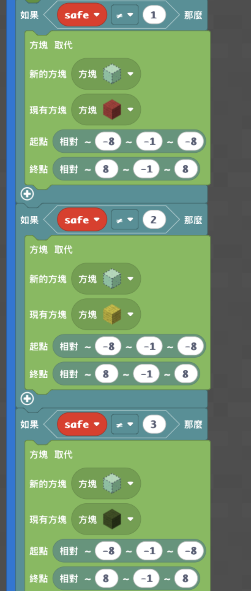
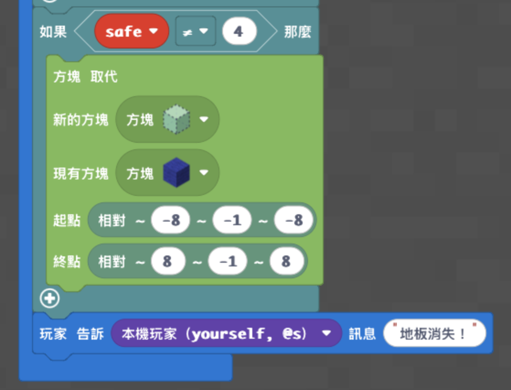

# 梯次 M｜隨機數：閃動格子

- 課程時間：09:00－12:00
- 遊戲版本：Minecraft Education
- 程式平台：Microsoft MakeCode
- 核心概念：隨機數、變數、條件判斷、相對座標
- 學生任務：使用隨機數選出安全顏色，讓其他三種顏色的地板消失

## 課前準備

- 開啟 Minecraft Education，確認版本及網路連線正常。
- 匯入或開啟「神木村v6」地圖，並保留一份世界備份。
- 確認學生可使用 MakeCode，且低、中、高三個版本分別為獨立專案。
- 傳送至場地座標 `/tp -404 166 40`，檢查練習場、正式比賽場、入口金塊與史萊姆區。
- 老師先測試場地建立、重置及正式比賽流程。
- 多人遊戲時，為學生分配不同練習場，避免程式互相影響。

## 教師備課快速總覽

| 教學階段 | 老師帶學生完成的程式 | 程式完成標準 | 完成後的遊戲或比賽 |
| --- | --- | --- | --- |
| 低階 | 用隨機數抽出1～4 | 執行後顯示其中一個安全數字 | 依數字跑到代表的顏色 |
| 中階 | 加入四個條件判斷 | 能依抽選結果顯示1～4 | 進行顏色移動練習 |
| 高階 | 公布安全顏色並移除危險地板 | 只保留抽中的安全顏色 | 學生主持練習賽並參加正式比賽 |

## 遊戲內容與規則

1. 程式從1～4中抽出安全數字。
2. 數字分別代表紅、黃、綠、藍。
3. 程式公布安全顏色，學生移動到對應地板。
4. 倒數結束後，其他三種顏色消失。
5. 留在安全地板上的學生過關；掉入史萊姆區的學生等待下一回合。
6. 正式比賽共10回合，每兩回合縮小一次場地。

> 電腦抽籤 → 記住數字 → 判斷顏色 → 危險地板消失 → 學生實際遊戲

## 上課知識點

- **隨機數：** 像電腦在1～4號球中抽出一顆，每次抽到的結果可能不同。
- **變數 `safe`：** 像一個數字盒子，用來記住電腦剛才抽到的號碼。
- **條件判斷：** 程式根據盒子裡的數字，決定紅、黃、綠、藍哪一種是安全顏色。
- **相對座標：** 程式以學生站立位置為中心尋找練習場，因此學生必須站在入口金塊上執行。

## 場地準備

- **神木村場地傳送座標：** `/tp -404 166 40`
- 神木村內已預設場地；若使用其他世界，可執行本頁附錄的老師用 Python 建立場地。
- 若日後改用結構方塊保存大型場地，應拆成數個小結構並以固定基準點載入，避免超過單一結構的範圍限制。

### 學生練習場


- 共10座，排列成2排，每排5座。
- 每座場地為8×8地板，每個同色區塊為2×2。
- 四種顏色：紅色、黃色、綠色、藍色。
- 下方設置史萊姆方塊，玩家掉落後可以持續彈跳。
- 每座入口設置金塊，作為學生與老師執行相對座標程式的基準點。
- 老師站在入口金塊上輸入 `9` 時，只恢復目前這一座場地。

### 正式比賽場


- 正式地板為16×16。
- 每個同色區塊為4×4，共16個色塊。
- 史萊姆層位於地板下方約12格，增加掉落與彈跳效果。
- 正式比賽共10回合，每兩回合縮小一圈：16×16、14×14、12×12、10×10、8×8。
- 每回合先恢復有效地板，再隨機宣布安全顏色；等待4秒後讓其他三色消失；4秒後恢復，休息2秒進入下一回合。

## 地圖檔

- **正式地圖：** [神木村v6.mcworld](../shared/maps/神木村v6.mcworld)
- **使用方式一：** 開啟神木村後傳送到 `/tp -404 166 40`，直接使用預設場地。
- **使用方式二：** 在其他世界執行本頁附錄的老師用場地生成 Python。
- 開課前請保留一份世界備份。
- 練習場與正式場包含高度差、史萊姆層、玻璃牆及多座分區，整體保存以 `.mcworld` 最穩定；若使用結構方塊，需拆成數個小結構並保留同一載入基準點。

## 程式示範影片

- [示範影片一](https://youtu.be/7jB5HjT0ZA0?si=qXL6wPtXgAY9D9Wn)
- [示範影片二](https://youtu.be/4AYH0QIoIT8?si=pahM1N-g5sxhFThu)

## 低、中、高分級教學

學生不需要製作場地，也不需要撰寫恢復程式。低、中、高階是三份獨立專案，不要疊在同一個專案；三個版本皆輸入聊天指令 `1` 執行。

### 低階：抽出並顯示安全數字

**學習目標：** 認識變數 `safe`，使用 `randint(1, 4)` 讓電腦從1、2、3、4中隨機選出一個數字。

**完成標準：** 輸入 `1` 後，聊天訊息會顯示1、2、3或4其中一個安全數字。

```python
safe = 0

def on_on_chat():
    global safe
    safe = randint(1, 4)
    player.tell(mobs.target(LOCAL_PLAYER), safe)
player.on_chat("1", on_on_chat)
```

- [下載低階 Python](code/low.py)


- **MakeCode分享連結：** [低階｜梯次M_閃動格子](https://makecode.com/_81rhrxg3y1fg)
- **測試方式：** 連續輸入數次 `1`，確認每次都會顯示1、2、3或4，且抽出的數字可能改變。
- **完成後活動：** 老師顯示抽出的數字，學生跑到數字代表的顏色。

### 中階：用條件判斷顯示隨機結果

**學習目標：** 把隨機數連接到四個條件判斷，顯示 `safe` 抽到的數字。

**完成標準：** 輸入 `1` 後，聊天訊息會顯示1、2、3或4其中一個結果。

```python
safe = 0

def on_on_chat():
    global safe
    safe = randint(1, 4)
    if safe == 1:
        player.tell(mobs.target(LOCAL_PLAYER), "1")
    if safe == 2:
        player.tell(mobs.target(LOCAL_PLAYER), "2")
    if safe == 3:
        player.tell(mobs.target(LOCAL_PLAYER), "3")
    if safe == 4:
        player.tell(mobs.target(LOCAL_PLAYER), "4")
player.on_chat("1", on_on_chat)
```

- [下載中階 Python](code/medium.py)


- **MakeCode分享連結：** [中階｜梯次M_閃動格子](https://makecode.com/_3ayP5vEaiKHH)
- **測試方式：** 連續執行並確認結果可能出現1～4。
- **完成後活動：** 學生依數字與顏色對照表移動到安全顏色。

### 高階：完整閃動格子

**學習目標：** 使用隨機數選出安全顏色，並用四個條件判斷讓其他三種顏色消失。

**執行位置：** 學生站在任一練習場入口金塊上。

**完成標準：** 輸入 `1` 後宣布安全顏色；等待3秒後，其他三種顏色消失。

```python
safe = 0

def on_on_chat():
    global safe
    safe = randint(1, 4)
    if safe == 1:
        player.tell(mobs.target(LOCAL_PLAYER), "安全顏色：紅色！")
    if safe == 2:
        player.tell(mobs.target(LOCAL_PLAYER), "安全顏色：黃色！")
    if safe == 3:
        player.tell(mobs.target(LOCAL_PLAYER), "安全顏色：綠色！")
    if safe == 4:
        player.tell(mobs.target(LOCAL_PLAYER), "安全顏色：藍色！")
    loops.pause(3000)
    if safe != 1:
        blocks.replace(AIR, RED_WOOL, pos(-8, -1, -8), pos(8, -1, 8))
    if safe != 2:
        blocks.replace(AIR, YELLOW_WOOL, pos(-8, -1, -8), pos(8, -1, 8))
    if safe != 3:
        blocks.replace(AIR, GREEN_WOOL, pos(-8, -1, -8), pos(8, -1, 8))
    if safe != 4:
        blocks.replace(AIR, BLUE_WOOL, pos(-8, -1, -8), pos(8, -1, 8))
    player.tell(mobs.target(LOCAL_PLAYER), "地板消失！")
player.on_chat("1", on_on_chat)
```

- [下載高階 Python](code/high.py)





- **MakeCode分享連結：** [高階｜梯次M_閃動格子](https://makecode.com/_WiyJH0T3wL9U)
- **測試方式：** 在 Minecraft Education 場地實測，確認公布的顏色保留、另外三色消失，而且不影響其他練習場。
- **完成後活動：** 學生使用自己的程式主持一回合練習賽。

## 半日營標準流程

| 時間 | 流程大綱 |
| --- | --- |
| 09:00－09:10 | 開場、自我介紹與破冰 |
| 09:10－09:35 | 遊戲操作與自由探索 |
| 09:35－10:15 | 基礎程式教學 |
| 10:15－10:35 | 基礎功能測試與遊戲活動 |
| 10:35－10:45 | 休息時間 |
| 10:45－11:25 | 進階程式教學 |
| 11:25－11:50 | 進階功能測試與成果挑戰 |
| 11:50－12:00 | 課程複習與收尾 |

## 家長回饋公版

親愛的家長您好：

今天孩子完成了 Minecraft Education「隨機數：閃動格子」課程。程式會從 1～4 隨機抽出一個結果，使用變數 `safe` 記住數字，再透過條件判斷決定紅、黃、綠、藍哪一種是安全顏色。進階程式還能在倒數後移除其他三種地板，讓孩子實際使用自己寫的程式參加挑戰。

孩子今天完成的程度為【低階／中階／高階】，課堂表現【請填寫具體表現，例如：能依測試結果找出條件或座標錯誤】。在遊戲中完成【請填寫回合或成果】，並能說明【請填寫孩子掌握的概念】。

回家後可以請孩子分享：「隨機數、變數與條件判斷如何一起決定安全顏色？」幫助孩子用自己的話整理今天的學習。

## 附錄：老師用場地生成與重置 Python

> 額外補充：以下是老師課前建立及重置場地使用的程式，不是本堂「隨機數」的主要學生教學內容。練習場地與正式場地必須放在兩個獨立的 MakeCode 專案，不要合併。

### 練習場地完整程式

- 輸入 `8`：建立10座8×8練習場。
- 老師站在任一座入口金塊上輸入 `9`：只恢復該座練習場。
- [下載練習場教師 Python](code/teacher-practice.py)

```python
def build_practice_floor(cx, cz):
    blocks.fill(RED_WOOL, pos(cx - 4, -2, cz + 3), pos(cx - 3, -2, cz + 4), FillOperation.REPLACE)
    blocks.fill(YELLOW_WOOL, pos(cx - 2, -2, cz + 3), pos(cx - 1, -2, cz + 4), FillOperation.REPLACE)
    blocks.fill(GREEN_WOOL, pos(cx, -2, cz + 3), pos(cx + 1, -2, cz + 4), FillOperation.REPLACE)
    blocks.fill(BLUE_WOOL, pos(cx + 2, -2, cz + 3), pos(cx + 3, -2, cz + 4), FillOperation.REPLACE)
    blocks.fill(BLUE_WOOL, pos(cx - 4, -2, cz + 5), pos(cx - 3, -2, cz + 6), FillOperation.REPLACE)
    blocks.fill(RED_WOOL, pos(cx - 2, -2, cz + 5), pos(cx - 1, -2, cz + 6), FillOperation.REPLACE)
    blocks.fill(YELLOW_WOOL, pos(cx, -2, cz + 5), pos(cx + 1, -2, cz + 6), FillOperation.REPLACE)
    blocks.fill(GREEN_WOOL, pos(cx + 2, -2, cz + 5), pos(cx + 3, -2, cz + 6), FillOperation.REPLACE)
    blocks.fill(GREEN_WOOL, pos(cx - 4, -2, cz + 7), pos(cx - 3, -2, cz + 8), FillOperation.REPLACE)
    blocks.fill(BLUE_WOOL, pos(cx - 2, -2, cz + 7), pos(cx - 1, -2, cz + 8), FillOperation.REPLACE)
    blocks.fill(RED_WOOL, pos(cx, -2, cz + 7), pos(cx + 1, -2, cz + 8), FillOperation.REPLACE)
    blocks.fill(YELLOW_WOOL, pos(cx + 2, -2, cz + 7), pos(cx + 3, -2, cz + 8), FillOperation.REPLACE)
    blocks.fill(YELLOW_WOOL, pos(cx - 4, -2, cz + 9), pos(cx - 3, -2, cz + 10), FillOperation.REPLACE)
    blocks.fill(GREEN_WOOL, pos(cx - 2, -2, cz + 9), pos(cx - 1, -2, cz + 10), FillOperation.REPLACE)
    blocks.fill(BLUE_WOOL, pos(cx, -2, cz + 9), pos(cx + 1, -2, cz + 10), FillOperation.REPLACE)
    blocks.fill(RED_WOOL, pos(cx + 2, -2, cz + 9), pos(cx + 3, -2, cz + 10), FillOperation.REPLACE)

def build_practice_arena(cx, cz):
    blocks.fill(AIR, pos(cx - 5, -6, cz + 2), pos(cx + 4, 2, cz + 11), FillOperation.REPLACE)
    blocks.fill(STONE, pos(cx - 1, -1, cz - 1), pos(cx, -1, cz + 2), FillOperation.REPLACE)
    blocks.place(GOLD_BLOCK, pos(cx, -1, cz))
    blocks.fill(SLIME_BLOCK, pos(cx - 4, -7, cz + 3), pos(cx + 3, -7, cz + 10), FillOperation.REPLACE)
    blocks.fill(GLASS, pos(cx - 5, -6, cz + 2), pos(cx - 5, 2, cz + 11), FillOperation.REPLACE)
    blocks.fill(GLASS, pos(cx + 4, -6, cz + 2), pos(cx + 4, 2, cz + 11), FillOperation.REPLACE)
    blocks.fill(GLASS, pos(cx - 5, -6, cz + 11), pos(cx + 4, 2, cz + 11), FillOperation.REPLACE)
    blocks.fill(GLASS, pos(cx - 5, -6, cz + 2), pos(cx + 4, -2, cz + 2), FillOperation.REPLACE)
    blocks.fill(GLASS, pos(cx - 5, -1, cz + 2), pos(cx - 2, 2, cz + 2), FillOperation.REPLACE)
    blocks.fill(GLASS, pos(cx + 1, -1, cz + 2), pos(cx + 4, 2, cz + 2), FillOperation.REPLACE)
    build_practice_floor(cx, cz)

def on_on_chat8():
    for index in range(5):
        build_practice_arena(index * 20 - 40, 0)
        build_practice_arena(index * 20 - 40, 20)
    player.tell(mobs.target(LOCAL_PLAYER), "10座練習場建立完成！")
player.on_chat("8", on_on_chat8)

def on_on_chat9():
    build_practice_floor(0, 0)
    player.tell(mobs.target(LOCAL_PLAYER), "這一座練習場已恢復！")
player.on_chat("9", on_on_chat9)
```

### 正式場地完整程式

- 老師先站在預定的場地入口中央；程式內所有座標皆以老師所在位置為基準。
- 輸入 `7`：建立16×16正式比賽場。
- 輸入 `5`：開始10回合正式比賽。
- 輸入 `6`：臨時恢復完整正式地板。
- 每兩回合縮小一圈：`16×16 → 14×14 → 12×12 → 10×10 → 8×8`。
- [下載正式比賽教師 Python](code/teacher-formal.py)

```python
safe = 0


# 建立16×16正式比賽地板
# 每個顏色區塊是4×4
def build_formal_floor():
    for tile_z in range(4):
        for tile_x in range(4):
            x1 = tile_x * 4 - 8
            z1 = tile_z * 4 + 3
            color_number = (tile_z % 2) * 2 + tile_x % 2

            if color_number == 0:
                blocks.fill(
                    RED_WOOL,
                    pos(x1, -2, z1),
                    pos(x1 + 3, -2, z1 + 3),
                    FillOperation.REPLACE
                )

            if color_number == 1:
                blocks.fill(
                    YELLOW_WOOL,
                    pos(x1, -2, z1),
                    pos(x1 + 3, -2, z1 + 3),
                    FillOperation.REPLACE
                )

            if color_number == 2:
                blocks.fill(
                    GREEN_WOOL,
                    pos(x1, -2, z1),
                    pos(x1 + 3, -2, z1 + 3),
                    FillOperation.REPLACE
                )

            if color_number == 3:
                blocks.fill(
                    BLUE_WOOL,
                    pos(x1, -2, z1),
                    pos(x1 + 3, -2, z1 + 3),
                    FillOperation.REPLACE
                )


# 輸入7：建立正式比賽場
def on_on_chat7():
    blocks.fill(
        AIR,
        pos(-9, -13, 2),
        pos(8, 3, 19),
        FillOperation.REPLACE
    )

    # 入口
    blocks.fill(
        STONE,
        pos(-1, -1, -2),
        pos(0, -1, 2),
        FillOperation.REPLACE
    )
    blocks.place(GOLD_BLOCK, pos(0, -1, 0))

    # 下方史萊姆層
    blocks.fill(
        SLIME_BLOCK,
        pos(-8, -14, 3),
        pos(7, -14, 18),
        FillOperation.REPLACE
    )

    # 左右玻璃牆
    blocks.fill(
        GLASS,
        pos(-9, -13, 2),
        pos(-9, 3, 19),
        FillOperation.REPLACE
    )
    blocks.fill(
        GLASS,
        pos(8, -13, 2),
        pos(8, 3, 19),
        FillOperation.REPLACE
    )

    # 後方玻璃牆
    blocks.fill(
        GLASS,
        pos(-9, -13, 19),
        pos(8, 3, 19),
        FillOperation.REPLACE
    )

    # 前方玻璃牆
    blocks.fill(
        GLASS,
        pos(-9, -13, 2),
        pos(8, -2, 2),
        FillOperation.REPLACE
    )
    blocks.fill(
        GLASS,
        pos(-9, -1, 2),
        pos(-2, 3, 2),
        FillOperation.REPLACE
    )
    blocks.fill(
        GLASS,
        pos(1, -1, 2),
        pos(8, 3, 2),
        FillOperation.REPLACE
    )

    build_formal_floor()
    player.tell(
        mobs.target(LOCAL_PLAYER),
        "正式比賽場建立完成！"
    )

player.on_chat("7", on_on_chat7)


# 輸入6：恢復完整正式地板
def on_on_chat6():
    build_formal_floor()
    player.tell(
        mobs.target(LOCAL_PLAYER),
        "正式比賽場已恢復！"
    )

player.on_chat("6", on_on_chat6)


# 恢復地板，並依照回合縮小場地
def prepare_formal_floor(shrink):
    build_formal_floor()

    if shrink > 0:
        # 前面縮小
        blocks.fill(
            AIR,
            pos(-8, -2, 3),
            pos(7, -2, 2 + shrink),
            FillOperation.REPLACE
        )

        # 後面縮小
        blocks.fill(
            AIR,
            pos(-8, -2, 19 - shrink),
            pos(7, -2, 18),
            FillOperation.REPLACE
        )

        # 左邊縮小
        blocks.fill(
            AIR,
            pos(-8, -2, 3 + shrink),
            pos(-9 + shrink, -2, 18 - shrink),
            FillOperation.REPLACE
        )

        # 右邊縮小
        blocks.fill(
            AIR,
            pos(8 - shrink, -2, 3 + shrink),
            pos(7, -2, 18 - shrink),
            FillOperation.REPLACE
        )


# 輸入5：開始10回合正式比賽
def on_on_chat5():
    global safe

    shrink = 0

    for round_number in range(10):
        prepare_formal_floor(shrink)

        player.say(
            "第 " + str(round_number + 1) + " 回合！"
        )

        # 隨機選出安全顏色
        safe = randint(1, 4)

        if safe == 1:
            player.say("安全顏色：紅色！")

        if safe == 2:
            player.say("安全顏色：黃色！")

        if safe == 3:
            player.say("安全顏色：綠色！")

        if safe == 4:
            player.say("安全顏色：藍色！")

        # 給玩家4秒尋找安全顏色
        loops.pause(4000)

        min_x = -8 + shrink
        max_x = 7 - shrink
        min_z = 3 + shrink
        max_z = 18 - shrink

        # 讓安全顏色以外的地板消失
        if safe != 1:
            blocks.replace(
                AIR,
                RED_WOOL,
                pos(min_x, -2, min_z),
                pos(max_x, -2, max_z)
            )

        if safe != 2:
            blocks.replace(
                AIR,
                YELLOW_WOOL,
                pos(min_x, -2, min_z),
                pos(max_x, -2, max_z)
            )

        if safe != 3:
            blocks.replace(
                AIR,
                GREEN_WOOL,
                pos(min_x, -2, min_z),
                pos(max_x, -2, max_z)
            )

        if safe != 4:
            blocks.replace(
                AIR,
                BLUE_WOOL,
                pos(min_x, -2, min_z),
                pos(max_x, -2, max_z)
            )

        player.say("危險地板消失！")

        # 維持消失狀態4秒
        loops.pause(4000)

        # 恢復這一回合的地板
        prepare_formal_floor(shrink)

        # 回合間休息2秒
        loops.pause(2000)

        # 每兩回合縮小一圈
        if round_number % 2 == 1:
            shrink += 1

    # 比賽結束後恢復完整16×16地板
    build_formal_floor()
    player.say("10回合結束！")

player.on_chat("5", on_on_chat5)
```
