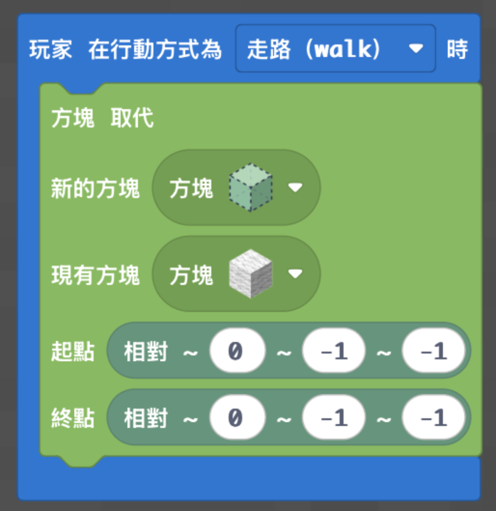
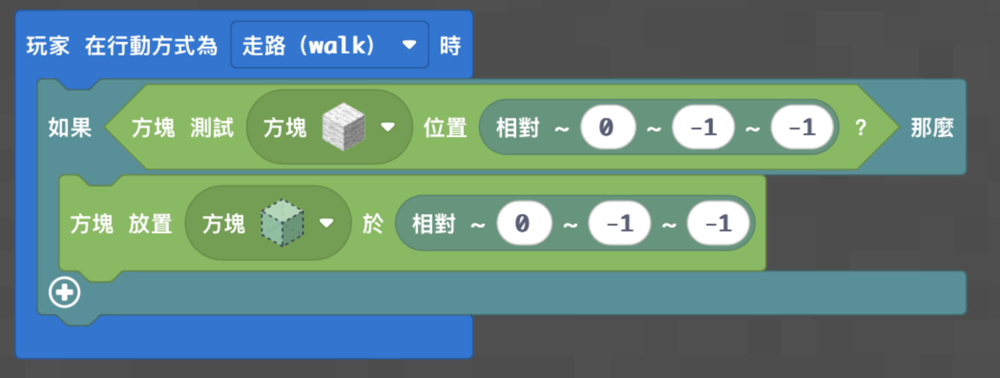
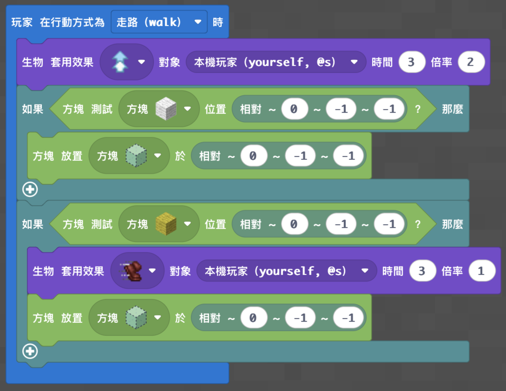
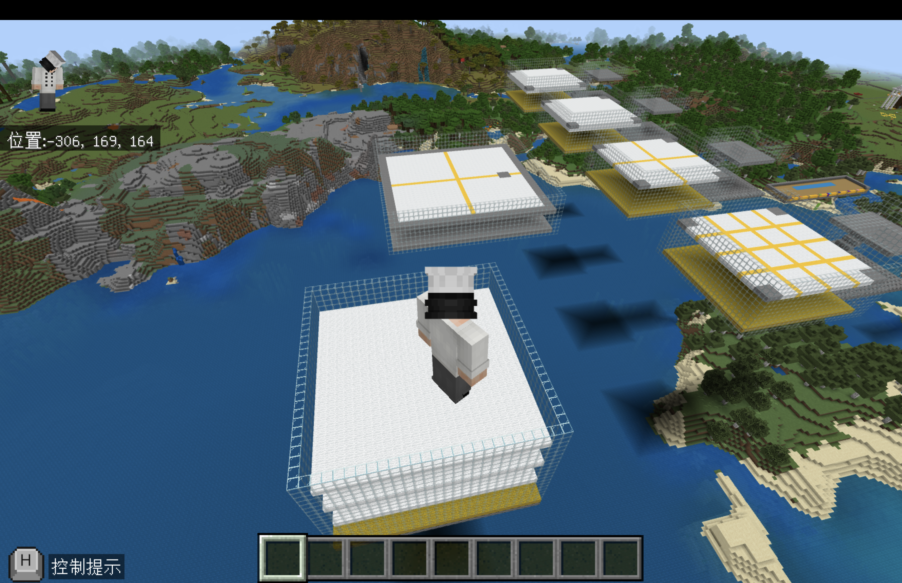

# 梯次 L｜條件判斷：方塊崩落大逃亡

## 課程定位

- 課程時間：09:00－12:00
- 遊戲版本：Minecraft Education
- 程式平台：Microsoft MakeCode
- 核心概念：玩家移動事件、相對座標與條件判斷
- 正式地圖：[神木村 v6](../shared/maps/神木村v6.mcworld)
- 備用地圖：[神木村 v5](maps/神木村v5.mcworld)
- 遊戲靈感：Hex-A-Gone／糖豆人式崩落地板
- 遊戲目標：學生使用自己完成的程式，讓走過的羊毛地板消失，在三層平台中移動並成為最後留在場上的玩家。

## 課前準備

- 場地包含一個教師示範場、一個最多八人共用測試場，以及三個正式比賽場。
- 教師示範場與正式場使用三層 25×25 羊毛平台；每層相隔 5 格。
- 共用測試場需預留較大活動空間，讓八位學生能同時測試，不使用個人隔間。
- 最底層下方設置較深的乾燥乾草坑，避免第三人稱視角卡住。
- 樓梯、觀戰區地面及玻璃牆下方均鋪設拒絕方塊，避免學生破壞玻璃或疊方塊離開。
- 各觀戰區互不連接；一關結束後，老師以創造模式飛到下一關並輸入 `/tp @a @s` 傳送全班。

## 教師備課快速總覽

| 教學階段 | 老師帶學生完成的程式 | 程式完成標準 | 完成後的遊戲或比賽 |
|---|---|---|---|
| 低階：崩落地板 | 使用玩家走路事件，把指定位置的白色羊毛換成空氣 | 走路時，玩家後下方的白色羊毛會消失 | 到共用測試區完成基礎移動挑戰 |
| 中階：條件判斷 | 先判斷指定位置是否為白色羊毛，再移除方塊 | 只有白色羊毛會消失，其他方塊不受影響 | 參加三層崩落地板正式賽 |
| 高階：跳躍與加速 | 加入跳躍提升，以及黃色羊毛的加速條件 | 白色羊毛消失；黃色羊毛提供加速後也消失 | 進行可跨越缺口、搶奪黃色方塊的進階賽 |

## 遊戲內容

### 遊戲準備

1. 老師先在示範場使用與學生相同的程式示範玩法；學生直接轉頭觀看老師螢幕。
2. 學生完成自己的分級程式後，到八人共用測試場自由測試。
3. 確認程式正常後，老師依序帶全班進行三關正式比賽。
4. 所有學生都參加三關，不因前一關掉落而失去下一關資格。
5. 每關開始前，老師將全班傳送到該關起點並確認所有人已停止移動。

### 學生任務

- 在三層羊毛平台上持續移動，規劃路線並避開已消失的方塊。
- 掉到第二層或第三層後仍可繼續比賽。
- 掉出第三層後進入乾草坑，再沿樓梯前往該關觀戰區。
- 留在場上的最後一位學生為該關冠軍。

### 勝負與獎品

- 每一關只取一位冠軍。
- 三關全部結束後，三位冠軍依第一關、第二關、第三關的順序，向老師選擇一項 Minecraft 物品作為獎品。
- 老師以現場觀察判定最後留在平台上的玩家。

## 程式內容

### 使用方式

- 低、中、高是三份獨立學生程式，每位學生只建立符合自己程度的一份。
- 三份程式均使用 `pos(0, -1, -1)`：以玩家位置為基準，Y 軸向下 1 格、世界 Z 軸負方向 1 格。
- Z 軸方向不會跟著玩家面向旋轉；正式授課前需測試四種面向，並依場地主要移動方向安排起點。
- 貼上程式前，先刪除編輯器原有內容。

### 低階完整程式

**老師要教：** 玩家走路事件、相對座標，以及把指定方塊換成空氣。

**完成標準：** 玩家走路時，後下方一格的白色羊毛消失；石頭與其他場地結構不被破壞。

```python
def on_travelled_walk():
    blocks.replace(
        AIR,
        WOOL,
        pos(0, -1, -1),
        pos(0, -1, -1)
    )
player.on_travelled(WALK, on_travelled_walk)
```

- [下載低階 Python](code/low.py)
- MakeCode 分享連結：**待補**



**測試：** 在共用測試區沿主要 Z 軸方向走過白色羊毛，確認身後形成缺口。

### 中階完整程式

**老師要教：** 使用「如果」判斷腳下指定位置是不是白色羊毛。

**完成標準：** 指定位置是白色羊毛時才移除，踩到其他方塊不執行移除。

```python
def on_travelled_walk():
    if blocks.test_for_block(WOOL, pos(0, -1, -1)):
        blocks.place(AIR, pos(0, -1, -1))
player.on_travelled(WALK, on_travelled_walk)
```

- [下載中階 Python](code/medium.py)
- MakeCode 分享連結：**待補**



**測試：** 分別走過白色羊毛、黃色羊毛及石頭，確認只有白色羊毛消失。

### 高階完整程式

**老師要教：** 第二個條件判斷，以及跳躍提升與速度效果。

**完成標準：** 走路時持續獲得跳躍提升；白色羊毛消失；黃色羊毛提供 3 秒速度效果後也消失。

```python
def on_travelled_walk():
    mobs.apply_effect(
        JUMP_BOOST,
        mobs.target(LOCAL_PLAYER),
        3,
        2
    )

    if blocks.test_for_block(WOOL, pos(0, -1, -1)):
        blocks.place(AIR, pos(0, -1, -1))

    if blocks.test_for_block(YELLOW_WOOL, pos(0, -1, -1)):
        mobs.apply_effect(
            SPEED,
            mobs.target(LOCAL_PLAYER),
            3,
            1
        )
        blocks.place(AIR, pos(0, -1, -1))

player.on_travelled(WALK, on_travelled_walk)
```

- [下載高階 Python](code/high.py)
- MakeCode 分享連結：**待補**



**測試：** 確認跳躍提升能跨越一格缺口；踩黃色羊毛會加速且方塊消失；效果只套用在本機玩家。跳躍等級較強，需確認玩家不會跳出玻璃牆。



## 場地座標、保存與重置

- 既有資料沒有留下競技場固定座標；老師應以神木村內的入口、示範場、八人測試場及三個正式場作為定位參考，並在正式地圖中自行記錄座標。
- 學生程式使用玩家相對座標 `pos(0, -1, -1)`，不依賴場地的絕對座標；世界 Z 軸負方向固定，不會隨玩家面向旋轉。
- 三層 25×25 平台、乾草坑、樓梯、觀戰區、玻璃牆及拒絕方塊構成大型場地，使用完整 `.mcworld` 保存最穩定。
- 本梯次不另附教師生成 Python 或結構方塊檔。大型場地若拆成多個結構，容易造成層高、觀戰區與傳送動線錯位。
- 每關結束後，老師以乾淨世界備份重開最可靠；若只修補少量方塊，可在創造模式補回白色與黃色羊毛。
- 切換下一關時，老師先飛到新場地安全起點，再輸入 `/tp @a @s` 傳送全班。

## 上課知識點

- **玩家事件：** 角色每次走路都會觸發同一段程式。
- **相對座標：** `pos(0, -1, -1)` 指向玩家下方一格、世界 Z 軸負方向一格的位置。
- **條件判斷：** 只有指定位置符合方塊種類時才執行移除或加速。
- **方塊狀態：** 將羊毛換成空氣，就是讓地板產生缺口。
- **效果與策略：** 跳躍提升能跨越缺口，速度效果能快速搶位，也會增加操作風險。
- **多人隔離：** 效果指定本機玩家，避免一位學生的程式改變全班狀態。
- **除錯方法：** 分別走過白色羊毛、黃色羊毛與石頭，逐一檢查每個條件。

## 程式示範影片

- [56.條件判斷：方塊崩壞大逃亡](https://youtu.be/QOAgEzOvPzw?si=ob1MxCdVxPLJyXGm)

## 半日營標準流程

| 時間 | 流程大綱 |
|---|---|
| 09:00－09:10 | 開場、自我介紹與破冰 |
| 09:10－09:35 | 遊戲操作與自由探索 |
| 09:35－10:15 | 基礎程式教學 |
| 10:15－10:35 | 基礎功能測試與遊戲活動 |
| 10:35－10:45 | 休息時間 |
| 10:45－11:25 | 進階程式教學 |
| 11:25－11:50 | 進階功能測試與成果挑戰 |
| 11:50－12:00 | 課程複習與收尾 |

## 家長回饋公版

親愛的家長您好：

今天孩子完成了 Minecraft Education「條件判斷：方塊崩落大逃亡」課程，使用玩家走路事件與相對座標，製作走過後會消失的羊毛地板。孩子再透過條件判斷控制白色羊毛、黃色羊毛與其他方塊的不同反應，並實際在三層競技場中使用自己的程式進行挑戰。

孩子今天完成的程度為【低階／中階／高階】，課堂表現【請填寫具體表現，例如：能用不同方塊逐一測試條件是否正確】。在正式比賽中完成【請填寫關卡或成果】，並展現【請填寫觀察、除錯、路線規劃或臨場反應】。

回家後可以請孩子分享：「程式為什麼只讓指定顏色的羊毛消失？」幫助孩子用自己的話整理事件、座標與條件判斷的關係。
