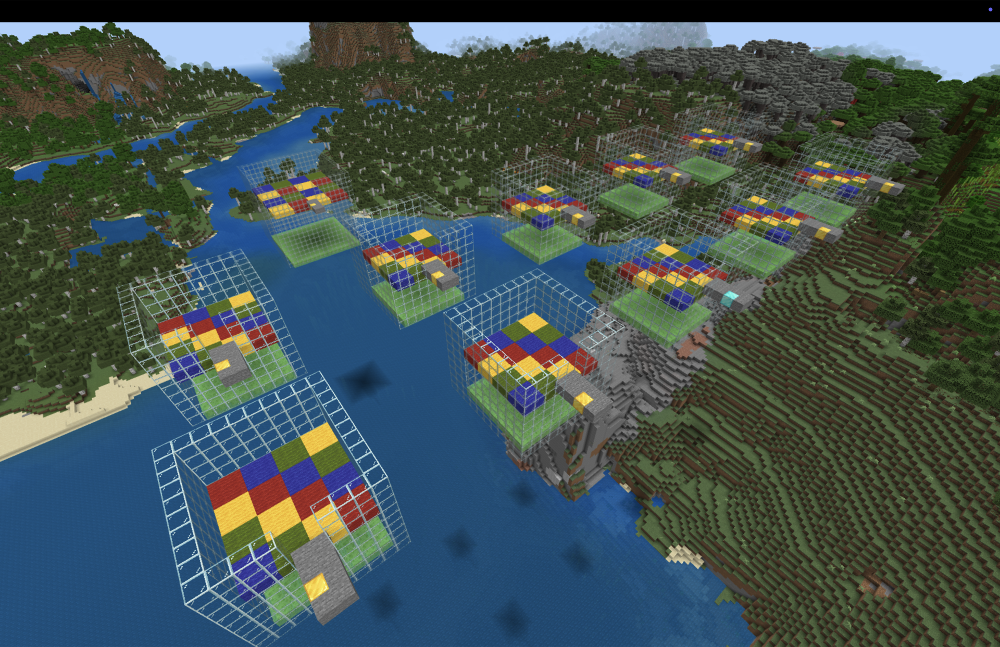
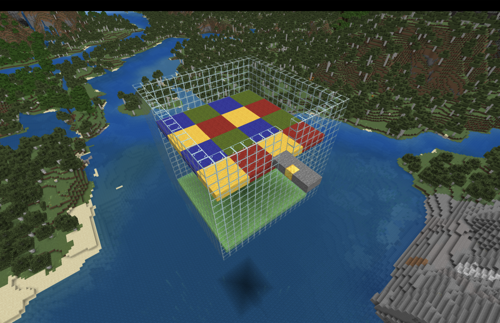
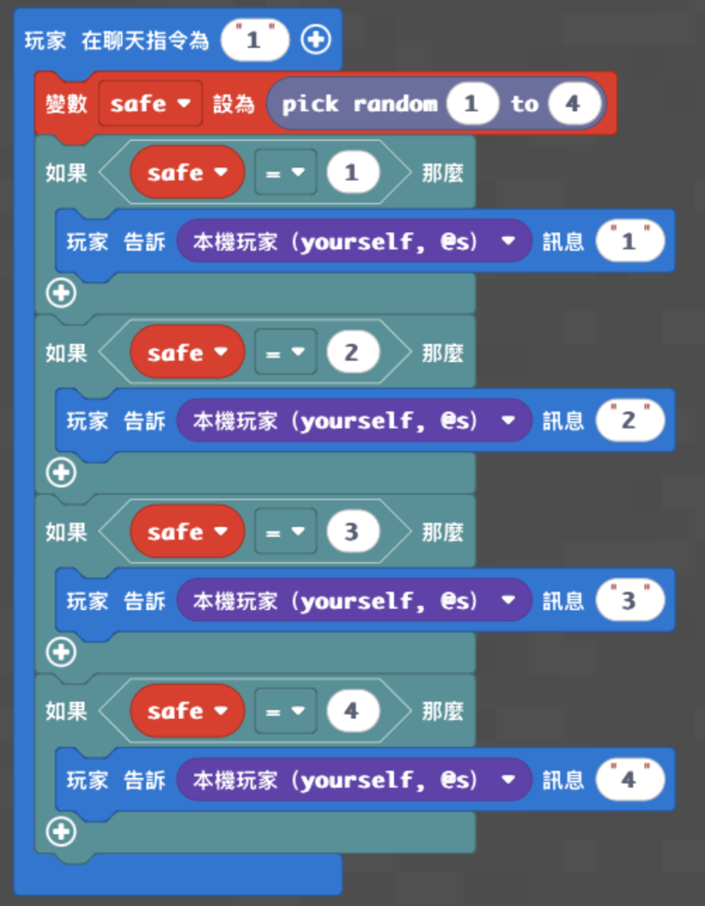
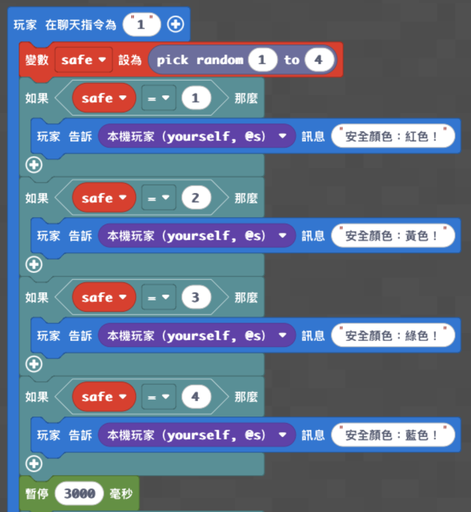
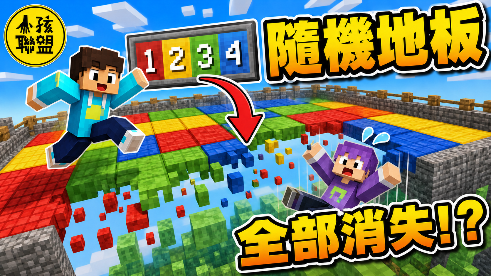

# 梯次T_隨機數：閃動格子

## 課程定位

- 時間：09:00－12:00，共三小時
- 平台：Minecraft Education＋Microsoft MakeCode
- 核心概念：隨機數、變數、條件判斷、相對座標
- 使用地圖：神木村v6
- 場地傳送座標：`/tp -404 166 40`
- 學生任務：使用隨機數選出安全顏色，讓其他顏色的地板消失。
- 老師任務：課前建立與恢復場地，正式比賽時控制10回合遊戲。

> 認識隨機數 → 設定 `safe` → 用條件判斷選出安全顏色 → 讓其他地板消失 → 個人測試 → 全班10回合閃動格子

## 兩種場地

### 學生練習場



- 共10座，排列成2排，每排5座。
- 每座場地為8×8地板，每個同色區塊為2×2。
- 四種顏色：紅色、黃色、綠色、藍色。
- 下方設置史萊姆方塊，玩家掉落後可以持續彈跳。
- 每座入口設置金塊，作為學生與老師執行相對座標程式的基準點。
- 老師站在入口金塊上輸入 `9` 時，只恢復目前這一座場地。

### 正式比賽場



- 正式地板為16×16。
- 每個同色區塊為4×4，共16個色塊。
- 史萊姆層位於地板下方約12格，增加掉落與彈跳效果。
- 正式比賽共10回合，每兩回合縮小一圈：16×16、14×14、12×12、10×10、8×8。
- 每回合先恢復有效地板，再隨機宣布安全顏色；等待4秒後讓其他三色消失；4秒後恢復，休息2秒進入下一回合。

## 學生分級程式

學生不需要製作場地，也不需要撰寫恢復程式。初、中、高階是三份獨立專案，不要疊在同一個專案；三個版本皆輸入聊天指令 `1` 執行。

### 初階：設定變數與隨機數

**學習目標：** 認識變數 `safe`，使用 `randint(1, 4)` 讓電腦從1、2、3、4中隨機選出一個數字。

**完成標準：** 輸入 `1` 後，程式可以設定隨機數並顯示完成訊息。

```python
safe = 0

def on_on_chat():
    global safe
    safe = randint(1, 4)
    player.tell(mobs.target(LOCAL_PLAYER), "隨機數已設定！")
player.on_chat("1", on_on_chat)
```


### 中階：用條件判斷顯示隨機結果

**學習目標：** 把隨機數連接到四個條件判斷，顯示 `safe` 抽到的數字。

**完成標準：** 輸入 `1` 後，聊天訊息會顯示1、2、3或4其中一個結果。

```python
safe = 0

def on_on_chat():
    global safe
    safe = randint(1, 4)
    if safe == 1:
        player.tell(mobs.target(LOCAL_PLAYER), "1")
    if safe == 2:
        player.tell(mobs.target(LOCAL_PLAYER), "2")
    if safe == 3:
        player.tell(mobs.target(LOCAL_PLAYER), "3")
    if safe == 4:
        player.tell(mobs.target(LOCAL_PLAYER), "4")
player.on_chat("1", on_on_chat)
```



### 高階：完整閃動格子

**學習目標：** 使用隨機數選出安全顏色，並用四個條件判斷讓其他三種顏色消失。

**執行位置：** 學生站在任一練習場入口金塊上。

**完成標準：** 輸入 `1` 後宣布安全顏色；等待3秒後，其他三種顏色消失。

```python
safe = 0

def on_on_chat():
    global safe
    safe = randint(1, 4)
    if safe == 1:
        player.tell(mobs.target(LOCAL_PLAYER), "安全顏色：紅色！")
    if safe == 2:
        player.tell(mobs.target(LOCAL_PLAYER), "安全顏色：黃色！")
    if safe == 3:
        player.tell(mobs.target(LOCAL_PLAYER), "安全顏色：綠色！")
    if safe == 4:
        player.tell(mobs.target(LOCAL_PLAYER), "安全顏色：藍色！")
    loops.pause(3000)
    if safe != 1:
        blocks.replace(AIR, RED_WOOL, pos(-8, -1, -8), pos(8, -1, 8))
    if safe != 2:
        blocks.replace(AIR, YELLOW_WOOL, pos(-8, -1, -8), pos(8, -1, 8))
    if safe != 3:
        blocks.replace(AIR, GREEN_WOOL, pos(-8, -1, -8), pos(8, -1, 8))
    if safe != 4:
        blocks.replace(AIR, BLUE_WOOL, pos(-8, -1, -8), pos(8, -1, 8))
    player.tell(mobs.target(LOCAL_PLAYER), "地板消失！")
player.on_chat("1", on_on_chat)
```




## `safe` 與座標講解

### `safe` 是什麼？

- `safe` 是一個變數，可以想像成一個會存放數字的盒子。
- `safe = randint(1, 4)` 會把1～4中的隨機結果放進盒子。
- 1代表紅色、2代表黃色、3代表綠色、4代表藍色。
- `safe != 1` 的意思是「安全數字不是1」，所以紅色不是安全顏色，紅色地板要消失。

### 為什麼使用 `pos(-8, -1, -8)` 到 `pos(8, -1, 8)`？

- `pos()` 是以玩家目前位置為中心的相對座標。
- 玩家站在入口金塊上，地板比玩家腳下低一格，因此Y使用 `-1`。
- X與Z使用 `-8` 到 `8`，形成足以涵蓋整座8×8練習地板的搜尋範圍。
- `blocks.replace()` 只會替換指定顏色的羊毛，因此搜尋範圍稍大不會讓玻璃牆、金塊或史萊姆消失。

## 正式比賽流程

1. 老師與全班進入正式比賽場。
2. 老師站在入口金塊上輸入 `5`。
3. 程式宣布回合與安全顏色。
4. 玩家有4秒移動到安全顏色。
5. 其他三種顏色消失，玩家落到下方史萊姆層並持續彈跳。
6. 4秒後地板恢復，再休息2秒。
7. 每兩回合縮小一圈；第9～10回合剩下8×8。
8. 完成10回合後恢復完整16×16地板。

## 程式示範影片

- [示範影片一](https://youtu.be/7jB5HjT0ZA0?si=qXL6wPtXgAY9D9Wn)
- [示範影片二](https://youtu.be/4AYH0QIoIT8?si=pahM1N-g5sxhFThu)

## 家長回饋

親愛的家長您好：

今天的主題是「隨機數：閃動格子」。

孩子們把「隨機數」想像成電腦抽籤，讓程式每次從1到4中隨機選出一個數字，並將結果放進名為「safe」的變數中。

接著，孩子們利用「如果」條件判斷數字代表的安全顏色。

在進階挑戰中，程式會宣布安全顏色，並讓其他顏色的地板消失，孩子們也實際使用自己的程式進行閃動格子遊戲。

學習重點一：理解隨機數每次執行都可能產生不同結果。

學習重點二：使用變數保存隨機抽選的數字。

學習重點三：利用條件判斷，將數字轉換成不同的遊戲結果。

今天每位孩子都表現得非常棒，也順利完成了指定的挑戰任務！

## YouTube 縮圖



## 備註：場地程式（封存）

> 額外補充：以下是老師課前建立及重置場地使用的程式，不是本堂「隨機數」的主要學生教學內容。練習場地與正式場地必須放在兩個獨立的 MakeCode 專案，不要合併。

### 練習場地完整程式

- 輸入 `8`：建立10座8×8練習場。
- 老師站在任一座入口金塊上輸入 `9`：只恢復該座練習場。

```python
def build_practice_floor(cx, cz):
    blocks.fill(RED_WOOL, pos(cx - 4, -2, cz + 3), pos(cx - 3, -2, cz + 4), FillOperation.REPLACE)
    blocks.fill(YELLOW_WOOL, pos(cx - 2, -2, cz + 3), pos(cx - 1, -2, cz + 4), FillOperation.REPLACE)
    blocks.fill(GREEN_WOOL, pos(cx, -2, cz + 3), pos(cx + 1, -2, cz + 4), FillOperation.REPLACE)
    blocks.fill(BLUE_WOOL, pos(cx + 2, -2, cz + 3), pos(cx + 3, -2, cz + 4), FillOperation.REPLACE)
    blocks.fill(BLUE_WOOL, pos(cx - 4, -2, cz + 5), pos(cx - 3, -2, cz + 6), FillOperation.REPLACE)
    blocks.fill(RED_WOOL, pos(cx - 2, -2, cz + 5), pos(cx - 1, -2, cz + 6), FillOperation.REPLACE)
    blocks.fill(YELLOW_WOOL, pos(cx, -2, cz + 5), pos(cx + 1, -2, cz + 6), FillOperation.REPLACE)
    blocks.fill(GREEN_WOOL, pos(cx + 2, -2, cz + 5), pos(cx + 3, -2, cz + 6), FillOperation.REPLACE)
    blocks.fill(GREEN_WOOL, pos(cx - 4, -2, cz + 7), pos(cx - 3, -2, cz + 8), FillOperation.REPLACE)
    blocks.fill(BLUE_WOOL, pos(cx - 2, -2, cz + 7), pos(cx - 1, -2, cz + 8), FillOperation.REPLACE)
    blocks.fill(RED_WOOL, pos(cx, -2, cz + 7), pos(cx + 1, -2, cz + 8), FillOperation.REPLACE)
    blocks.fill(YELLOW_WOOL, pos(cx + 2, -2, cz + 7), pos(cx + 3, -2, cz + 8), FillOperation.REPLACE)
    blocks.fill(YELLOW_WOOL, pos(cx - 4, -2, cz + 9), pos(cx - 3, -2, cz + 10), FillOperation.REPLACE)
    blocks.fill(GREEN_WOOL, pos(cx - 2, -2, cz + 9), pos(cx - 1, -2, cz + 10), FillOperation.REPLACE)
    blocks.fill(BLUE_WOOL, pos(cx, -2, cz + 9), pos(cx + 1, -2, cz + 10), FillOperation.REPLACE)
    blocks.fill(RED_WOOL, pos(cx + 2, -2, cz + 9), pos(cx + 3, -2, cz + 10), FillOperation.REPLACE)

def build_practice_arena(cx, cz):
    blocks.fill(AIR, pos(cx - 5, -6, cz + 2), pos(cx + 4, 2, cz + 11), FillOperation.REPLACE)
    blocks.fill(STONE, pos(cx - 1, -1, cz - 1), pos(cx, -1, cz + 2), FillOperation.REPLACE)
    blocks.place(GOLD_BLOCK, pos(cx, -1, cz))
    blocks.fill(SLIME_BLOCK, pos(cx - 4, -7, cz + 3), pos(cx + 3, -7, cz + 10), FillOperation.REPLACE)
    blocks.fill(GLASS, pos(cx - 5, -6, cz + 2), pos(cx - 5, 2, cz + 11), FillOperation.REPLACE)
    blocks.fill(GLASS, pos(cx + 4, -6, cz + 2), pos(cx + 4, 2, cz + 11), FillOperation.REPLACE)
    blocks.fill(GLASS, pos(cx - 5, -6, cz + 11), pos(cx + 4, 2, cz + 11), FillOperation.REPLACE)
    blocks.fill(GLASS, pos(cx - 5, -6, cz + 2), pos(cx + 4, -2, cz + 2), FillOperation.REPLACE)
    blocks.fill(GLASS, pos(cx - 5, -1, cz + 2), pos(cx - 2, 2, cz + 2), FillOperation.REPLACE)
    blocks.fill(GLASS, pos(cx + 1, -1, cz + 2), pos(cx + 4, 2, cz + 2), FillOperation.REPLACE)
    build_practice_floor(cx, cz)

def on_on_chat8():
    for index in range(5):
        build_practice_arena(index * 20 - 40, 0)
        build_practice_arena(index * 20 - 40, 20)
    player.tell(mobs.target(LOCAL_PLAYER), "10座練習場建立完成！")
player.on_chat("8", on_on_chat8)

def on_on_chat9():
    build_practice_floor(0, 0)
    player.tell(mobs.target(LOCAL_PLAYER), "這一座練習場已恢復！")
player.on_chat("9", on_on_chat9)
```

### 正式場地完整程式

- 輸入 `7`：建立16×16正式場地。
- 老師站在入口金塊上輸入 `6`：恢復完整正式地板。
- 老師站在入口金塊上輸入 `5`：開始10回合正式比賽。

```python
safe = 0

def build_formal_floor():
    for tile_z in range(4):
        for tile_x in range(4):
            x1 = tile_x * 4 - 8
            z1 = tile_z * 4 + 3
            color_number = (tile_z % 2) * 2 + tile_x % 2
            if color_number == 0:
                blocks.fill(RED_WOOL, pos(x1, -2, z1), pos(x1 + 3, -2, z1 + 3), FillOperation.REPLACE)
            if color_number == 1:
                blocks.fill(YELLOW_WOOL, pos(x1, -2, z1), pos(x1 + 3, -2, z1 + 3), FillOperation.REPLACE)
            if color_number == 2:
                blocks.fill(GREEN_WOOL, pos(x1, -2, z1), pos(x1 + 3, -2, z1 + 3), FillOperation.REPLACE)
            if color_number == 3:
                blocks.fill(BLUE_WOOL, pos(x1, -2, z1), pos(x1 + 3, -2, z1 + 3), FillOperation.REPLACE)

def on_on_chat7():
    blocks.fill(AIR, pos(-9, -13, 2), pos(8, 3, 19), FillOperation.REPLACE)
    blocks.fill(STONE, pos(-1, -1, -2), pos(0, -1, 2), FillOperation.REPLACE)
    blocks.place(GOLD_BLOCK, pos(0, -1, 0))
    blocks.fill(SLIME_BLOCK, pos(-8, -14, 3), pos(7, -14, 18), FillOperation.REPLACE)
    blocks.fill(GLASS, pos(-9, -13, 2), pos(-9, 3, 19), FillOperation.REPLACE)
    blocks.fill(GLASS, pos(8, -13, 2), pos(8, 3, 19), FillOperation.REPLACE)
    blocks.fill(GLASS, pos(-9, -13, 19), pos(8, 3, 19), FillOperation.REPLACE)
    blocks.fill(GLASS, pos(-9, -13, 2), pos(8, -2, 2), FillOperation.REPLACE)
    blocks.fill(GLASS, pos(-9, -1, 2), pos(-2, 3, 2), FillOperation.REPLACE)
    blocks.fill(GLASS, pos(1, -1, 2), pos(8, 3, 2), FillOperation.REPLACE)
    build_formal_floor()
    player.tell(mobs.target(LOCAL_PLAYER), "正式比賽場建立完成！")
player.on_chat("7", on_on_chat7)

def on_on_chat6():
    build_formal_floor()
    player.tell(mobs.target(LOCAL_PLAYER), "正式比賽場已恢復！")
player.on_chat("6", on_on_chat6)

def prepare_formal_floor(shrink):
    build_formal_floor()
    if shrink > 0:
        blocks.fill(AIR, pos(-8, -2, 3), pos(7, -2, 2 + shrink), FillOperation.REPLACE)
        blocks.fill(AIR, pos(-8, -2, 19 - shrink), pos(7, -2, 18), FillOperation.REPLACE)
        blocks.fill(AIR, pos(-8, -2, 3 + shrink), pos(-9 + shrink, -2, 18 - shrink), FillOperation.REPLACE)
        blocks.fill(AIR, pos(8 - shrink, -2, 3 + shrink), pos(7, -2, 18 - shrink), FillOperation.REPLACE)

def on_on_chat5():
    global safe
    shrink = 0
    for round_number in range(10):
        prepare_formal_floor(shrink)
        player.say("第 " + str(round_number + 1) + " 回合！")
        safe = randint(1, 4)
        if safe == 1:
            player.say("安全顏色：紅色！")
        if safe == 2:
            player.say("安全顏色：黃色！")
        if safe == 3:
            player.say("安全顏色：綠色！")
        if safe == 4:
            player.say("安全顏色：藍色！")
        loops.pause(4000)
        min_x = -8 + shrink
        max_x = 7 - shrink
        min_z = 3 + shrink
        max_z = 18 - shrink
        if safe != 1:
            blocks.replace(AIR, RED_WOOL, pos(min_x, -2, min_z), pos(max_x, -2, max_z))
        if safe != 2:
            blocks.replace(AIR, YELLOW_WOOL, pos(min_x, -2, min_z), pos(max_x, -2, max_z))
        if safe != 3:
            blocks.replace(AIR, GREEN_WOOL, pos(min_x, -2, min_z), pos(max_x, -2, max_z))
        if safe != 4:
            blocks.replace(AIR, BLUE_WOOL, pos(min_x, -2, min_z), pos(max_x, -2, max_z))
        player.say("危險地板消失！")
        loops.pause(4000)
        prepare_formal_floor(shrink)
        loops.pause(2000)
        if round_number % 2 == 1:
            shrink += 1
    build_formal_floor()
    player.say("10回合結束！")
player.on_chat("5", on_on_chat5)
```

## 相關資料

- 縮圖另附可編輯 SVG：`images/youtube-thumbnail.svg`
