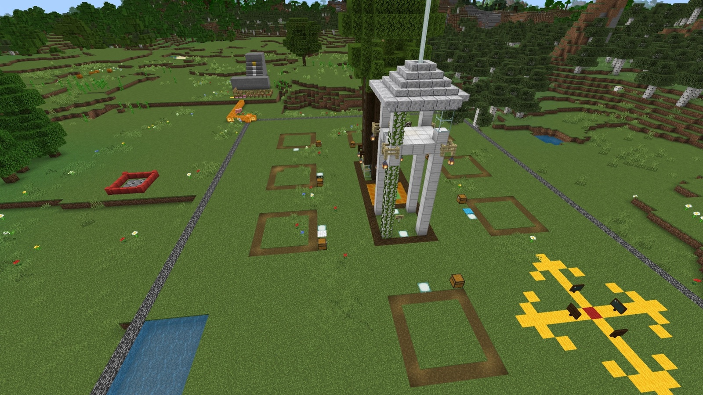
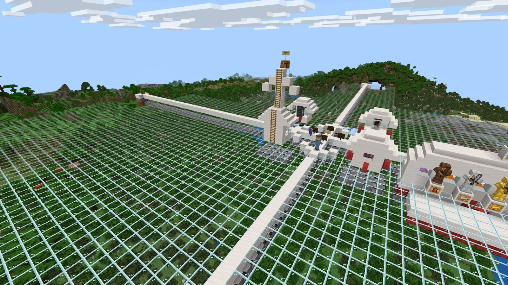
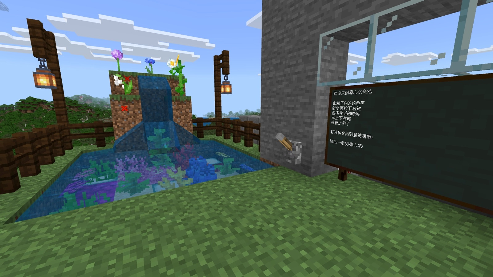
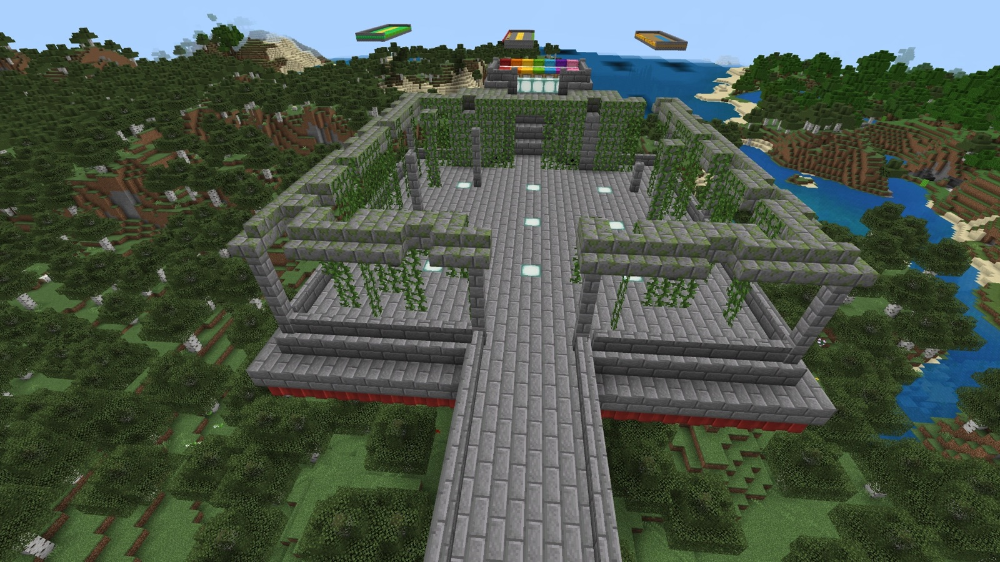

# 神木村｜場地與座標指南

本頁依「地形名稱 → 圖片 → 座標 → 使用教案」排列。座標順序為 `X Y Z`；使用座標前請先備份世界。

## 神木村

**座標**

`/tp 100 65 -100`

**使用教案**

[梯次 A｜迴圈：求生大冒險](../../batch-a-survival-adventure/lesson-plan.md)

---

## 紅石工程大道

**座標**

`/tp -527 66 236`

**使用教案**

[梯次 B｜迴圈：紅石工程師](../../batch-b-redstone-engineer/lesson-plan.md)

**教師地形程式**

[紅石練習場教師程式](../../batch-b-redstone-engineer/code/teacher-redstone-practice-field.py)

---

## 玻璃空島

**座標**

`/tp 200 150 200`

---

## 專心釣魚池

**座標**

`/tp 100 100 100`

---

## 競技場

**座標**

`/tp 91 98 97`

**使用教案**

[梯次 I｜變數：狩獵大師](../../week-01-catch-chicken/lesson-plan.md)

---

## 10 線鐵路測試場

**座標**

`/tp -442 139 231`

**使用教案**

[梯次 B｜迴圈：紅石工程師](../../batch-b-redstone-engineer/lesson-plan.md)

**教師地形程式**

[10 線鐵路測試場教師程式](../../batch-b-redstone-engineer/code/teacher-field.py)

---

## 八人造橋關卡

**座標**

`/tp -114 90 44`

神木村既有場地可從「程式挑戰入口」NPC 前往 A 點。重新生成時，老師站在預定 A 點中央輸入聊天指令 `9`；該站立位置為教師程式的相對原點。

**使用教案**

[梯次 J｜巢狀迴圈：程式造橋闖關](../../batch-k-nested-loop-bridge/lesson-plan.md)

**教師地形程式**

[八人造橋教師地形程式](../../batch-k-nested-loop-bridge/code/teacher-terrain.py)

---

## 方塊崩落大逃亡競技場

**座標**

`/tp -216 133 -1`

**使用教案**

[梯次 L｜條件判斷：方塊崩落大逃亡](../../batch-s-collapsing-floor/lesson-plan.md)

**教師地形程式**

[方塊崩落教師地形程式](../../batch-s-collapsing-floor/code/teacher-terrain.py)

---

## 閃動格子練習場與正式比賽場

**座標**

`/tp -404 166 40`

到達後確認練習場、正式比賽場、入口金塊與史萊姆區。其他地圖可用教師程式重新生成。

**使用教案**

[梯次 M｜隨機數：閃動格子](../../batch-m-random-flashing-floor/lesson-plan.md)

**教師地形程式**

- [練習場教師程式](../../batch-m-random-flashing-floor/code/teacher-practice.py)
- [正式比賽場教師程式](../../batch-m-random-flashing-floor/code/teacher-formal.py)
