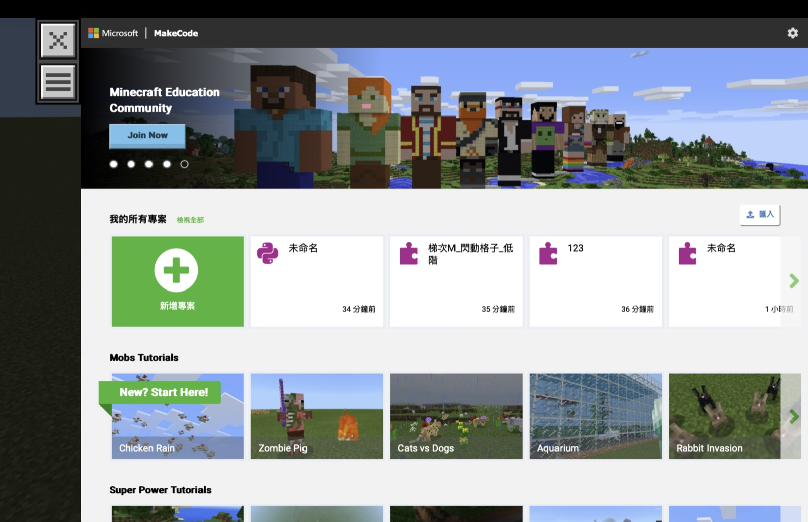
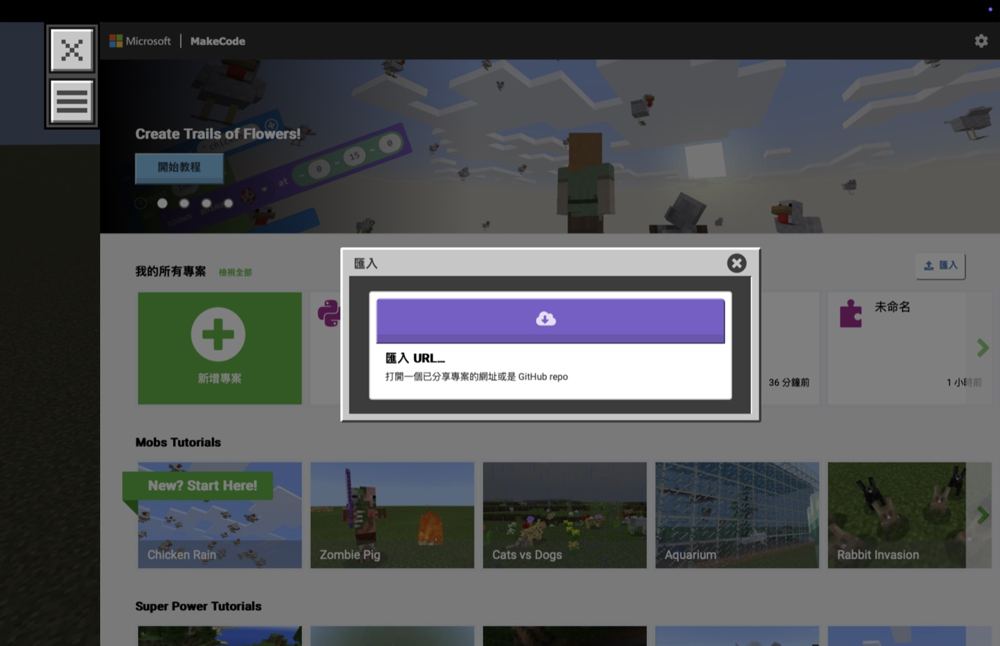
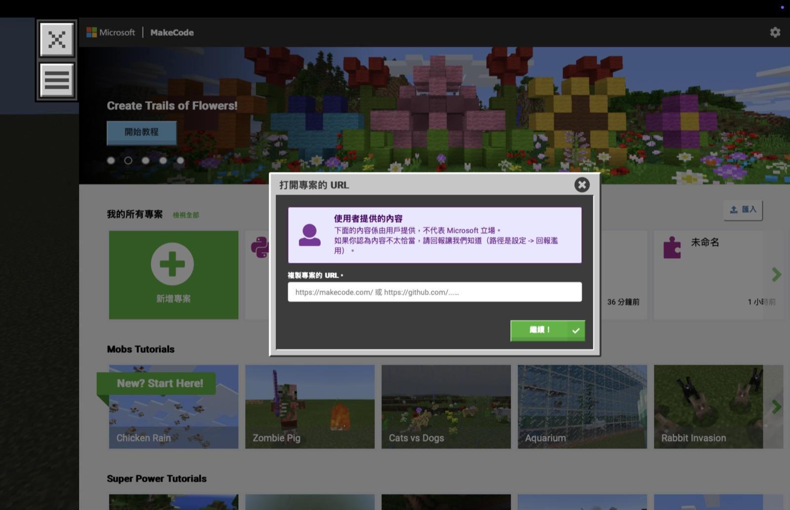

# 教師 SOP｜匯入 MakeCode 分享連結至 Minecraft Education

## 使用時機

教案若提供低階、中階或高階 MakeCode 分享連結，老師與學生可依下列步驟將專案匯入 Minecraft Education。每個程度應使用一份獨立專案，不要將低、中、高階程式疊在同一份專案中。

## 一、開啟 MakeCode

1. 進入 Minecraft Education 的教學世界。
2. 按鍵盤 `C` 開啟 Code Builder。
3. 選擇 Microsoft MakeCode。
4. 等待 MakeCode 首頁載入完成。

## 二、點擊「匯入」

在「我的所有專案」右側找到並點擊「匯入」。

## 三、選擇「匯入 URL」

匯入視窗出現後，點擊「匯入 URL…」。

## 四、貼上分享連結

1. 在「複製專案的 URL」欄位貼上教案提供的 MakeCode 分享連結。
2. 確認網址以 `https://makecode.com/` 開頭。
3. 點擊右下角綠色的「繼續！」。

## 五、確認專案

1. 等待專案載入完成。
2. 確認專案名稱、主題及程度正確。
3. 切換到積木畫面，確認積木完整顯示。
4. 確認畫面中沒有灰色的 `<python code>` 區塊。
5. 若專案顯示「未命名」，先核對程式內容，再重新命名為「梯次＋主題＋程度」。

## 六、回到遊戲測試

1. 關閉或縮小 Code Builder，回到 Minecraft 世界。
2. 站到教案指定的位置。
3. 開啟聊天室並輸入教案指定的聊天指令，例如 `1`。
4. 確認程式執行結果符合教案的完成標準。

> 匯入成功只代表專案可以開啟，不代表程式已完成實機驗證。老師仍須在指定地圖、座標及多人設定下測試程式效果。

## 分享連結使用原則

- 低階、中階、高階各使用一個獨立的 MakeCode 分享連結。
- 老師上課前應逐一開啟連結，確認專案仍可載入。
- 匯入後的專案會出現在使用者自己的專案清單中。
- 修改匯入後的專案，不會自動更新原本的分享內容；正式交付前應重新檢查分享連結。
- 不要讓全班同時執行教師場地程式，以免覆蓋其他學生的區域。

## 常見問題

### 找不到「匯入」

確認目前位於 MakeCode 首頁，而不是積木編輯畫面。返回首頁後，在「我的所有專案」右側尋找「匯入」。

### 貼上連結後無法繼續

- 確認已複製完整網址。
- 移除網址前後多餘的空格或換行。
- 確認使用的是 MakeCode 分享連結，而不是 Notion 教案或其他網頁網址。
- 關閉匯入視窗後重新操作一次。

### 程式可以開啟，但遊戲沒有反應

- 確認聊天指令正確。
- 確認 Code Builder 已連接目前世界。
- 確認角色站在教案指定位置。
- 確認程式事件已啟動。
- 涉及建造或替換方塊時，確認座標範圍沒有超出個人場地。

## 教師課前檢查

- [ ] MakeCode 分享連結可以正常開啟。
- [ ] 已確認匯入的程度正確。
- [ ] 低、中、高階為三份獨立專案。
- [ ] 積木畫面沒有灰色 `<python code>` 區塊。
- [ ] 聊天指令與教案一致。
- [ ] 已在指定世界與位置完成功能測試。
- [ ] 多人測試不會影響其他學生的程式或場地。
