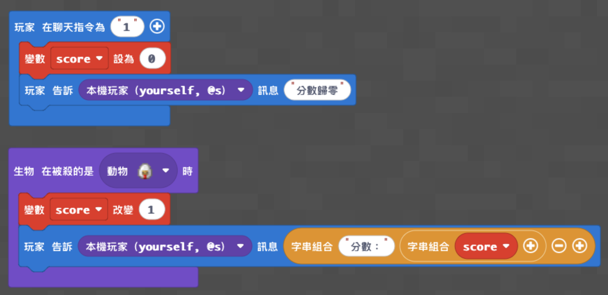
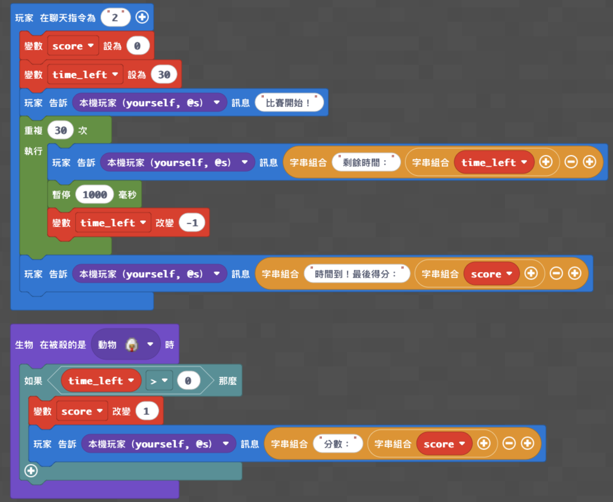
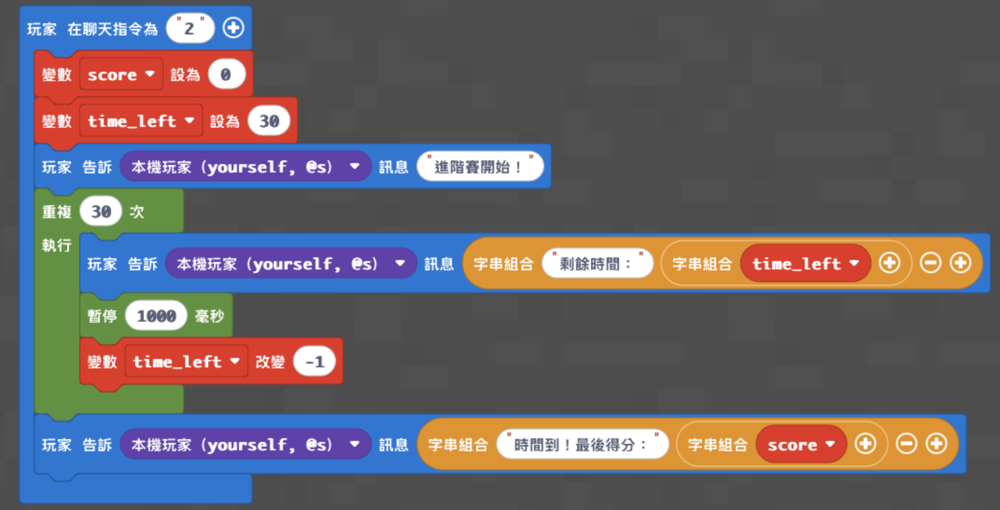
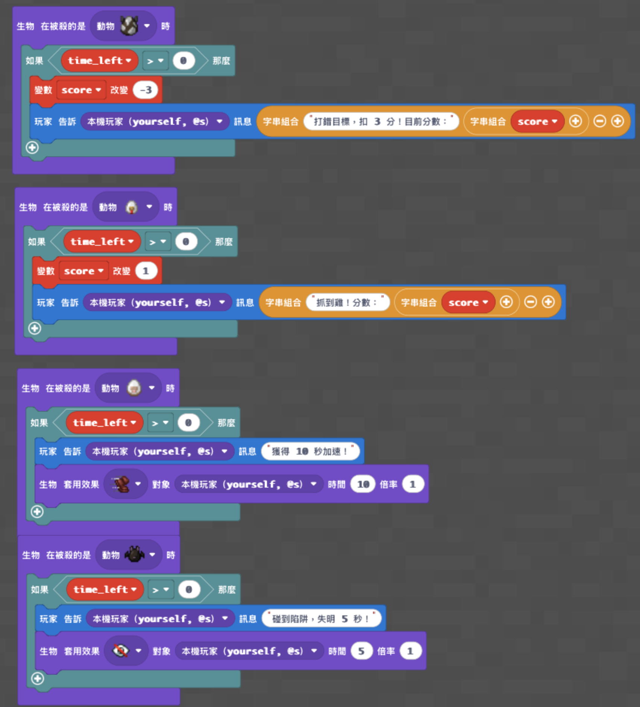

# 第 1 週｜變數：瘋狂抓雞大賽

- 課程時間：09:00－12:00
- 遊戲版本：Minecraft Education
- 程式平台：Microsoft MakeCode Python
- 核心概念：變數、事件、迴圈、條件判斷

## 課前準備

- 使用地圖：`maps/神木村8人版.mcworld`
- 學生執行程式時，將學生權限設置為操作者（皇冠）。
- 課前確認每台電腦都能開啟 Minecraft Education 與 MakeCode。
- 先以教師帳號測試低、中、高階程式。

## 遊戲內容

先進入神木村，讓第一次玩 Minecraft 的學生練習移動、視角、物品欄與攻擊操作，也可以先建構簡單房子。

### 第一回合：基礎抓雞賽

- 在限定時間內擊倒雞，每隻雞加 1 分。
- 時間結束後比較分數，熟悉計分規則。

### 第二回合：進階動物競技場

- 雞：加 1 分。
- 牛：扣 3 分。
- 羊：獲得加速效果。
- 蝙蝠：受到失明效果。
- 學生必須判斷追擊目標、避開陷阱，最後進行全班決賽。

## 程式內容

本梯次以「變數、事件、迴圈、條件判斷」為核心，程式完成後會直接成為抓雞大賽的遊戲規則。

1. 基礎計分板
   - 分數歸零。
   - 擊倒雞時分數加 1。
   - 顯示目前分數。
2. 限時計分賽
   - 聊天輸入 `2` 開始 30 秒比賽。
   - 自動重設分數並倒數。
   - 只有比賽時間內擊倒雞才會得分。
   - 時間到顯示最後成績。
3. 進階規則
   - 擊倒牛扣 3 分。
   - 擊倒羊獲得加速。
   - 擊倒蝙蝠受到失明。

## 半日營標準流程

| 時間 | 流程大綱 |
|---|---|
| **09:00－09:10** | 開場、自我介紹與破冰 |
| **09:10－09:35** | 遊戲操作與自由探索 |
| **09:35－10:15** | 基礎程式教學 |
| **10:15－10:35** | 基礎功能測試與遊戲活動 |
| **10:35－10:45** | 休息時間 |
| **10:45－11:25** | 進階程式教學 |
| **11:25－11:50** | 進階功能測試與成果挑戰 |
| **11:50－12:00** | 課程複習與收尾 |

## 分級教學設計

全班預設目標是完成中階。年紀較小、第一次玩 Minecraft 或第一次寫程式的學生，以完成低階並能參加比賽為成功；進度較快、年紀較大、較熟練或參加過多次的學生，繼續完成高階，不必等待其他同學。

| 層級 | 適合學生 | 程式完成標準 | 完成後的遊戲效果 |
|---|---|---|---|
| **低** | 年紀較小、第一次玩 Minecraft、第一次寫程式 | 分數歸零；擊倒雞加 1 分；顯示目前分數 | 可參加基礎抓雞賽，由老師協助控制回合時間 |
| **中（全班預設）** | 所有學生的主要完成目標 | 低階功能＋30 秒倒數；時間內才可得分；時間到顯示結果 | 可獨立執行一場有開始、計分與結束的完整比賽 |
| **高** | 進度快、年紀較大、操作熟練或參加過多次 | 中階功能＋牛扣分、羊加速、蝙蝠失明 | 加入陷阱、獎勵與策略選擇，完成進階動物競技場 |

## 實際程式碼

以下三份程式已在官方 Minecraft MakeCode 編輯器逐份貼上，並成功轉換成積木。低、中、高是三個獨立完整版，請依學生程度三選一；貼上前先把編輯器原有內容全部刪除，不可將三份程式疊在同一個專案。

### 低階程式

完成目標：自動計分板。老師負責宣布開始與時間到；學生輸入 `1` 將分數歸零。

- [開啟低階完整程式碼](code/low.py)

### 中階程式（全班預設）

完成目標：有開始、30 秒倒數、限時計分與結束成績的完整比賽。學生輸入 `2` 開始。

- [開啟中階完整程式碼](code/medium.py)

### 高階程式

完成目標：在完整比賽中加入扣分、獎勵與陷阱；所有效果只在倒數期間生效。學生輸入 `2` 開始。

- [開啟高階完整程式碼](code/high.py)

## 家長回饋

課後回饋範本

親愛的家長您好：

今天的主題是「變數（Variables）」。

「變數」聽起來像是生硬的工程名詞，但我們透過一場 Minecraft「瘋狂抓雞大賽」，讓孩子在遊戲中自然理解這項核心邏輯。孩子今天化身為遊戲設計師，親手完成專屬的自動計分板與倒數計時器。

**孩子今天掌握的三項程式能力：**

1. **把變數具象化成「有標籤的魔法箱」**  
   孩子建立「分數」與「時間」變數，用來儲存並追蹤遊戲中的資料。
2. **分辨「設為」與「改變」**  
   比賽開始前將分數設為 0；每抓到一隻雞，分數增加 1；倒數期間，時間每秒減少 1。
3. **控制電腦的運算節奏**  
   孩子使用暫停 1000 毫秒，讓程式每一秒更新一次倒數，練習控制程式流程。

進階挑戰中，孩子也加入牛扣分、羊加速與蝙蝠失明等規則，理解不同事件如何產生不同結果。這不只是完成一段程式，更是把自己寫的規則真正變成一場可以遊玩的遊戲。

## 教師課後確認

- [ ] 全班完成低階或中階版本。
- [ ] 進度較快的學生有完成高階挑戰。
- [ ] 學生能說出變數如何保存分數與時間。
- [ ] 學生實際使用自己寫的程式完成遊戲回合。
- [ ] 下課前完成今日程式概念複習。
